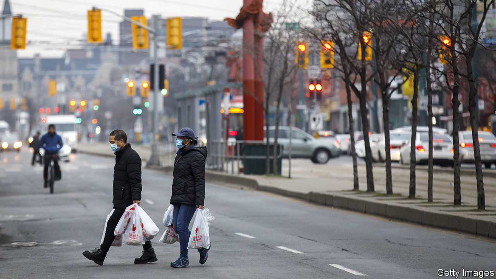
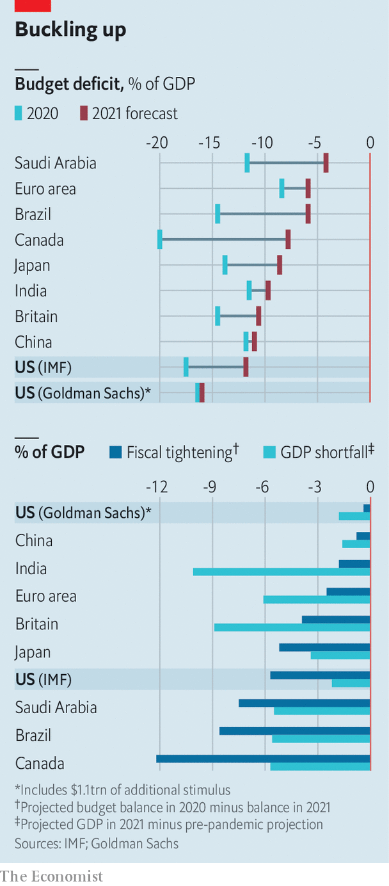

###### Acting less big

# Who is at risk from premature austerity? 

##### Some countries are tightening too far, too soon 

 

> Jan 30th 2021 


THE BUDGET deficits of the world’s governments will add up to about 8.5% of global GDP this year, according to new projections by the IMF. That amounts to well over $7trn of additional red ink. Remarkably, it may not be enough.


Many economists of a Keynesian bent are haunted by the aftermath of the global financial crisis, when recovery was enfeebled by a premature turn to fiscal caution. Back then, economists fretted about spikes in interest rates and the corrosive effect of overborrowing. Now they view low rates as a fact of life and worry about the scarring effect of underspending. “With interest rates at historic lows, the smartest thing we can do is act big,” said Janet Yellen, America’s new treasury secretary.


The arithmetic of deficits and growth is daunting. Suppose a country ran a deficit of $1trn in 2020 and repeated the trick this year. How much would this yawning fiscal gap add to economic growth in 2021? The answer is zero, all else equal. To contribute to growth, the deficit cannot just be big. It must be bigger than it was the year before.

 


Few governments will meet that hurdle. Of the 21 economies featured in the IMF’s forecasts, only five will spill more red ink this year than last (measured in their local currencies, at constant prices). The rest will endure some kind of fiscal tightening. The euro area’s budget deficit will shrink by 2.5 percentage points; Japan’s, by 5.2 points. The tightening will be even greater in Brazil.


Fiscal consolidation would be welcome if it reflected the strength of the economic revival. But although many countries will grow quickly this year, their recoveries will not be complete. One measure of this incompleteness is the gap between the level of output the IMF now envisages and what it foresaw before covid-19. Japan’s GDP this year will be 3.4% below the fund’s pre-pandemic projections for 2021; the shortfall for the euro area is 6.1%. Taken together, the scale of tightening and the shortfall in GDP reveal how exposed a country is to austerity. The chart shows which countries have the most need for fiscal support and the most sharply diminishing amount of it.


Some economies may need to accept a dose of austerity to quell inflation or preserve external stability. Saudi Arabia will have to slash its budget if oil prices remain around $50; otherwise large fiscal deficits may put pressure on the riyal’s peg to the dollar. Other countries are hobbled by high levels of foreign-currency debt. Here, fiscally lax governments might trigger a run on the currency or lean on central banks to loosen monetary policy, thereby depressing the exchange rate. Either outcome can raise the burden of dollar debt to unbearable levels. But most of the countries in the chart have low inflation, floating currencies and modest amounts of foreign debt. In Brazil, for example, core inflation is below 3% and foreign-currency public debt amounts to only 6% of GDP.


The country most exposed to austerity is Canada. Ahead of its budget the prime minister, Justin Trudeau, has urged his finance minister to “use whatever fiscal firepower is needed in the short term”, but also to “preserve Canada’s fiscal advantage”, which presumably includes its coveted AAA credit rating. Its southern neighbour seems less ambivalent. TheIMF reckons that America’s deficit will shrink by 5.7 percentage points based on current legislation. But if Congress passes another $1.1trn of stimulus, as assumed by Goldman Sachs, the federal deficit will be about as big this year as last, and GDP will be just shy of its pre-covid path. America has many fiscal advantages. Its new government seems intent on using them. ■


Dig deeper


All our stories relating to the pandemic and the vaccines can be found on our . You will also find trackers showing ,  and the virus’s spread across  and .

