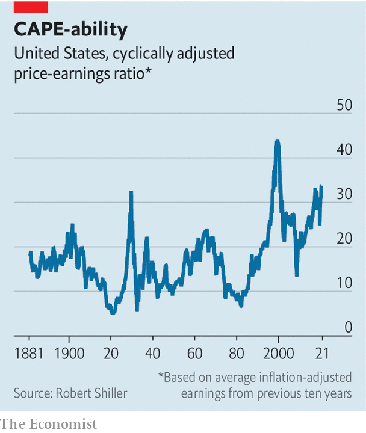

###### Buttonwood

# Why you should ignore the siren call of market timing 

##### Few manage to profitably outwit the herd 

 

> Jan 30th 2021 


HERE IS A sage piece of investment advice you might not usually find in any tip-sheet, newsletter or “thoughtful” weekly column on capital markets. It comes from Will Rogers, a popular entertainer and wit of interwar America, via the writings of Paul Samuelson, a Nobel prizewinning economist and wit of post-war America. Are you ready? Here it is. You should buy stocks when they are going to go up. When they are going to go down, you should sell them.


Nice work if you can get it, quipped Samuelson. It is a shame only a few can. Yet the idea of timing the market—all ups, no downs—remains a seductive one. Anyone who invests in equities has at one time or another fancied they can sell at the top and buy again at the bottom, thus enjoying the return from stocks while avoiding the risks. It seems simple. If stocks are dear and investors look heedless, you should get out of the market. When it falls back, as it surely must, fill your boots.


There is a lot of this thinking around just now. The cyclically adjusted price-earnings (CAPE) ratio, a measure of value constructed by Robert Shiller of Yale University, has rarely been higher. The combination of social media and low-cost trading apps aimed at small investors is behind a lot of herding into faddish stocks, a signifier of toppy markets. In such circumstances it is tempting to try to outwit the herd. But market timing is harder than it looks. Few have the skill, temperament or the focus to do it profitably.

 


Stock prices are noisy. The axiom used to be they are a random walk: their current levels tell us nothing about where they are going. A less purist view has since emerged. This says the earnings yield—the inverse of the CAPE—is a decent guide to the expected returns on equities in the longer run. Put simply, high stock prices now mean lower returns in future. At today’s CAPE, expected returns are well below the long-run average, just as they were in the late 1920s and the late 1990s (see chart).


The sharp-eyed will notice that whenever stock prices have gone up a lot faster than earnings, they tend to fall back again. But would-be market timers could not have known precisely when to sell. It is never obvious that the CAPE is close to a peak or trough. Studies of timing guided by valuation metrics such as the CAPE show disappointing results compared with just buying and holding stocks for the duration. A big problem is selling too early. As Samuelson, who wrote a lot about the perils of timing, once put it: “Anything can be carried on to twice where it has already reached.” When the market does crater, it is not so easy to act. It takes nerve to buy when everyone is selling. Delay seems wise. Prices could always fall again. The fate of many a market-timer is to buy stocks back at higher prices than those at which they sold.


Despite today’s low expected returns, shares still have some appeal, because of the paucity of returns on offer in other asset markets. In the late 1990s, when the CAPE soared above 40, the yield on inflation-protected Treasuries was close to 4%. Today it is -1% on the ten-year bond. If low real rates are the main prop for share prices, then any attempt to time the stockmarket is in essence a bet on the bond market—and, in turn, on how inflation evolves, and how central banks react to it. Good luck with getting those calls right. The forces behind the decades-long decline in real interest rates and quiescent inflation are not well understood even by people who have spent a lot of time thinking about them.


It is hard for most investors to make judgments about whether, when and how quickly these secular trends will go into reverse. Yes, there is something screwy about negative real bond yields. In America they are a novelty. But in Europe and Japan they have lasted for far longer than many people thought possible. Agnosticism about their future path is probably the best policy.


It would be lovely to have ups without downs. But investment rewards generally come with risks. The advice from market-timing sceptics like Samuelson is of the mom-and-apple-pie kind. Sell down your stockholdings to the sleeping point, where you can rest easy at night. Spread your bets widely across stocks and geographies—stockmarkets outside America have lower CAPE ratios and higher expected returns. And remember, timing is a snare. If there were reliable trading signals, everyone would follow them. And then there would be no one to sell to at the top and no one to buy from at the bottom.

