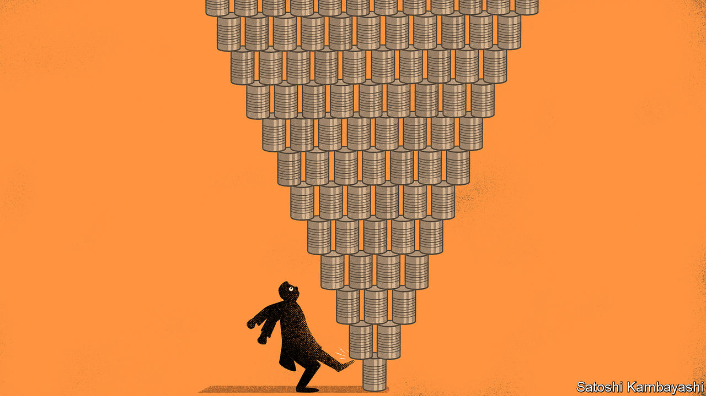
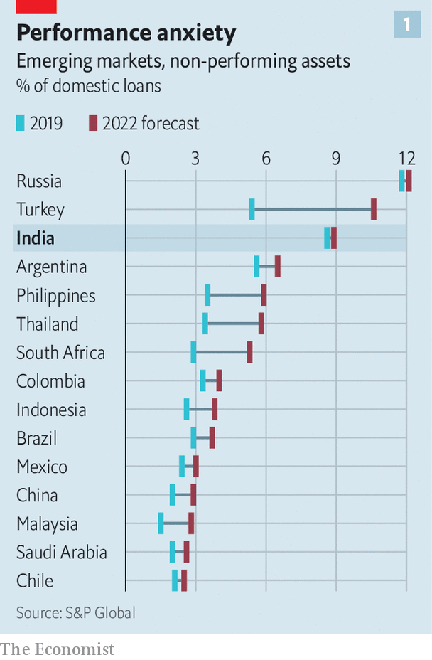
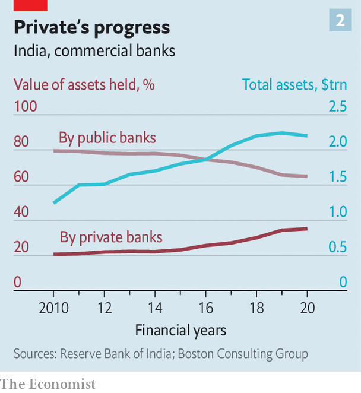
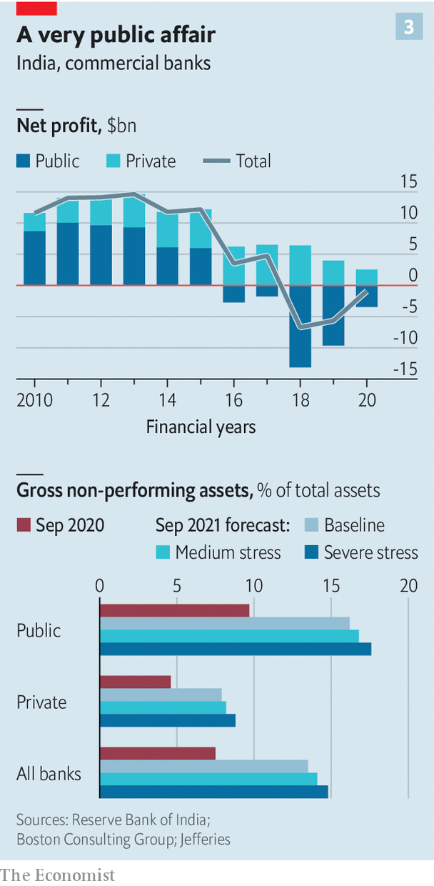

###### The end of the road nears

# Will India’s government act to save its public-sector banks? 

##### Few options are palatable to both the government and investors 

 

> Jan 30th 2021 


CRIPPLED BY YEARS of mismanagement, much of India’s financial system was poorly positioned even before the turmoil of covid-19. S&amp;P, a rating agency, reckons that non-performing assets as a share of loans came close to double digits in 2019—a much higher rate than other big emerging markets, except for Russia (see chart 1). The government’s own straitened finances meant that there was little scope for aid when the crisis struck. Instead, it put off a reckoning while minimising upfront costs. A moratorium that was in place until August let borrowers skip payments and banks pretend they were being paid; another provision allowed loans that would otherwise be placed in default to be restructured.


Banks’ earnings for the final quarter of 2020, which are starting to be released, contain hints of what unfolded after the moratorium ended. Earnings reports from the successful private-sector banks, notably HDFC and Kotak Mahindra, showed tolerable credit losses and strong deposit growth, as perceptions of their strength instilled confidence in customers. The public banks continue to show far higher levels of non-performing loans—and a temporary stay imposed by India’s Supreme Court on classifying borrowers in default means that these are likely to be understated. There are reasons to think that these problems cannot be ignored for much longer.


The widening gap between the private and public banks reflects an acceleration of a long-running trend, says Saurabh Tripathi of BCG, a consultancy. The state lenders, which were nationalised more than half a century ago under the socialist administrations of Jawaharlal Nehru and his daughter, Indira Gandhi, still account for about 60% of all loans. But the handful of privately run banks set up in the 1990s have gained market share (see chart 2), and account for most of the banking system’s innovation and profit (see chart 3). Customers’ enthusiasm for digital banking during the pandemic has only abetted their rise.

 


By contrast, the state banks’ record of poor lending decisions forced the central government to infuse more than $35bn into them between 2015 and 2019—more than it spent on public health in that time. The pandemic has brought more troubles. Plenty of loans went unpaid as a result of the moratorium—fully two-thirds of state banks’ loans in April, compared with a third of domestic private banks’ loans. A chunk of them may never be repaid. The Reserve Bank of India (RBI) projects that 16-17% of public banks’ assets will be classified as non-performing by September this year. That would wipe out even robust institutions. According to the RBI, at least four, and possibly as many as nine, banks will need to be recapitalised.


Keeping these institutions going will require large new infusions of cash. Their size and political importance, in doling out loans to farmers and small firms, means that letting them collapse is unthinkable. But from where is the money to come?

 


Private banks, with their healthy returns and prospects, have been able to draw on overseas investment over the past year. Indeed when Lakshmi Vilas Bank, an old private lender, failed in October, it was bought by Singapore’s DBS Bank. More such deals could happen. But it seems far-fetched to imagine that politicians would let state banks fall into foreign hands—and also, perhaps, that foreigners would want to buy them. Several other options are being discussed—but few are palatable to both investors and the government.

 


One idea, which is rumoured to be on the cards when the government announces its budget on February 1st, is a roll-up of state-owned banks into a holding company, shares and bonds in which would then be sold to the public. This has the advantage of sweeping the banks’ problems into a single, large entity with cohesive management and an unsullied name—all attractive to the government but, without a state guarantee, less so to investors.


Another proposal, from Shaktikanta Das, head of the RBI, is to set up a “bad” bank to absorb the rot on a one-time basis. This would free banks to provide fresh credit, but it would not prevent more bad loans building up. An advisory group within the central bank has also floated the idea of allowing India’s conglomerates to expand into banking, in order to attract private capital. Whatever the benefits, that raises the possibility of tycoons using deposits as a source of cheap funds.


The option deemed most desirable by analysts and bankers is the least politically attractive: a thorough flushing of the system, beginning with bad debts but extending to governance. State banks pay low salaries, frequently change their politically appointed bosses and lend to politically favoured causes. Proper reform would change all this, say through privatisation. That has been beyond recent governments, and the current one seems unlikely to take on the task. But the post-covid state of the banks means something must be done. ■

