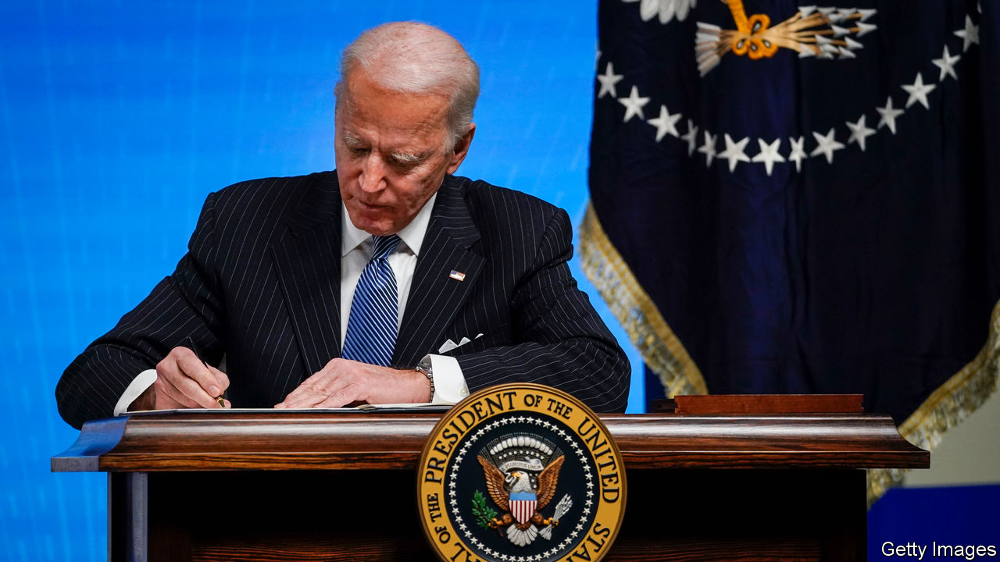

###### The folly of buying local

# Buy American is an economic-policy mistake 

##### President Biden’s protectionism sullies his economic agenda 

 

> Jan 30th 2021 


MODERN PRESIDENTS of the United States do not sit in the Oval Office for long before reaching for the pen. Since entering the White House on January 20th Joe Biden has signed nearly 40 executive orders and proclamations. Many are welcome; some are crucial. He is overturning some of the harshest immigration restrictions imposed by Donald Trump and restoring America’s support of the Paris agreement on climate change (see ). One of Mr Biden’s edicts, however, is an early economic-policy mistake: the tightening of rules obliging America’s federal government to prefer domestic suppliers to foreign ones. It could be a sign of worse errors to come.


The “Buy American” agenda is long-running. A law passed in 1933 requires the federal government to prefer domestically produced goods to foreign ones; it is reinforced by an unwieldy mass of similar state and local rules. The stimulus Mr Biden oversaw as vice-president after the global financial crisis targeted American suppliers with American supply chains. President Trump issued reams of executive orders aiming to favour domestic firms over their foreign competitors. One of his rule changes, which raises the bar for an item to be considered American-made and increases the mark-up over global prices which domestic firms can charge, has still to come into effect.


Mr Biden campaigned on going further than Mr Trump, whom he castigated for not doing enough. It will take more than a stroke of the pen to fulfil that promise. As past administrations have discovered, America’s commitments to the World Trade Organisation (WTO) constrain its ability to discriminate in favour of its own firms (see ). As a result, Mr Biden’s order only fiddles at the margins, confirming Mr Trump’s last changes, giving the White House more oversight of exemptions from the rules and introducing a vague new requirement that Washington’s purchases should promote employment.


Yet the president has the support in Congress to go further if he wants to. He has promised a diplomatic effort to modernise—code for weaken—the WTO rules. And they can in any case be circumvented by sending money to states and attaching conditions on how they spend it, which is how the Democrats might structure their stimulus and infrastructure spending.


Presidents and voters like Buy American because they think it creates jobs. In a direct sense, it does. But by locking firms out of global supply chains and shielding them from competition it promotes inefficiency, destroying more employment than it creates. By one estimate America would gain a net 300,000 jobs if it got rid of its local-content rules.


There is no evidence that buying at home boosts innovation either, whatever its advocates might claim. In fact, it almost certainly hampers productivity increases in the long term. And coddling local firms is a raw deal for taxpayers. From February American firms will be able to charge their government up to 20% more than prevailing global prices.


Perhaps the sturdiest economic rationale for buying local is that it stops the short-term stimulatory effect of new spending—of which Mr Biden is planning a lot—from leaking overseas. But that should not be a big concern for America in 2021 because its stimulus is so enormous. Were Mr Biden’s $1.9trn spending proposal to pass, it would take America’s cumulative pandemic spending to more than a quarter of its pre-crisis GDP (before considering the additional effects of any infrastructure bill). America can afford a little leakage. In any case, the lesson from 2009 is that requirements to buy American hamper stimulus by forcing firms to look for new suppliers before they can start projects. It is not encouraging that Mr Biden’s order will make it still harder to obtain exemptions from the existing mountain of red tape.


It is a relief that, unlike Mr Trump, Mr Biden supports the rules-based system of global trade. He will not sabotage the WTO or go out of his way to antagonise America’s allies, whom he wants to rally against China. But his soft protectionism—which, thanks to the Trumpification of the Republican Party, is more popular in Congress than it has been in decades—will rankle the outside world; the European Union, which recently reached an investment agreement with China, is already bristling at his executive order. In his instincts about the economics of trade, America’s new president is not so different from his predecessor. That is bad news for America and for the world. ■

