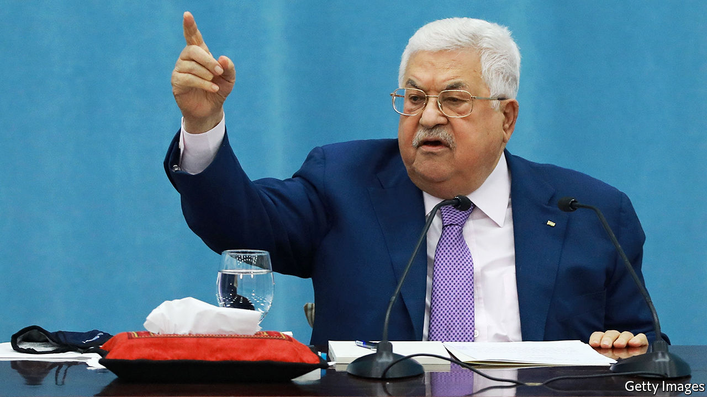

###### Time for Abbas to retire

# New leadership is needed in the West Bank and Gaza 

##### The Palestinians deserve better than Fatah and Hamas 

 

> Jan 28th 2021 


MAHMOUD ABBAS really knows how to show Israel the stuff he is made of. When the Israeli prime minister, Binyamin Netanyahu, mulled annexing parts of the West Bank last year, the Palestinian president stopped accepting transfers of tax revenue that Israel collects on behalf of the Palestinian Authority (PA). The move left the PA short of hundreds of millions of dollars and forced tens of thousands of civil servants to take salary cuts. Yet even after Israel suspended talk of annexation in August, Mr Abbas persisted with his protest. Only in November, facing a self-inflicted cash crunch, did he quietly relent.


This is what passes for leadership in the occupied territories. Though Israel bears much blame for the suffering of its neighbours, the pain is compounded by the self-defeating policies of Palestinian leaders. The stubborn men who rule the West Bank and Gaza often seem more concerned with preserving their own power than with improving their people’s lives (see ). Palestinians deserve better.


True, the PA, which runs the West Bank, has been making some more encouraging noises of late. It has resumed co-operating with Israel on security and plans to reform its policy of giving money to the families of Palestinians whom Israel jails for such things as murdering Israelis—which American politicians tastelessly call “pay for slay”. Most important, Mr Abbas has announced that legislative and presidential elections will be held in May and July, after 15 years without a vote.


But can anyone trust Mr Abbas? He is in the 17th year of a four-year term as president. He has announced elections before, only to call them off. If they do take place, they will probably be a stitch-up between Fatah, Mr Abbas’s party, and Hamas, the militant Islamist group that runs Gaza. The past decade and a half has shown that neither is fit to govern.


The last time the Palestinians went to the polls, in 2006, Hamas beat Fatah in legislative elections. That led to a civil war which left Hamas in control of Gaza. The militants have since turned the territory into a corrupt, oppressive and miserable one-party state. They blame Israel’s blockade of Gaza for the fact that jobs, electricity and drinking water are scarce, which is fair enough. But it is the militants who hog precious resources and store weapons on civilian sites, making them targets. Their attacks on Israel achieve little besides prolonging their own people’s misery.


Things are better in the West Bank, but not much. It too resembles a one-party state, under Fatah. Mr Abbas rules by decree, with no hint of accountability. Though he is 85, he refuses to groom a successor, lest it speed his long-overdue departure. The president and his geriatric coterie of loyalists inspire little confidence, even from putative allies. “With those people, it’s hard to trust them or to think you can do something to serve Palestine in their presence,” said Prince Bandar bin Sultan, a former Saudi spy chief, on Saudi television last year.


Israel, to its shame, fosters Palestinian dysfunction. Its blockade of Gaza, with Egypt’s co-operation, has turned the territory into what many see as “an open-air prison”. Mr Netanyahu shows no interest in a fair peace deal. Nor do any of the contenders vying to replace him in an election scheduled for March. A popular rival, Gideon Sa’ar, has called the two-state solution an “illusion”. No wonder a sizeable number of Palestinians favour confronting Israel through armed intifada.


Israel, however, is not to blame for the failure of Fatah and Hamas to reconcile with each other. Nor is its blockade the only reason life is so grim for Palestinians. Their own leaders have failed them. In the midst of a pandemic, they have not bothered to ask Israel to share its supply of covid-19 vaccines. President Joe Biden has promised to renew aid to the Palestinians and restore diplomatic ties (broken by Donald Trump), but he can or will do only so much for them while they have such awful leaders.


Mr Abbas and his counterparts in Hamas should step aside for fresher, less tainted faces. Ordinary Palestinians should have a free, fair chance to pick a new government. There is no guarantee that this will make things better. Opinion polls are unclear and many voters still find militancy appealing. But there is little chance of meaningful reform unless today’s leaders step down. Voters should be allowed to choose a new government, and to sack it after four years if it blunders. ■

