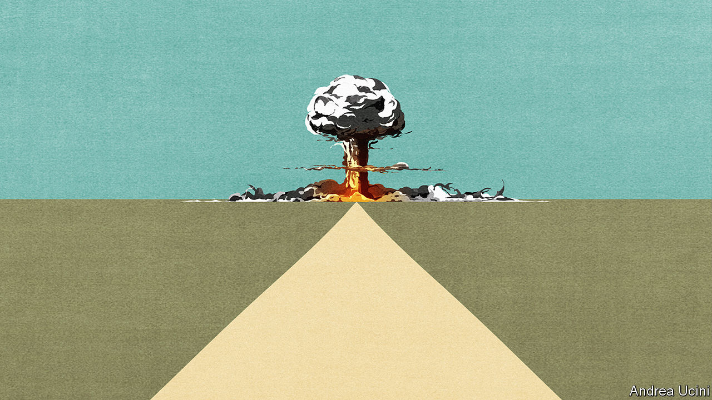

###### Arms control

# The world is facing an upsurge of nuclear proliferation 

##### To stop it, the nuclear powers need to act 

 

> Jan 30th 2021 


THIRTY-ONE countries, from Brazil to Sweden, have flirted with nuclear weapons at one time or another. Seventeen launched a formal weapons programme. Just ten produced a deliverable bomb. Today nine states possess nuclear arms, no more than a quarter-century ago. Yet the long struggle to stop the world’s deadliest weapons from spreading is about to get harder.


In the past 20 years most countries with nuclear ambitions have been geopolitical minnows, like Libya and Syria. In the next decade the threat is likely to include economic and diplomatic heavyweights whose ambitions would be harder to restrain. China’s rapidly increasing regional dominance and North Korea’s growing nuclear arsenal haunt South Korea and Japan, two of Asia’s largest powers. Iran’s belligerence and its nuclear programme loom over the likes of Saudi Arabia and Turkey (see ). Proliferation is not a chain reaction, but it is contagious. Once the restraints start to weaken they can fail rapidly.


The nuclear omens are bad. Arms control between America and Russia, which saw cuts of 38,000 warheads—a 79% fall—in 1991-2010, has dwindled. On January 26th Presidents Joe Biden and Vladimir Putin agreed to extend the last remaining pact, the New START treaty, for five years. That is welcome, but prospects for a follow-on are dim. China, India, North Korea and Pakistan are all expanding and modernising their nuclear forces. There is dismal progress towards global disarmament, the ultimate aim of the Non-Proliferation Treaty (NPT), the cornerstone of the nuclear order. A new treaty banning the bomb, which was signed by 86 countries and came into force on January 22nd, channels the frustration among nuclear have-nots. It accomplishes little else.


If nuclear weapons are not going away, and security threats are worsening, some states will be tempted to pursue a bomb of their own. In decades past America kept nuclear aspirants in line, threatening to withdraw security guarantees from errant friends, like Taiwan, and using sanctions and military force to dissuade enemies, such as Iraq. Yet the currency of American power is weaker today. Donald Trump’s tempestuous term has sown doubts about America’s appetite to defend allies and enforce rules. They will linger, however much Mr Biden seeks to restore an orthodox foreign policy.


Consider the nuclear umbrella that America extends over Asian allies. It amounts to a promise that, should North Korea or China strike Seoul or Tokyo, America would retaliate against Pyongyang or Beijing. For decades, America could issue that threat confident that its own cities were out of range of North Korean missiles. Now they are not. An American strike on Pyongyang would put San Francisco at risk. That may make Mr Biden reluctant to act—a calculation that could embolden Kim Jong Un to attack Seoul. No wonder that, particularly in times of crisis, most South Koreans say that they would like to see a return of the American tactical nuclear weapons withdrawn from their soil in 1991 or, failing that, an indigenous South Korean bomb.


In democracies like South Korea, Japan and Taiwan, nuclear ambitions are tempered by political reality. The Middle East is different. The nuclear deal curtailing Iran’s nuclear programme is collapsing. Even if Mr Biden revives it, many of its provisions expire in a decade. Should Iran at any time look as if it is contemplating going nuclear, Saudi Arabia will not want to fall behind. Muhammad bin Salman, the Saudi crown prince, has few domestic checks on his authority and ambitious plans for nuclear technology. Turkey could well follow.


If the nuclear order starts to unravel, it will be almost impossible to stop. Hence the importance of acting today. America, China, Europe and Russia share an interest in stopping proliferation. Russia does not want a nuclear Iran any more than America does. The prospect of a nuclear-armed Japan would be among China’s worst nightmares. The Iranian nuclear deal in 2015 showed that rivals can muster a response to proliferation.


Listen on:  |  |  |  | 


The nuclear states should start with the basics. America and Russia still have 90% of the world’s nuclear warheads, so any effort begins with them. Now that New START will be extended, they should begin work on a successor that would include other weapons, such as hypersonic gliders and lower-yield warheads, which Russia has in abundance. More radical ideas should also be discussed. America operates a triad of nuclear forces: silos on land, submarines at sea and bombers in the air. Retiring the land-based missiles would demonstrate genuine progress towards disarmament, without eroding deterrence.


Arms control between America and Russia might persuade China that its existing arsenal could survive an attack, helping avoid a destabilising surge in its forces. Chinese restraint would, in turn, reassure India and Pakistan.


America’s most important role in calming nerves over North Korea and Iran remains its value as an ally, and here Mr Biden has already promised to repair ties. Even if one presidency is not enough to restore confidence completely, Mr Biden should make a start by reaffirming and strengthening America’s nuclear umbrella over Japan and South Korea. That includes the role of American troops on the ground, who serve not only as a line of defence but also as an assurance to allies and a warning to enemies that America could not sit out a conflict.


Stopping proliferation also requires spotting it. Intelligence agencies have understandably focused on the familiar gallery of rogues, like Iran. Their gaze should widen to include early warning of shifts in nuclear technology, public opinion and political intentions in such places as South Korea or Turkey. The International Atomic Energy Agency, the world’s nuclear watchdog, does a commendable job of monitoring civilian nuclear sites and policing Iran’s programme with the strongest inspections regime ever instituted. Yet the agency is overburdened and underfunded, and needs to keep up with technological change.

Heed the doomsday alarm clock


The world has plenty on its mind. Even so, it cannot afford to downplay the dangers of nuclear proliferation. Today’s nuclear diplomacy may seem a slog, but it is as nothing compared with the lethal instabilities that arise whenever regional nuclear-armed rivals confront each other. There is no time to lose. ■

