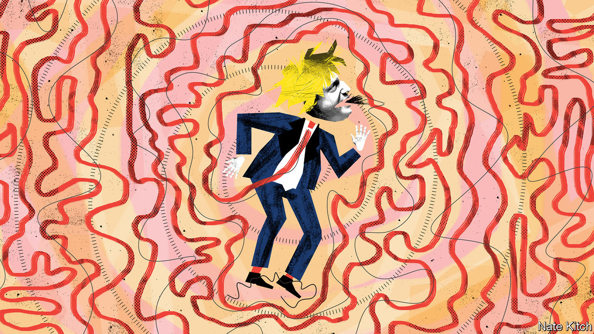
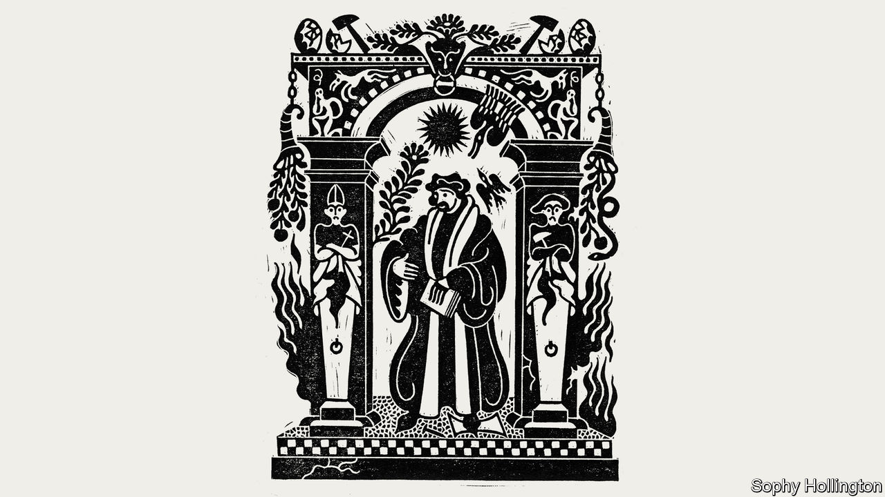

###### On Donald Trump, Lincolnshire, Switzerland, Erasmus

# Letters to the editor 

##### A selection of correspondence 

> Jan 30th 2021 


 


January 6th and all that


Donald Trump did not whip up the mob that stormed the Capitol building (, January 16th). During his speech near the White House he urged his followers to cheer on members of Congress who were objecting to and debating the electoral-college count (Democrats in the House of Representatives also disputed the count following the 2000 and 2004 general elections). Never did Mr Trump call for violence, or tell his supporters to storm Congress. Condemning the entire rally as an insurrection ignores the fact that the vast majority of the people there were exercising their constitutional rights to assembly and speech.


Extremists who show up to rallies are not part of the wider movement. Last year, while cities across America burned and were looted, we were lectured about not blaming the “peaceful” protests for the criminal actions of the rioting crowds. True supporters of Mr Trump denounced the violence, just as they did in places like Kenosha, Minneapolis, Portland and Seattle. Many Democrats can make no such claim. Nancy Pelosi actually described law enforcement officers who were defending a courthouse under constant siege as “storm troopers”. Some in her party openly called for unrest. Did The Economist denounce those politicians? Have their social-media accounts also been closed down?


Violence to bring about political change is never justified. Extremism on both the left and right should be condemned.


D. CHARLES BOGAN

Santa Fe, New Mexico


You raised the possibility that the Supreme Court may have to determine whether Mr Trump’s impeachment trial and possible conviction are valid, now that he has left office.


Maybe. But in the early 1990s, Walter Nixon, an impeached federal judge, sought a judicial review of the process by which the Senate had convicted him. William Rehnquist’s opinion for the court in 1993, joined by Clarence Thomas, noted the absence “of a single word in the history of the constitutional convention or in contemporary commentary that even alludes to the possibility of judicial review in the context of the impeachment powers.” The opinion included the broad statement that “judicial review would be inconsistent with the Framers’ insistence that our system be one of checks and balances.”


Mr Trump’s lawyers could make arguments that his case was distinguishable. However, they would be facing strong headwinds.


THOMAS D. ROWE, JR

Professor of law emeritus

Duke University

Durham, North Carolina

 


 (January 16th) proffered Plato’s “Republic” as a meditation on the evils of mob rule. As an alternative, I would suggest Plato’s earlier “Gorgias”. It examines the politics of manipulation and the skills of persuasion and lying. Unlike the “Republic” it has no uplifting conclusions. It ends with a bitter unresolved argument between Socrates and Callicles, a young ambitious Athenian aristocrat who argues that “the strong” should rule over the “weak masses” with “charms and incantations”.


“Gorgias” has the virtue of being a brilliant dissection not of the mob but of the motivations, techniques and dangers of people who would exploit the “many-headed-monster” for their own power, wealth and ego. Dealing with that situation would seem to be the real challenge of this particular moment.


M. MACKENZIE

Montreal


I am disappointed that a publication of your erudition feels the need to use the informal “mobocracy”, when a perfectly good word, “ochlocracy”, already exists.


COLIN MCCALLISTER

St Andrews, Fife

 


The missing cabbages


Your article on private art collectors in Britain raised various issues, but the concluding lines were peculiarly revealing of a metropolitan bias (, January 16th). It is not just that much of the Willoughby de Eresby art collection has anyway been on show, or that the Lincolnshire “flatlands” are also home to the paintings at Belvoir and Belton, and other kinds of “culture” besides. But that if you walk in the extensive and “undulating” grounds of Grimsthorpe Castle, you never catch even a glimpse of a cabbage, a vegetable which, you say, the surrounding land is “rich in”.


PENELOPE CURTIS

London

 


A business backwater


You were spot-on about the prospect of “an eternity of negotiations” with the European Union that awaits Britain, as experienced here in Switzerland (, January 2nd). In 1990, 60% of America’s top 20 companies based their European headquarters here (Dow, DuPont, General Motors, Hewlett-Packard, IBM and so on). Then in 1992 Swiss voters voted against joining the extended European Community (the Norwegian option).


Roll the clock forward and only one of the 20 most-valuable American companies has its headquarters here. Dow, IBM and others have stuck around, but have declined in relevance. Others gradually left or were absorbed. The Swiss American Chamber of Commerce has become a kind of museum.


The most vibrant companies, such as Airbnb, Amazon, Apple, Fanuc, Samsung, Stripe, Snowflake and Uniqlo, chose not to come here. Instead they went to Amsterdam, Dublin, and London. They will not return to Switzerland without unequivocal access to the second-most important market in the world. Though the decline has been imperceptible, it has left a void in the Swiss economy more measurable in loss of potential than productivity. The next big thing in artificial intelligence, payments, or internet sharing will not be spawned in Switzerland because there is no mothership to spin it off.


I suspect the case will be similar for Britain. The grass grows more quickly and quietly than we think. If a country is unable to attract promising technologies and competitive companies, if it cannot provide them with free access to markets and talent, how can it remain vibrant and prosperous? Museums don’t produce many high-paying jobs.


R. JAMES BREIDING

Zurich

 


A man for all seasons


Your appreciation of Desiderius Erasmus was timely (, December 19th). Described by Diarmaid MacCulloch as “the patron saint of networkers, as well as of freelance writers”, a time-travelling Erasmus might easily find his bearings in today’s Europe. The covid crisis would be eerily familiar to him, having lost his parents to the plague. So would the anti-vaxxers and conspiracy theorists in their resemblance to medieval quacks. But observing scientific efforts to tackle humanity’s pressing problems, he’d find himself vindicated in his belief in the reasoning faculties of the human mind.


CHRISTOPHER STEHBERGER

Traunstein, Germany


Erasmus would have loved the fabled moderate chant of English protesters: “What do we want?” “Gradual change!” “When do we want it?” “In due course!”


RICHARD WAUGAMAN

Clinical professor of psychiatry

Georgetown University

Washington, DC

