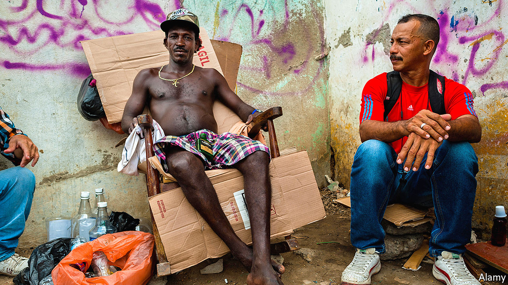

###### Bootleg bonanza

# Thanks to Colombia’s state liquor monopoly, a black market is booming 

##### The big winners are criminal combos 

 

> Jan 28th 2021 


ROGELIO GUTIéRREZ, who lives in Castilla, a violent area of northern Medellín, chugs a bottle of chirrinchi, a mix of alcohol, water and sugar, every day. He earns the money to buy it by guarding tables and chairs at a food stall when it is closed in the mornings. At noon the 76-year-old, whose vision is clouded by cataracts, slowly walks three blocks to a green house. He hands 5,000 pesos ($1.40) to a man sitting on the pavement. The man enters the house and returns with a black plastic bag. Mr Gutiérrez (not his real name) clasps it to his chest, walks five blocks and settles down underneath a pedestrian bridge. He pulls out the bottle and stares at it. He cannot see the sediment in the colourless liquid.


In the green house is Mr Gutiérrez’s favourite alambique, or maker of bootleg liquor. Medellín’s northern neighbourhoods have thousands, each controlled by a combo (criminal gang). The chirrinchi he drinks is the lowest grade of liquor you can buy in Medellín. Alambiques also produce counterfeit aguardiente, an aniseed-flavoured spirit served at every Colombian festivity. Some also make rum and whisky. Each combo controls not just the alambiques in their territories but also the bars and shops that sell fake and smuggled alcohol. In Castilla it is hard to find a legal bottle of spirits.


Medellín, Colombia’s second-largest city and the capital of the department of Antioquia, is the country’s centre of bootleg booze. But the problem is widespread. The alambiques on the outskirts of Villavicencio, in the eastern plains, are run by FARC guerrillas who rejected a peace deal with the government signed in 2016. A study by Daniel Rico, director of C-Analysis, a consultancy that advises governments and firms on how to counter criminal enterprises, says half of the alcohol sold in some cities is illegal.


While the government combats bootlegging, its policies encourage it. Chief among them is the state’s monopoly on distilling and selling spirits. In the 1700s the Spanish crown, keen to cash in on colonials’ quaffing, took control of the production of aguardiente (which Spaniards had brought to South America). Colombia’s government held on after independence in 1819. The monopoly is enshrined in constitutions adopted since 1886. In the 20th century the government transferred it to the 32 semi-autonomous regions, which have fewer sources of revenue.


The monopoly gives departments the right to be the sole producers of spirits within their borders. They can choose to allow for sale only their own brands of aguardiente, which they can produce themselves or buy from manufacturers owned by other departments. Huila, in the south-west, outsources production of its aguardiente, Doble Anís, to Antioquia. Departments can also impose taxes and fees on imported brands. An example is Cundinamarca, whose capital is Bogotá. The monopoly provides more than a third of departments’ income.


Legal booze is thus expensive. A bottle of Antioqueño, Antioquia’s aguardiente, costs around 40,000 pesos. Unsurprisingly, the combos undercut legitimate liquor.


Unlike drug-traffickers’ inputs, the components of bootleg aguardiente are cheap and easy to get. Alambiques’ equipment consists of a bucket or similar vessel, and a hose. Colombia imports most of its alcohol, the raw material, from Ecuador, where it is cheaper. The government does not keep track of such imports. Buyers within Colombia can get it from Mercado Libre, an online marketplace, or from manufacturers of perfume. Some alambiques in Castilla buy it from El Arriero, a store in central Medellín that sells aromatherapy oils. Some alcohol comes from workers at the departments’ manufacturers, who sell it to combos on the sly.


Waste pickers provide the bottles. They sell the discards they find outside bars to “recycling companies’’, which clean and resell them to the combos. Hundreds of shops that cater to alambiques crowd the pavements of northern Medellín with sacks of clean empties, bearing the labels of Antioqueño and Old Parr and Buchanan’s whiskies. They cost the combos no more than 500 pesos apiece. Alambiques keep them empty for as long as possible. If the police discover them no crime has taken place, says a former official who investigated the bootleg market in Medellín.


Alambiques are busiest on weekend nights. Their mixologists prepare whatever the local bars demand. The recipe for aguardiente is simple: two parts tap water to one part alcohol plus some aniseed essence (also available from El Arriero). Whisky is more complicated. Mixologists infuse alcohol with woody flavour by soaking in it a stocking filled with sawdust, says Mr Rico. Hygiene is not a priority. Paint cans and toilets serve as mixing vats.


Alambiques move every few days to avoid detection. Some take up temporary residence in houses or shops, whose occupants get paid. In Medellín’s fourth comuna, the quarter that abuts Castilla, residents could be seen leaving a fried-chicken restaurant with plastic bags full of liquor bottles, not wings or drumsticks.


At least 26 people died in 2020 from drinking adulterated alcohol, reports Mr Rico’s study. Although combos sometimes use methanol, which can cause blindness and death, they increasingly use potable ethanol to avoid attracting attention. Colombia has too few police to dismantle the thousands of alambiques in Medellín, Bogotá and other cities. Local and department officials take bribes to reopen bars that police shut down for selling illegal booze.


Mr Gutiérrez does not mind that the chirrinchi he drinks is illegal. He could not afford it otherwise, he says. But the dodgy drinks industry, which is encouraged by Colombia’s antiquated monopolies, is putting his health at risk. The combos, by contrast, are thriving.■

