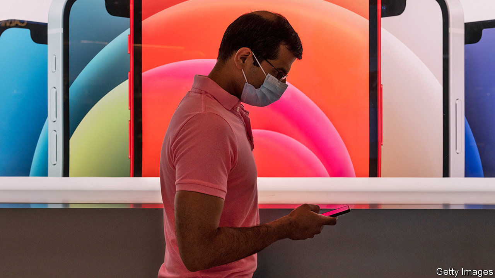
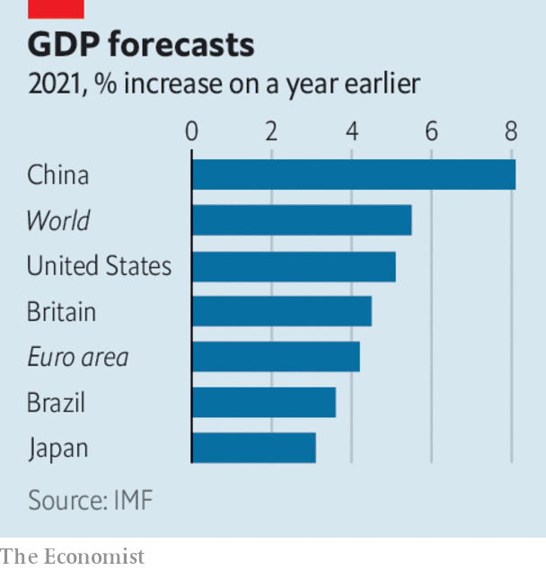

###### 

# Business this week 

#####  

 

> Jan 28th 2021 


America’s tech giants reported quarterly earnings. Apple smashed analysts’ expectations, reporting record revenue of $111.4bn and a net profit of $28.8bn. Sales rose across all regions—the biggest gains were from China—and across all of Apple’s products and services. Revenues from the iPhone, which have waned in recent years, were up by 17% year on year. See .


Facebook also reported record quarterly revenues. Tesla made its first-ever annual net profit, of $721m.

Home office reform


Satya Nadella, Microsoft’s chief executive, described the switch to home working and attendant need for cloud computing as a “structural change” that would outlive the pandemic. Revenue from the company’s Azure cloud platform helped push quarterly net profit to $15.5bn, up by a third year on year.


An ever-louder buzz surrounded the forthcoming IPO of Kuaishou, the closest rival to TikTok (known as Douyin in China). The Chinese firm’s flotation in Hong Kong may be the biggest tech IPO since Uber.


Solid revenues from investment banking and wealth management underpinned a rise of 54% in annual net profit at UBS, to $6.6bn. The Swiss bank announced a big share buy-back programme.


Andrea Orcel was appointed chief executive of UniCredit, Italy’s biggest bank. One of Europe’s best-known bankers, Mr Orcel is close to reaching a settlement with Santander, Spain’s biggest lender, for withdrawing its commitment to hire him as its CEO.


The American Treasury delayed until May 27th the date from which Americans are barred from investing in firms with alleged ties to China’s military. It is reviewing the list complied by the Pentagon under Donald Trump.


Boeing reported an annual net loss of almost $12bn. It also delayed deliveries of its new 777X jet until late 2023. Its 737 MAX aircraft has only recently been cleared for take-off (Britain and the EU did so this week) after a 20-month grounding. See .

 


The IMF increased its estimate of global GDP growth this year, to 5.5%. It urged countries to co-operate across all regions and income levels to bring covid-19 under control. The fund thinks that making vaccines widely available, along with other measures, could bring local transmission down to safe levels everywhere by the end of 2022.


Merck decided not to proceed with production of a covid-19 vaccine, following disappointing results from clinical experiments. Meanwhile, Johnson &amp; Johnson was close to announcing the efficacy data for the vaccine it has developed, which could be a single-dose jab, a potential game-changer in many countries’ inoculation programmes.


BlackRock beefed up its green strategy. The world’s biggest fund manager is now asking the companies it invests in to show how they would comply with a “global aspiration” of net zero greenhouse-gas emissions by 2050. If any of its holdings in an actively managed portfolio “pose significant climate risk”, they will be flagged for sale.


Shell agreed to buy Ubitricity, the biggest provider in Britain of street charging points for electric cars, such as those in lampposts. The energy company, which already operates fast-charging points in petrol stations, is investing heavily in smart-mobility infrastructure.


The share price of AMC, the world’s biggest cinema chain, jumped by 300% after speculators bet it had enough funding to survive the next year. Underlining the disruptive effect of streaming on film-viewing habits, AT&amp;T wrote down the value of its pay-TV business by $15.5bn, as subscribers continued to abandon the service.


A Swiss court sentenced Beny Steinmetz to five years in prison, after he and two colleagues were convicted of paying bribes to the wife of a former president of Guinea in order to gain rights to explore for iron-ore deposits. The complex case stretches back over a decade, to when the mining group owned by Mr Steinmetz’s family obtained the rights. Multinational mining companies have also been ensnared in related corruption charges. Mr Steinmetz will appeal against his conviction (it is unlikely that he will serve any actual time). See .

No longer being served


The doors of Debenhams department stores in Britain are to be shut for ever, as a deal emerged to buy the distressed company’s name and associated brands. Boohoo, an online retailer, has snapped up the assets, but does not want the stores. Separately Asos, another online outfit, is negotiating the acquisition of Arcadia’s brands, which include Topshop and Miss Selfridge, and also does not want to buy any shops. Both high-street retailers were in trouble long before covid-19 came along; lockdowns only compounded their problems.

