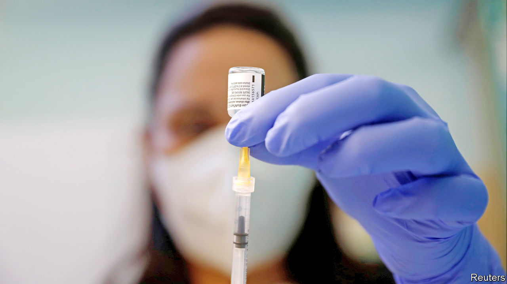
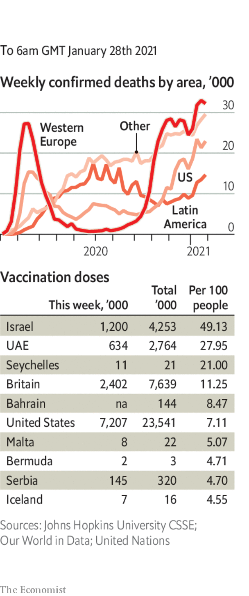

###### 

# Politics this week 

#####  

 

> Jan 28th 2021 


The spectre of vaccine nationalism stalked Europe as a row erupted between Britain and the European Commission over supply of the AstraZeneca-Oxford vaccine. Because of manufacturing problems at one of its European factories, AstraZeneca has said it will deliver less to the EU than it had planned in the coming months. The commission wants some of the shortfall to be made up with vaccine allotted for Britain. That risks breaching contractual obligations. But there are threats from the EU that if AstraZeneca does not agree, then supplies to Britain of other vaccines made in Europe, in particular the Pfizer jab, may be affected. See .


Large protests took place in Moscow and many other Russian cities, following the arrest of Russia’s leading opposition figure, Alexei Navalny. There were thousands of arrests. More rallies are planned. The situation may come to a head when Mr Navalny appears in court on February 2nd. See .


Giuseppe Conte, the prime minister of Italy, tendered his resignation after losing his majority in the Senate. The country’s president, Sergio Mattarella, embarked on a round of consultations to see if a new government can be formed, under Mr Conte or someone else. If not, a snap election may have to be called, though this will be the president’s last resort. See . 


Rioting broke out across the Netherlands after the government imposed a national curfew, the first since the Nazi occupation, to curb the spread of covid-19. Shops were looted and cars set on fire.


In Mali, French and Malian troops have killed more than 100 jihadists this month during an offensive in the north of the country. Mali has been battling jihadists since 2012.


Muhammadu Buhari, the president of Nigeria, replaced the country’s highest military leaders amid mounting criticism of his government’s response to a jihadist insurgency in the north-east.


Three senior government officials in Zimbabwe died after contracting covid-19. Among them was Sibusiso Moyo, the foreign minister, who became the face of a coup in 2017 that toppled Robert Mugabe. In Tanzania President John Magufuli falsely described covid-19 vaccines as dangerous and instructed his government not to rush to order them.


The Biden administration announced that it would restore diplomatic relations with the Palestinians and resume sending aid, reversing Donald Trump’s punitive approach. The new government also reaffirmed America’s support for a two-state solution to the conflict between Israel and the Palestinians. See .


Protests continued in Tunisia. Demonstrators are angry about a lack of jobs and police brutality. The parliament approved a cabinet reshuffle aimed at calming the unrest, but President Kais Saied indicated that he would reject the new ministers, saying some have conflicts of interest and noting the absence of women.


Canada’s governor-general, Julie Payette, resigned after allegations that she had verbally abused her employees. Ms Payette, a former astronaut, was the Canadian representative of Queen Elizabeth, Canada’s head of state.


The FARC, which fought a 52-year guerrilla war against the Colombian state until 2016 and then became a political party, changed its name to the Common People’s Party, or Comunes. Many Colombians blame the group for a war that killed perhaps 220,000 and displaced 7m. Comunes will be “the party of peace, reconciliation and love for life”, tweeted its spokesman.


Carlos Holmes Trujillo, Colombia’s defence minister, died with covid-19. He was seen as a possible successor to the president, Iván Duque. Mexico’s president, Andrés Manuel López Obrador, and the country’s richest man, Carlos Slim, also contracted the disease.


Chinese and Indian troops again clashed on the border between the two countries, in the Indian state of Sikkim. Last year the two sides skirmished repeatedly on the fringes of the Indian part of Kashmir.


Farmers protesting against free-market reforms stormed the Red Fort in Delhi, prompting widespread condemnation. Hundreds of thousands of protesters have been camped around India’s capital city since November. See .


The prime minister of Mongolia resigned after protests against the treatment of a new mother with covid-19 at a government hospital, and over the broader handling of the pandemic. A close ally from the ruling Mongolian People’s Party has taken the job. See .


Only five Republican senators joined Democrats in a vote that will allow the impeachment trial of Donald Trump to proceed. The lack of support from Republicans suggests that the two-thirds majority required in the Senate for a conviction does not exist. The trial is due to start on February 9th. See .


Mr Biden issued more executive orders overturning the edicts of Mr Trump. Among them was a reversal of a ban on transgender people from serving in the armed forces. The president also signed a series of actions to improve “equity” in policing, prisons and public housing. See .

Coronavirus briefs

 


The cumulative number of recorded infections worldwide reached 100m. The true figure is thought to be much higher.


In Britain the recorded death toll passed 100,000, the world’s fifth-highest and far ahead of other European nations. England’s lockdown will last until at least March 8th. Restrictions at the country’s borders were tightened.


With infections falling, Cyprus is to ease its lockdown, allowing schools to reopen on February 8th.


The White House banned non-American travellers from South Africa, where a virulent strain of the disease has been discovered, from entering the United States.


The International Olympic Committee said that the postponed games in Tokyo, scheduled to start on July 23rd, will definitely go ahead.

