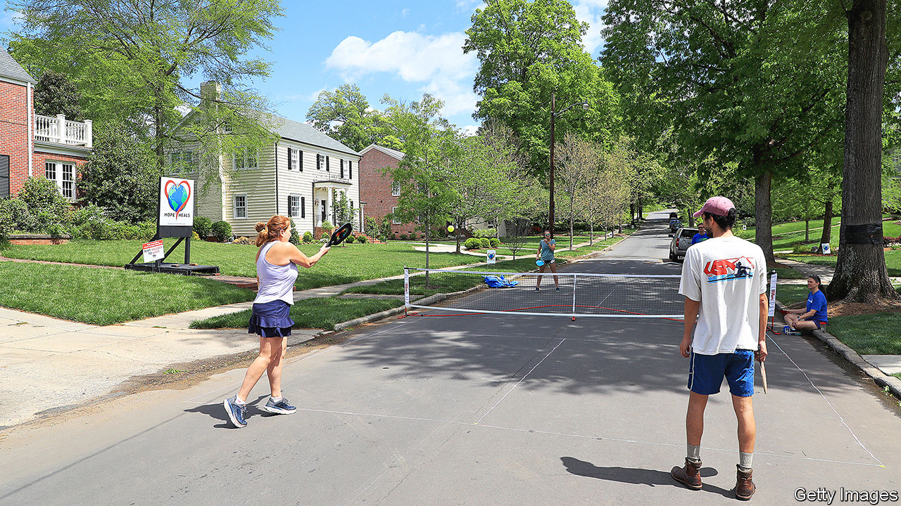

###### The new, old thing

# Pickleball is the fastest-growing sport in America 

##### But it has kept a low profile 

 

> Jan 30th 2021 


IN 1965 THREE fathers in Washington state faced a dilemma familiar to beleaguered parents in 2021: how to keep their restless children entertained. They threw together wooden paddles, a badminton net, and a perforated plastic ball. The sport “pickleball” was born, deriving its name—according to one legend—from a dog named Pickle, which kept running away with the ball.


Today pickleball, which is a hybrid of tennis, badminton and ping-pong, is the fastest-growing sport in America. In the five years to the end of 2019, pickleball participation grew by more than 7%, while Americans’ overall activity level stayed flat, according to the Sport &amp; Fitness Industry Association. Although data from 2020 have not yet been released, the sport has picked up more swing thanks to covid-19. Last March, when quarantines went into effect and gyms closed, portable pickleball nets temporarily sold out. Players set up courts, which are half the size of tennis courts, in driveways. “It’s the new thing,” says Derek Heil, an employee at Dick’s Sporting Goods in Dallas, who has seen a sales spike for pickleball equipment over the last year, including for higher-end paddles which sell for around $100.


The 3.5m Americans who play pickleball are about one-tenth the number who golf and one-fifth the number who play tennis. Yet there are reasons to bet on the sport’s spread. Like many outdoor activities, pickleball is social, but it is easier to learn than tennis and faster and less expensive than golf. Country clubs and recreation centres across the country are converting some of their tennis courts into pickleball courts to meet demand. The more places there are to play, the more players will try the sport.


Hoping to predict where the ball is going to land, manufacturers of tennis racquets are starting to make pickleball kit too. “Pickleball was seen as a threat in the tennis community,” says Stu Upson of USA Pickleball, the sport’s national governing body, who used to work for the International Tennis Hall of Fame. But now, he insists, it is viewed as an opportunity. Tennis pros are adding pickleball lessons to their repertoire. As more people take up the sport, demand for televised matches and sponsorships will increase. Mr Upson hopes that one day pickleball will become an Olympic sport, although that may be a long shot.

