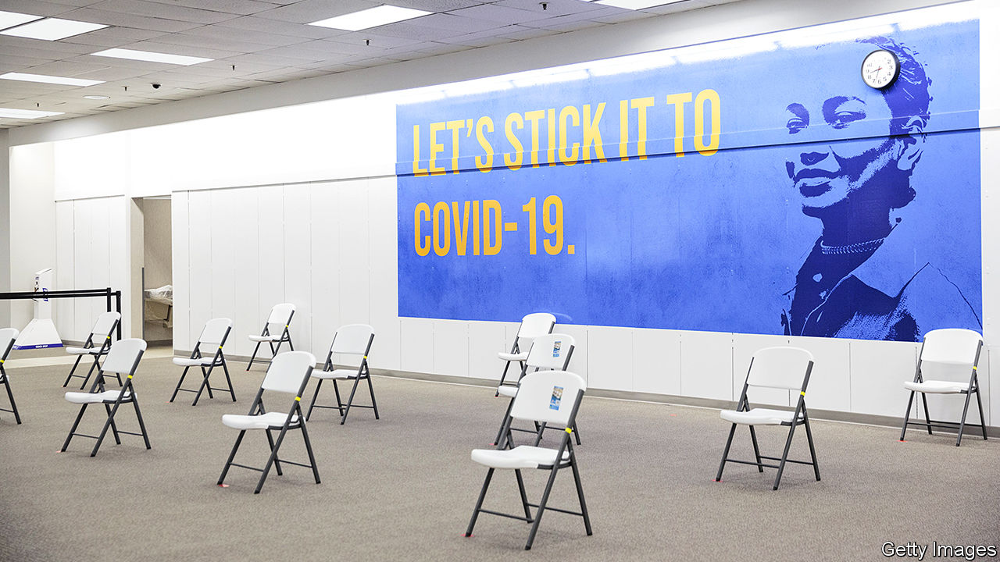

###### Access denied

# Racial minorities in America are much more vaccine hesitant 

##### That need not be such a hurdle to getting Americans vaccinated once their access to the vaccine improves 

 

> Jan 30th 2021 


THE BIDEN administration has pledged to deliver 150m covid-19 vaccinations within the president’s first 100 days in office, but who should get those shots? Most states are prioritising frontline health-care workers and long-term care-home residents, followed by people aged 75 or older and essential workers. Few states are making sure African-Americans or Hispanics get vaccinated, even though they are three times more likely to die from the virus than whites. In fact minorities may be at the back of the queue for something that is of great value to all Americans.


In Memphis, Tennessee, in mid-January, all 10,800 vaccine appointments were claimed before those without internet access could sign up by phone; but black and Hispanic Americans are less likely to have internet access. Location is also a barrier in some instances. In Suffolk County, Massachusetts, which includes Boston, 46% of white residents live in a census tract within one mile of a vaccination site, compared with only 14% of black residents and 26% of Hispanic residents. “If [the goal is] to help reduce the suffering and the death particularly experienced by black, Latino, and older communities, then...everybody should be focusing their vaccination efforts on reaching those groups,” says Nina Schwalbe of Columbia University’s Mailman School of Public Health. This has not been the case, however.


In early January New York City announced new vaccination sites in the Bronx and Queens, predominantly minority areas. But the mass-vaccination centres at Citi Field and Yankee Stadium delayed their openings because of low supplies, while many other sites closed. In Dallas, Texas, health officials attempted to give vaccinations first to residents living in predominantly minority zip codes, but state officials threatened to revoke vaccine allocation if they were not distributed to all eligible people regardless of race.


Unless states and cities prioritise vaccinating non-whites, they are likely to fall behind. Yet if they do, that could create a backlash and result in legal challenges. According to the Journal of the American Medical Association, such strategies would need to use “racially neutral vaccine allocation criteria” that could “lawfully prioritise populations based on factors like geography, socioeconomic status, and housing density that would favour racial minorities de facto, but not explicitly include race.”


This is problematic, because non-whites are also more hesitant about getting the vaccine anyway. According to the Association for a Better New York, a non-profit, white New Yorkers are more eager to get the vaccine as soon as possible—78%, compared with 39% of black residents and 54% of Hispanic and Asian residents. This mistrust need not necessarily be a big obstacle, though. According to the same survey, people’s interest in getting vaccinated grows sharply once some people they know have been vaccinated. For Asians the propensity to get the jab increases by 26 percentage points, for Hispanics by 29 points and for African-Americans by 34 points.


“It is important to first reach those who want the vaccine, and educate others in the meantime,” says Dr Leana Wen of George Washington University. Christopher Marte, a community organiser in the Lower East Side in New York City, recommends a grassroots door-to-door approach. To reach the elderly black, Hispanic and Asian residents in his community, Mr Marte has joined local organisations, such as food banks and pensioners’ centres, to walk the hallways, slide flyers under doors and call landlines. Trust has built over time. People “started to know people who went to the local testing sites and had a good experience,” Mr Marte says.


He is optimistic that getting vaccines to interested people will help reduce hesitation, too. But only if they can get to where the jabs are being offered. Mr Marte says some pensioners are a 20-minute walk from the nearest vaccination centre. For an elderly person, this could become an hour-long walk in below-freezing weather.


For those who remain distrustful, education from respected figures is vital. Ofole Mgbako, a black physician at Columbia University Medical Centre, explains that his minority clients are sceptical at first. But they become open to getting the vaccine when given information from someone they trust who understands their worries. “I have the ability to review the science myself...to look at all the data and make my own decision,” explains Dr Mgbako. “And that’s where representation is important, because if more people like me are able to do that, then we can disseminate [the information] and have reasonable conversations with people in our communities.”■


Dig deeper


All our stories relating to the pandemic and the vaccines can be found on our . You will also find trackers showing ,  and the virus’s spread across  and .

