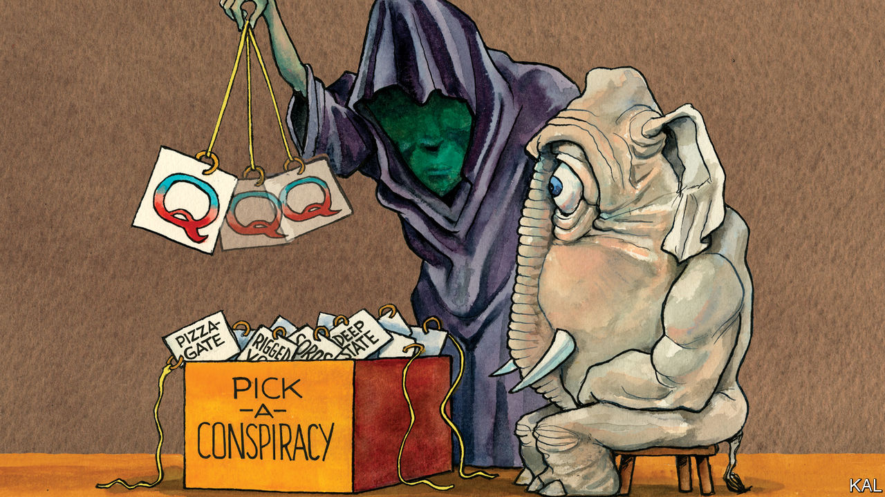

###### Lexington

# Republicans face a choice between Donald Trump and reality 

##### Most of the party’s voters still revere him, in part because they do not believe he was defeated 

 

> Jan 28th 2021 


THIS IS AN awkward moment for the QAnon conspiracists who put their considerable faith in Donald Trump. Inauguration Day came and went with no mass execution of Satanist Democratic paedophiles. The Storm, as a million-odd QAnon followers called that wished-for event, was a shower. So there was no Great Awakening—a post-slaughter celebration of Mr Trump—either. “No plan, no Q, nothing,” grumbled one follower, referring to the conspiracy’s shadowy prophet, an imagined Trump aide, on the Telegram messaging platform to which the group has flocked.


That followed its expulsion from Twitter and Facebook, after QAnon conspiracists helped lead the assault on Capitol Hill. The companies have since blocked the accounts of tens of thousands; the FBI has arrested some of the alleged insurrectionists, including Jacob Chansley, the “QAnon shaman”. One of the conspiracy’s architects, Ron Watkins, a Japan-based conspiracy theorist who administered the now-defunct 8chan website on which “Q”’s cryptic messages were posted, says the game is up. “We gave it our all,” he wrote on Telegram, in an un-millenarian fashion. He and his father, an air-force veteran and former pornographer who once ran a pig-farm outside Manila, are thought by some researchers to have written the cryptic messages from “Q” that fuelled the conspiracy.


An even more successful conspiracist, Alex Jones of Infowars, has also turned on the nonsense he once helped spread: ridiculing QAnon as a bunch of “witches and warlocks”. But QAnon is not going away. Updated versions of it are spreading—including one on TikTok that has pushed the Storm back to March 4th. And the conspiratorial impulse behind QAnon will be even more enduring. Fully half of Mr Trump’s supporters claimed to believe its core falsehoods: that he was fighting a high-level Democratic child-sex operation. As that suggests, the conspiracy is not only dangerous in itself, but both symptom and cause of the bigger epistemic and democratic crisis that Mr Trump has moved from the murkier parts of the internet to the Republican mainstream.


America has a rich history of conspiracism, due to its anti-government, apocalyptic religious and entrepreneurial traditions. Pat Robertson, a 90-year-old televangelist and former Republican presidential candidate, illustrated the last two when he predicted Mr Trump would “without question” win re-election and preside over a period “of great peace”, before the probable end of the world in 2025. After Mr Trump refused to accept his defeat, Mr Robertson accused the then president of living in an “alternate reality”.


The left also has bunk theories, often involving predatory bankers, and sometimes pushed by Michael Moore or Oliver Stone. Yet the paranoid style in American politics has been most pronounced on the right. During the red scares of the 1950s and 60s, led by Joseph McCarthy and the John Birch Society, it almost subsumed it. And the past two decades have witnessed an even bigger explosion of right-wing confabulation: fuelled by the anti-empiricism of the Republican elite, the grievance politics of its base and new opportunities to spin the climate-change denialism, Benghazi trutherism and end-of-days frenzies that have ensued.


Infowars, on which Mr Jones spends three-quarters of his time spinning anti-government falsehoods and the rest hawking quack supplements, such as Super Male Vitality, to steel his listeners for the coming civil war, has over 12m visits to its website a month. Fox News, where this week Tucker Carlson attacked the crackdown on QAnon as government mind-control, has millions more viewers. Such truth-bending was one of the enabling conditions for Mr Trump, who appeared on Mr Jones’s show and echoed many of his talking-points during his 2016 primary campaign. Yet the former president, an unfeigned conspiracist, did not only amplify the rise of right-wing conspiracism; he also transformed it.


A genuinely prophetic book by the political scientists Russell Muirhead and Nancy Rosenblum, published in 2019 when QAnon was still in its infancy, describes Mr Trump’s conspiracy theories as a political step-change. Past conspiracies typically sought to explain a genuinely surprising occurrence, such as the ability of a lone gunman to assassinate the most protected man alive. They have also tended to flourish among the powerless. Mr Trump has promoted conspiracies, from Trump Tower and the Oval Office, only to demonise and invalidate his opponents, including the democratic system itself. Thus, his claim that Barack Obama was born in Africa; his attacks on “fake news” and whatever “Deep State” agency or dutiful public servant impeded him; and his electoral-fraud delusion. The QAnon conspiracy, which Mr Trump directly promoted, was essentially an effort by his supporters to write these fabrications into a single narrative.


For Mr Muirhead and Ms Rosenblum, Mr Trump’s conspiracism amounts to a blueprint for political success in a post-truth world, which imitators will probably follow. It is hard to disagree. Mr Trump’s fortunes are a triumph of delusion over political gravity. Despite leading his party to defeat, its leaders may be about to absolve him for inciting an insurrection intended to overturn that defeat, because most of the party’s voters still revere him, in part because they do not believe he was defeated.


It is a stunning achievement, albeit decades in the making. And the longstanding structural weaknesses Mr Trump has exploited, including the grievance politics Mr Carlson pushes, the erosion of established media, the anarchy of the internet, will endure. Twitter’s crackdown on QAnon is of little consequence by comparison.

Back to life, back to reality


The fight for American democracy cannot be won by companies—or election officials or judges. It will be decided by Republican politicians, who now have an opportunity to reset the terms of battle. Democracy thrives as a contest of ideas; it muddles through as a war of interests. But without the shared reality that was the single main target of Mr Trump’s attacks, it cannot function.■

