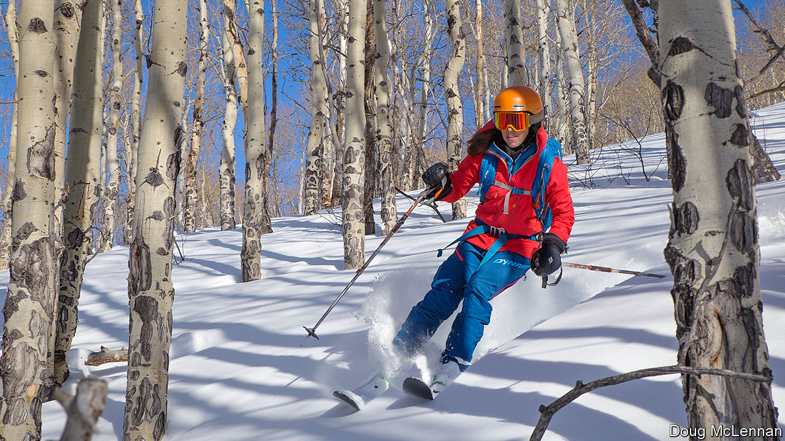

###### Lifts-off

# The ups and downs of covid skiing 

##### Sales of ski-touring equipment are booming 

 

> Jan 28th 2021 


WHEN AMERICA’S newest ski resort opened on December 31st, Bluebird Backcountry was uniquely adapted to social-distancing measures because it lacked one thing that every other ski resort in America has: lifts. There were no queues to stand in, worrying about your neighbour breathing on you. Instead of shuttling ticket-holders up the mountain by gondola, lifts and other mechanised means, the new resort made skiers and snowboarders slide up the mountain before gliding down.


Bluebird is part of the growing interest in backcountry skiing (or, in European resorts, “ski touring”). Not long ago, off-piste skiing was frowned on in most of the United States. Your correspondent remembers ducking under ski boundary ropes in search of untracked powder, only to have the ski patrol threaten to ban him from the resort. But even before the pandemic, backcountry skiing was becoming mainstream.


From 2016 to March 2020, sales of touring gear (such as skis with bindings that release at the heel for skiing up) more than doubled, going from $39m to $79m. By the 2017-18 season, 5% of America’s 30m skiers and snowboarders were venturing out of bounds. Although some resorts are open to backcountry skiers, most choose wilder environs, such as national parks, where they find solitude and better powder.


Now covid-19 has supercharged the growth of the sport. In March last year backcountry-gear sales leapt 34% compared with the year before. Retailers reported that, a week after resorts were forced to shut down, much of their stock was sold out. Car parks at popular access spots were full. This year most resorts are open but the boom continues. Manufacturers and retailers had increased the supply of skis, boots and the like. Yet many stores are still running low. Doug Bittinger, the owner of Mountain Outfitters in Breckenridge, Colorado, reported that he had sold as much by late December as in the whole 2019-20 season. Now he has very limited stock.


This spike in interest is making some in the ski industry nervous. America generally has fewer avalanche deaths per year than Europe, where off-piste skiing is less discouraged by resorts. But now many neophytes are rushing up mountains which do not have ski patrols, sometimes without safety gear such as avalanche transceivers. In December Colorado saw four backcountry skiers die in avalanches; over the whole previous season, only six died. Experienced skiers are calling for caution. “We all have to make changes because of covid, and stick to low-consequence terrain,” says Tim Estep, a backcountry skier in Golden. Retailers now push beginners to pay for avalanche-safety courses.


Will the boom in backcountry skiing last? If the virus disappears, many skiers will return to the safety and ease of traditional resorts. But some will develop a yen for what the sport has to offer: a brutal workout in a winter wonderland.

