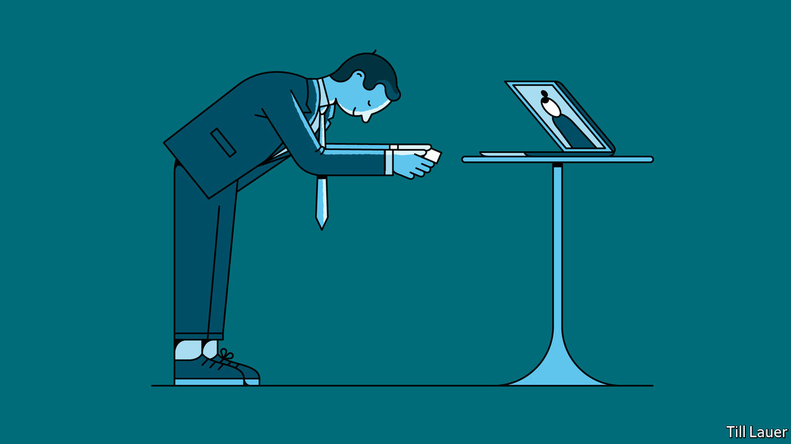

###### Here’s my QR code

# Business cards are going online in Asia 

##### But traditionalists miss the feel of paper and ink 

 

> Feb 6th 2021 


IN ASIA MEETINGS do not begin until business cards have been swapped. It is no mere formality. Accept the card with two hands and carefully examine it, noting the giver’s title and other indicators of rank—essential information in any strongly hierarchical business culture. It is so important to master this ritual in Japan (just how deep does one bow?) that numerous books and courses promise to transform bumbling novices into meishi-koukan (card-swapping) virtuosos. If a new acquaintance fails to give a card to Glenn Lim of CEO Asia, a Singaporean business-networking company, “it makes me forget them,” he says. 


Yet the pandemic has put the business card on life support. Networking is difficult when white-collar workers have fled to home offices, business lunches have been cancelled and conferences have migrated online. Orders for business cards from Vistaprint, a multinational printing company, plummeted by 70% in late March and early April and have yet to recover fully. Mr Lim normally hands out about 200 cards a month. In the six months following Singapore’s lockdown in March, he reckons he dispensed about five. “I’ve forgotten what business cards look like,” remarks a British banker based in Singapore. “How do you sanitise them?”


But it is still helpful to know who is who at meetings, even when they take place on Zoom. Companies are therefore reimagining the business card for the era of social distancing. Nagaya, a Japanese firm, prints them on face masks (a literal interpretation of a Japanese metaphor that likens business cards to one’s face). After the launch of the “Meishi” mask, traffic to Nagaya’s website surged by 65,000%. 


Sansan, another Japanese firm, allows companies to sort scanned business cards so bosses can see which employees have made new contacts. It also offers “virtual cards”. Users receive QR codes which they display as virtual backgrounds on video-conferencing apps. Scanning the code with a phone camera will summon the user’s digital business card. Some 4,300 companies have begun using Sansan’s virtual cards since they launched in June. 


But Mr Lim, who uses Sansan’s virtual cards, does not plan on binning the paper version just yet. People tend to exchange virtual cards after meetings have started or as they end, forcing participants to ask who does what during the meeting itself. “That’s sometimes a little bit rude,” he says. Many others in Singapore are evidently fond of paper cards, too. Sales at ExpressPrint, a printing company, have picked up in the past two months, as more people resume in-person meetings. Stephen Forshaw, head of public affairs at Temasek, Singapore’s sovereign-wealth fund, says that he recently topped up his supply of cards for the “first time in a long time”. Even Edward Senju, the head of Sansan’s operations in South-East Asia, still keeps some in his wallet, “just in case”. ■

