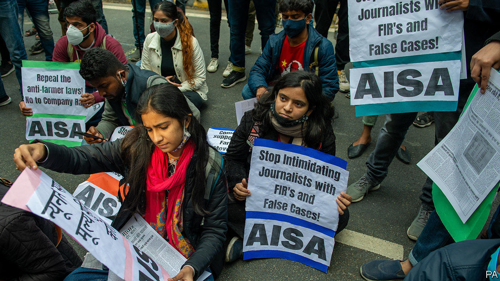
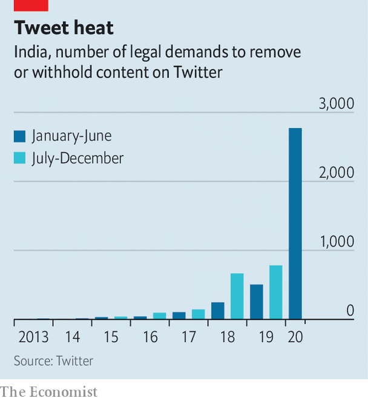

###### Prevention is better than cure

# India’s government is censoring people before they comment 

##### A favoured tactic is turning off the internet in areas where protests might be organised 

 

> Feb 4th 2021 


IDI AMIN, the late Ugandan dictator, once declared that he respected freedom of speech, but could not guarantee freedom after speech. India’s government seems to be taking this concept one step further. Despite running what is often hailed as the world’s biggest democracy, it has gained a taste for curtailing freedom before speech.


Just ask Siddique Kappan, a journalist who has been detained since October under the Unlawful Activities Prevention Act. His sin was to have been caught driving towards Hathras, a district in the state of Uttar Pradesh. Other reporters had gathered there to cover the alleged gang rape and murder of a Dalit woman by upper-caste men. Mr Kappan never reached the village of the 19-year-old victim, whose family assert that state police sided with her alleged killers, to the point of seizing and cremating her brutalised corpse to conceal the evidence. On the defensive, police have claimed a wider conspiracy to cause caste conflict. They accuse Mr Kappan, arrested at a highway toll booth, of “intent” to stir up trouble of this sort.


Someone else familiar with such “intent” is Munawar Faruqui. A popular young stand-up comedian, Mr Faruqui is also now behind bars. Along with five associates, he was arrested in the city of Indore, in central India, on January 1st after the son of a politician from the ruling Bharatiya Janata Party (BJP) complained about the content of their show—or rather, content that the plaintiff believed might appear in the show. In fact, there is no evidence that the show did include “derogatory remarks” about Hindu gods or government ministers, as alleged. Nevertheless Mr Faruqui and his friends have repeatedly been denied bail, with one judge commenting that “such people” must not be spared.


These may look like isolated cases, but they reflect a wider trend. In anticipation of popular protests, the government reflexively pulls the plug on internet service, particularly via smartphone. Such shutdowns were pioneered in restive Kashmir, where the revocation of local autonomy and statehood in 2019 was accompanied by pre-emptive arrests and a 213-day internet blockade. Ostensibly for security reasons, mobile connections in much of the former state—now run directly by the national government—remain limited to lumbering 2G service. The authorities now deploy internet-muting as a crowd-control tactic across India, including the capital. During the ongoing stand-off between protesting farmers and police on the borders of Delhi, mobile networks have been shut down for hours at a time to discourage flash mobs. A recent report estimates that the 8,927 hours of internet restrictions imposed by the government during 2020 cost the country $2.8bn in forgone economic activity.

 


In addition to this scattershot approach, the government is also targeting individuals. One new initiative invites “cyber volunteers” to join police in hunting “anti-national content” on the internet. Twitter reports that during the first six months of 2020, the number of official demands to remove content swelled by 254%, to more than 2,700 (see chart). On February 1st users of the service erupted in protest after it blocked some 250 accounts, including those of prominent journalists, at the government’s request. When it hastily unblocked them, citing freedom of speech, the government replied with a threat to sue it for “disobedience to legal blocking orders”. The fingered accounts had shared a provocative hashtag regarding the farmers’ protest, but its use in most cases appeared inadvertent. It does not help the government’s case that several of the journalists, all among its critics, found themselves charged by police with sedition in multiple BJP-ruled states in similarly worded rapsheets. Their crime was to have raised questions regarding whether one farm protester had been killed in a road accident, as police claim, or by police gunfire, as his family and independent medical experts reportedly believe.


In another move to pre-empt open discussion of touchy issues, the foreign ministry has imposed new rules on academic conferences. In addition to the existing, stringent scrutiny of foreigners invited to conventional events, it will now require state-run institutes and universities to seek prior permission from the ministry for any online conference or seminar “clearly related to India’s internal matters”. Professors may soon find it harder to travel abroad, too. Police in the state of Uttarakhand have announced that henceforth, anyone they deem to have posted “anti-national” content on the internet will not get a passport. Not to be outdone, police in Bihar say that anyone who joins a protest can forget ever having a government job or contract—a jarring rule in a country that won independence through peaceful protest. ■

