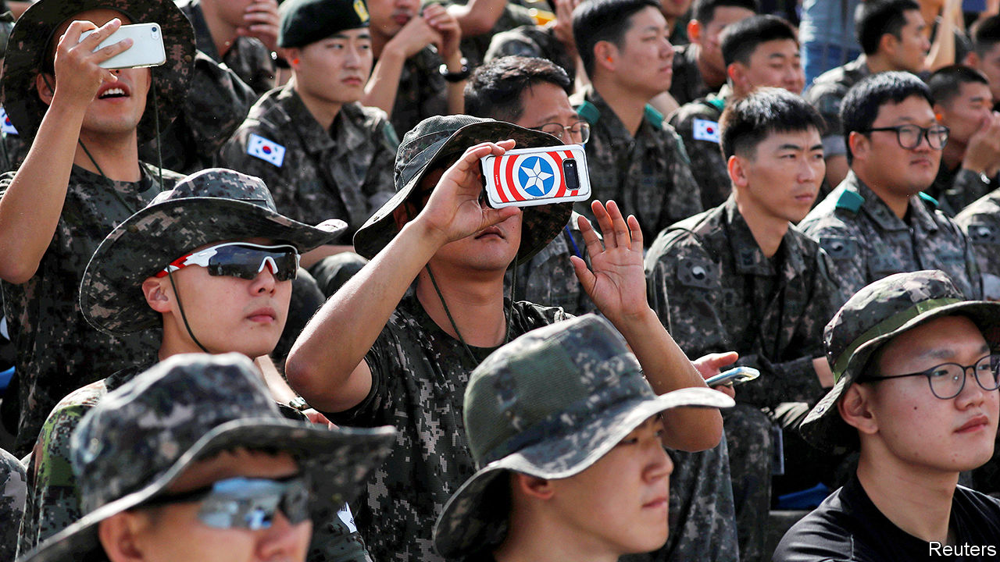

###### Strengthening the shrimp

# South Korea is preparing for a lonelier, scarier future 

##### It may have fewer soldiers, weaker alliances and stronger enemies 

 

> Feb 6th 2021 


WHEN HE DID his basic military training in 2009, Lee Ju-min was so disconnected from the world for four months that he forgot how to use a computer. Josh Yang got three minutes of phone time during his first six weeks in training in 2016. But by the time Chon Dong-yeong joined the South Korean army in 2019, he was allowed to use his mobile phone every evening, from the end of drilling until lights out. “My experience in the army was very different from that of my friends, even those who started a year earlier,” he says.


The easing of restrictions on soldiers has been one of the more visible changes in South Korea’s armed forces in recent years. But it is only one of many. The government wants to make the army smaller, more efficient and better able to deal with the changing threats the country faces. At the same time, politicians want it to become more attuned to the increasingly liberal society that it is there to defend.


The reforms are driven partly by demography. South Korea is ageing faster than any other country in the world. Last year the population shrank for the first time since records began. That makes the past reliance on a big army manned by conscripts impossible to sustain, says Sheen Seong-ho of Seoul National University. It therefore provides an impetus to overhaul the command structure, to beef up the navy and air force, and to acquire more advanced weapons.


More modern forces are seen as all the more important because South Korea finds itself in an increasingly alarming geopolitical environment. Security types like to refer to it as a “shrimp among whales”. China has shown itself to be hostile: in 2017, after South Korea allowed the deployment of an American anti-missile system intended chiefly as a defence against North Korea, China punished it with a painful economic boycott. Relations with Japan, a fellow American ally, continue to be disrupted by a simmering argument over Japan’s obligations to elderly Koreans forced to work in factories and brothels by the Japanese army during the second world war. North Korea, though a fellow shrimp, is still technically at war with the South and is continuing to build up its arsenal of both nuclear and conventional weapons.


The shifting dynamics of the alliance with America are of particular concern. Donald Trump kept demanding that South Korea cover more of the cost of keeping 28,500 American troops in the country, and muttered about withdrawing them altogether. In 2019 he called off joint exercises that had been held with South Korea every year since 1961. Even with a new president in the White House, America will expect South Korea to take on more responsibility and develop its capabilities in areas such as intelligence-gathering, planning, and naval and air defence, says a military officer involved in the defence reforms. “The new administration is going to be more diplomatic and polite about it, so I expect we’ll get on better, but their objectives will not change fundamentally,” he says.


To some degree, America’s aims match those of the South Korean government, which would like more say in the alliance. At present, command of all South Korean forces would be handed to an American in the event of a war on the peninsula. This arrangement dates back to the origins of the alliance, during the Korean war, when the South was considered unable to defend itself alone against an assault from the North. But in the early 2000s the left-of-centre government of Roh Moo-hyun began trying to build the capacity to take back control of the country’s own forces. The current government, which is led by Moon Jae-in, who was Roh’s chief-of-staff, had hoped to complete the transfer by the end of Mr Moon’s term, next year. But it looks unlikely that the armed forces’ capabilities will have improved to the degree required in time.


Other aspects of the reforms are progressing faster. The number of troops declined to 555,000 at the end of last year, down from 600,000 in 2018. It is supposed to fall below half a million by the end of this year, with the bulk of the cuts made to the army. Mandatory military service is being shortened to 18 months. Wages for conscripts are rising sharply. The government aims to hire more women and more civilians to work for the armed forces, to help bridge the gap between soldiers and the rest of society.


Last summer the country launched its first military-communications satellite. It also secured America’s approval to modify past agreements to permit it to use solid fuel in missiles, which allows them to be launched more quickly and easily. That should pave the way for better deterrence against the North, although the South says it plans mainly to launch satellites this way. Defence spending rose by 8.2% in 2019 and by 7.4% in 2020; this year’s budget envisages an increase of 5%, despite the intense competition for funds created by the covid-19 pandemic.


Some of the money will be misspent. Last year, for instance, the navy announced that it would soon build an aircraft-carrier—a pointless trophy, in the eyes of many. “It’s like having a golden gun,” says the defence-planning officer. But the armed forces are also stocking up on drones, submarines and anti-submarine defences, among other sensible purchases.


In public, Mr Moon’s administration insists that it is committed to peace with North Korea and does not expect fundamental changes to the alliance with America. The cheery language, however, masks quiet but elaborate contingency planning, in case either expectation is dashed. ■

