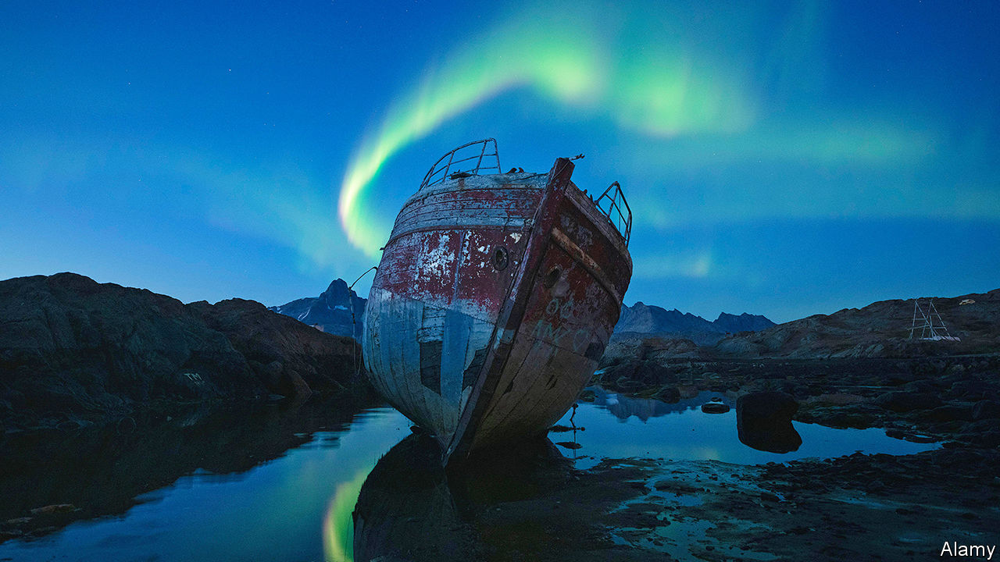

###### Eco-fiction

# A “Moby Dick” for the age of climate change 

##### Charlotte McConaghy’s first novel blends nature writing with dystopian fiction 

 

> Feb 6th 2021 


Migrations. By Charlotte McConaghy. Flatiron Books; 272 pages; $26.99. Published in Britain as “The Last Migration”; Chatto &amp; Windus; £12.99


THE VOGUE for emotive literary engagements with the natural world—known as the “new nature writing” and encompassing the work of Amy Liptrot, Helen Macdonald and Robert Macfarlane—can be interpreted as a form of mourning, an attempt to fix on the page a beauty and variety that are vanishing. Landscapes, seascapes and wild creatures are described by these writers just as they slip away because of climate change and the loss of habitats.


The debut novel by Charlotte McConaghy, an Australian author, is a fascinating hybrid of nature writing and dystopian fiction. The reader meets Franny Lynch, the book’s protagonist, in Tasiilaq, Greenland, some time in the not-so-distant future. Human activity has reduced biodiversity to a handful of creatures at the edges of the globe. Franny is an ornithologist, tagging the last remaining Arctic terns before their long migration south.


For reasons that are not entirely clear, Ennis Malone, the grizzled captain of a fishing trawler, is persuaded to follow the terns south. There are strong echoes of “Moby Dick” in his dreams of “the Golden Catch”, a great bounty and his own white whale, and in a sea fished and polluted to the point of extinction. Franny joins the crew—a motley, charismatic bunch—as they head off, with some trepidation, in search of the terns and the fabled catch.


The new nature writing places the personal, emotional response of the author at the centre of its representation of the natural world. The bird of prey in “H is for Hawk” helps Ms Macdonald get closer to her dead father; Ms Liptrot turns to the rugged beauty of Orkney to tackle her alcoholism. Similarly, in this novel the narrative of the fishing voyage is interwoven with the tale of Franny’s difficult, itinerant upbringing, her tricky marriage to Niall, an environmentalist and university lecturer, and the dark secrets that she carries with her and may explain her volatile temper and self-destructive impulses.


Recently the climate crisis has dominated literary dystopias, spawning another new genre: cli-fi. From Margaret Atwood’s “The Year of the Flood” to John Lanchester’s “The Wall”, authors have considered how rising temperatures will change human life. Ms McConaghy’s novel may be the first in the genre to put the animal world at the centre of its story, mourning dying species and asking what might happen when people forget “what it feels like to love creatures that aren’t human”.


These grand ambitions do not always cohere. The seafaring yarn is gripping, but Franny remains an enigma, the flashbacks to her early life interrupting the story’s flow. Yet by merging cli-fi and nature writing, the novel powerfully demonstrates the spiritual and emotional costs of environmental destruction. ■

