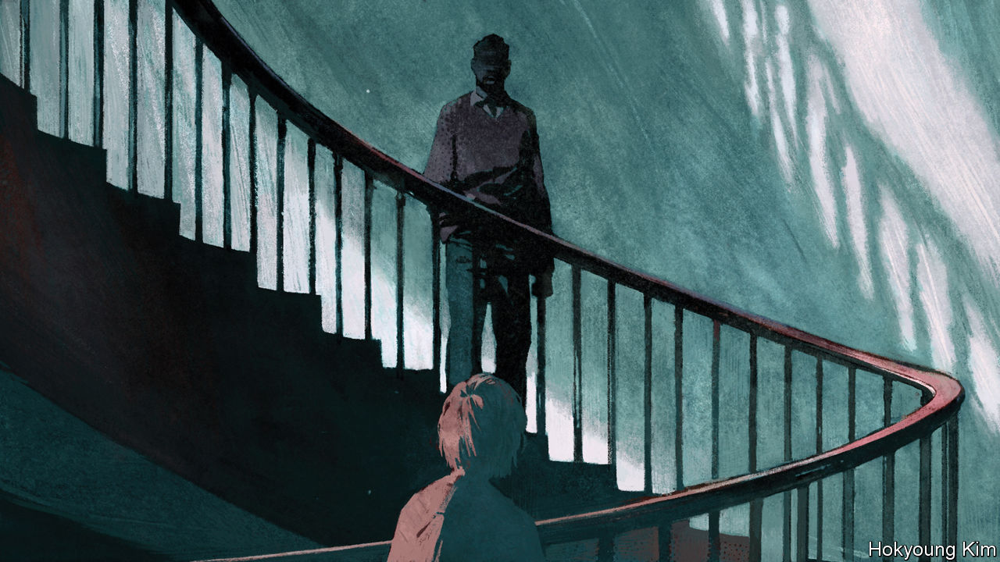

###### Open secrets

# France’s silence over the sexual abuse of minors is breaking 

##### Two memoirs have cast light on the problem’s scale—and the widespread complicity 

 

> Feb 6th 2021 


La familia grande. By Camille Kouchner. Éditions du Seuil; 205 pages; €18


Consent: A Memoir. By Vanessa Springora. Translated by Natasha Lehrer. HarperVia; 208 pages; $27.99 and £12.99


IT WAS A childhood wrapped in comfort, reverie and freedom. Long summers in the south of France at the family home, amid almond trees and lavender, literary friends and cousins, former Maoists and acolytes of Fidel Castro. Dinners late into the night, when the familia grande would gather to put the world to rights. Guests went barefoot in the dried grass, and naked in the pool. The seasonal rituals reassured; the political dreams inspired.


Until the day that Camille Kouchner’s twin brother, whom she calls Victor, told her that their stepfather had visited his bedroom in the night. “He stroked me, and you know…” They were, she writes, 14 years old. Victor was sworn by their stepfather to silence. “If you talk about it, I will die,” he implored his sister. The night-time visits continued for two or three years. It took nearly three decades, and her mother’s death, before Ms Kouchner heard a lawyer name this crime for what it was: incest.


Now aged 45, and with Victor’s permission, Ms Kouchner has told her story in an attempt “to poison the hydra” of paralysing guilt and shame. The account is tightly written, improbably controlled, and overwhelming. At first, as a young teenager, she had no real idea what was going on behind that closed bedroom door, detecting only “unknown smells” as her stepfather left. Her adoration of him blinded her to any wrong she might have sensed. Besides, was this not the lifestyle that their extended family embraced? In their Mediterranean home an entire room was decorated with posters celebrating May ’68. Her stepfather flirted with his friends’ wives. The young were “offered” to older women. “Fucking is our liberty,” her mother once told her.


Ms Kouchner has lobbed a grenade into the heart of the cosy Paris left-bank intellectual elite. For the stepfather in question is Olivier Duhamel, a political scientist, literary editor and broadcaster. He married Camille’s mother, Évelyne Pisier, a law professor and one-time lover of Castro, after she left Bernard Kouchner, the twins’ father and a former foreign minister and co-founder of Médecins Sans Frontières. (Mr Kouchner has publicly praised his daughter for having the courage to speak out.) While decrying what he calls “personal attacks” against him, Mr Duhamel has resigned as head of the foundation that oversees Sciences Po, an elite Paris university, and from other posts. That has prompted a cascade of other resignations, including that of Élisabeth Guigou, a friend and Socialist former justice minister, who presided over an official commission—on incest. She has said that she knew nothing.


Reporting by Le Monde suggests that many in Mr Duhamel’s circle did know, but turned away. This is deeply disturbing. It is not just the scale of the problem that unsettles: a French poll found that one in ten people has been the victim of some form of incest. It is also the complicit silence, particularly among an older generation that tends to dismiss the #MeToo movement as a form of bourgeois Anglo-Saxon puritanism that has no place in France. “There is a tolerance both from society and the law, with a very serious degree of impunity,” said Muriel Salmona, a psychiatrist specialising in sexual abuse. Under French law incest (which covers relations with step-parents) is not a separate crime, but an aggravating circumstance in cases of rape or sexual violence. Moreover, the burden is on even a minor under 15 to prove that there was no consent.


But what constitutes consent? This is the conundrum at the heart of Vanessa Springora’s memoir. Published in French last year, it comes out in English this month. Ms Springora was 13 years old, her parents having separated, when her mother dragged her along one evening to a dinner party with literary friends. One guest, who she later learned was Gabriel Matzneff, a novelist, could not take his eyes off her. “No man had ever looked at me like that before,” she writes. Thus began the writer’s ruthless pursuit, which led to a sexual relationship with Ms Springora that began when she was 14. He was nearly 50.


The word that best captures the complex psychological dependency that Ms Springora narrates in this chilling account is emprise: the hold, or grip, in which the older man traps his pubescent prey. Not by physical force, but manipulation and the cold exercise of power. Anxious for affection, she thought she entered into this relationship willingly: “I felt adored as never before.” But did she really? “Are you aware he’s a paedophile?” her mother asks casually when the girl first confides in her. When the teenage Ms Springora puts such thoughts to Mr Matzneff, he brushes them off as puritan nonsense and insists on her good fortune: “Are you aware that in ancient times, the sexual initiation of young people by adults was not only encouraged, it was considered a duty?”


In retrospect, these questions torture Ms Springora. As angry as she is with Mr Matzneff, she is almost more so with her mother, who consulted her friends but “no one, apparently, was particularly disturbed.” In the 1970s there was a movement in France to decriminalise sex between adults and minors. Letters and petitions signed by literary luminaries appeared in Le Monde and Libération. Paedophilia features repeatedly in Mr Matzneff’s own novels—including one later based on his relationship with Ms Springora—in which he writes of his quest for “young meat”.


Paris éditeurs readily published his work; he won literary prizes. Normality, in this world, was grotesquely deformed. Only later does Ms Springora see that, at 14, “it’s not normal…to find yourself in his bed at teatime with his penis in your mouth.”

The old normal


It is precisely this emprise that makes such abuse so toxic. It flips the sense of guilt and shame onto the victim, locks in the lies, deepens suffering and silences complaint. Ms Springora and Ms Kouchner struggled for years to put the blame where it belonged. “Your silence is your responsibility,” Ms Kouchner’s mother tells her.


Might things now change? These books are empowering a new generation. Thousands of victims of incest have spoken out, under the hashtag #MeTooInceste. The public prosecutor has opened a criminal investigation into Mr Duhamel; Victor has pressed charges against him for the first time. Mr Matzneff is under investigation for rape of a minor (he has called the allegations against him “unjust and excessive”). President Emmanuel Macron, too, has weighed in, promising that “these words, these cries, nobody can ignore them any longer.” A bill going through parliament will criminalise any sexual relations with a minor under 13 years, “consensual” or not.


But lawmakers have not yet agreed to raise this to 15, the age at which sex is legal. France may have found the words to talk about its ghastly secrets, but not yet the legal framework to stamp them out. ■

