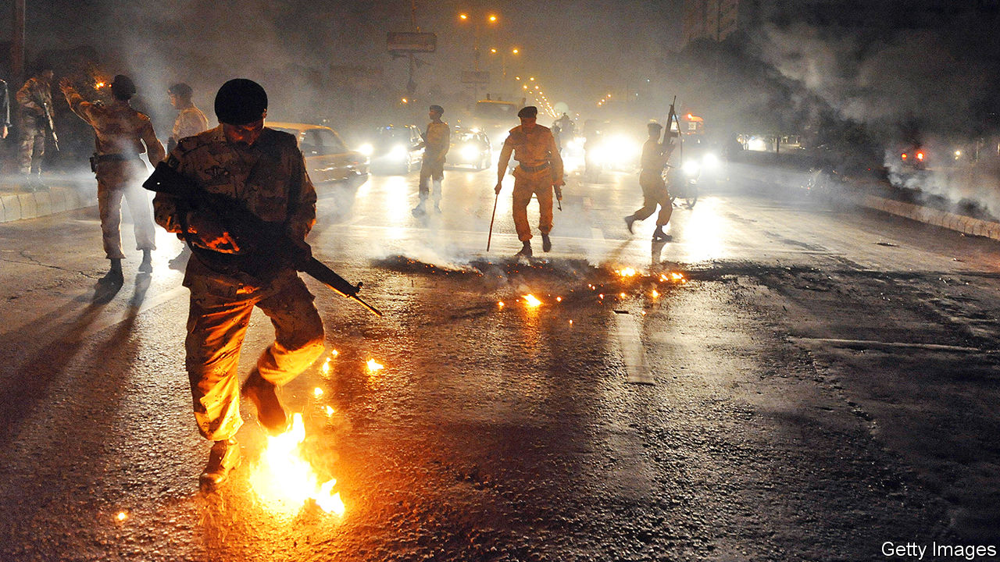

###### Tales of the city

# The volatile history of Karachi 

##### Told through the extraordinary lives of a few ordinary people 

 

> Feb 6th 2021 


Karachi Vice. By Samira Shackle. Granta; 272 pages; £14.99


OUTSIDE THE city, few people have heard of the “eight-day operation” mounted in Lyari, a district of Karachi, in April 2012. About 3,000 heavily armed policemen in armoured personnel-carriers laid siege to the area in a battle with local gangsters. The electricity, gas and water were shut off. The machine-gun and rocket fire were so intense that leaving home was impossible. On the eighth day, the police retreated, their mission an unmitigated disaster, with five officers dead and the official figure of 20 civilian casualties widely believed to be a serious understatement.


It is far from the deadliest episode covered in “Karachi Vice”, a gripping account of the city’s recent history by Samira Shackle, a British journalist whose mother was born in the city. Violence and death recur with sickening regularity. In December 2009 at least 43 people were killed when an Ashura procession by Shia Muslims was bombed by Sunni extremists, a blast followed by the torching of over 3,000 shops. In September 2012 hundreds died in a fire at a textile factory. In 2014 the international airport was the scene of a pitched battle, after it was invaded by terrorists from the Pakistani Taliban. Besides these atrocities the book is full of a steady stream of assassinations, gangland murders and police “encounters”—extra-judicial killings.


To make sense of this city of some 20m inhabitants, Ms Shackle follows five characters as they try to navigate it: an ambulance-driver for Edhi, a huge charity; a teacher-turned-development worker; a television crime reporter; a social activist whose organisation maps unofficial settlements in an attempt to bring their residents some rights; and a young woman from a village who defies her circumstances to stay at school until graduation.


From these personal stories emerges a subtle portrait of Karachi’s overlapping conflicts. Many are those of Pakistan as a whole. Both have always been prey to ethnic and sectarian tension. Though Karachi is in Sindh province, many among its population are not Sindhis but “Mohajirs”, Urdu-speakers who migrated from India at the time of partition in 1947, or from East Pakistan when it became Bangladesh in 1971. And the Pushtun population has grown this century as extremism and violence took root in Pakistan’s north-west, where it blurs into Afghanistan, driving many to seek refuge in Karachi, including some of the violent extremists.


Unique to Karachi was the stranglehold long held on politics by the MQM, a party representing Mohajir interests, run for years by its pudgy but oddly charismatic leader, Altaf Hussain, from exile in London. The links between militias, gangsters and mainstream politics became harder to disentangle in Karachi than anywhere else in Pakistan. “Every street criminal had a political affiliation,” notes Ms Shackle, “every political party had its fingerprints all over multiple criminal enterprises.”


The book has a happy ending—up to a point. The violence has been restrained and the MQM diminished as a political force. But the village of the poorest of Ms Shackle’s characters suffers outrageous expropriation. And the crime reporter remains sceptical of the changes: “The situation is under control, but it is not peace.”


“Karachi Vice” recalls “Maximum City” (published in 2004), Suketu Mehta’s epic chronicle of another South Asian megacity, Bombay (now Mumbai), which also told its story through the lives of vividly drawn individuals. Ms Shackle’s book differs in being much shorter, and, unlike Mr Mehta’s, in seeing her city largely through the eyes of good people trying to make a terrible situation better. It is a moving account of the struggles of everyday heroes—and of the unhappy metropolis that needs them. ■

