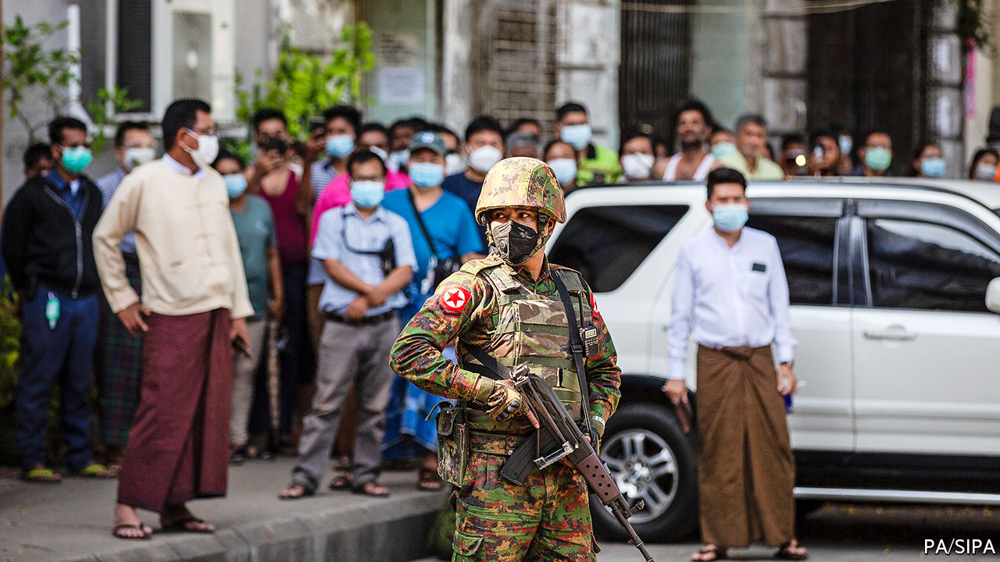
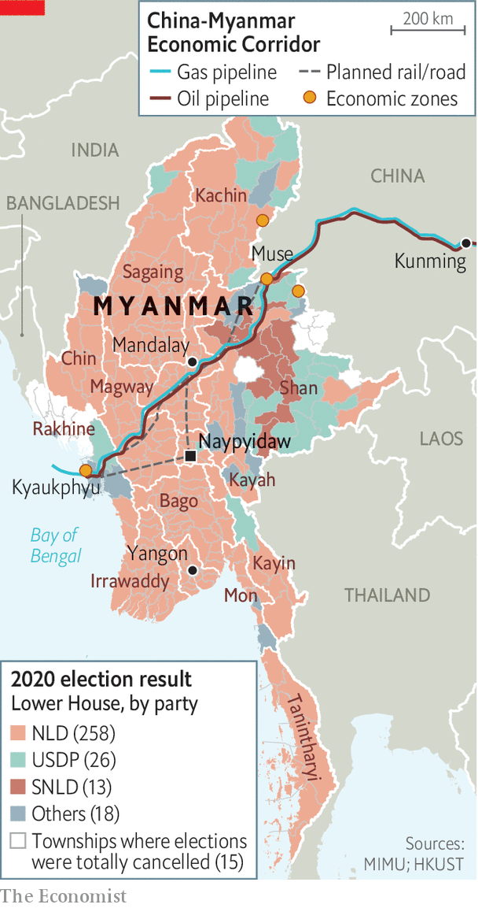

###### Reversal of fortune

# Myanmar’s coup turns the clock back a decade 

##### New leader; old problems 

 

> Feb 6th 2021 


MYAWADDY, A TELEVISION station owned by the Burmese army, is normally so bad as to be unwatchable. But when the residents of Naypyidaw, Myanmar’s capital, and Yangon, its largest city, woke on February 1st to find soldiers in the streets and martial music blaring from their radios Myawaddy became “must-see TV”. It was a Myawaddy newsreader who announced that the country was in a state of emergency and under the control of Min Aung Hlaing, the head of the army.


Soldiers were stationed in government offices. Airports were closed and, in the cities, the internet shut down. Hundreds of politicians from the National League for Democracy (NLD), which won an overwhelming victory in the country’s parliamentary elections last November, were put under house arrest. The armed forces also rounded up chief ministers from all the country’s 14 states in addition to democracy activists, writers, three monks and a film-maker, Min Htin Ko Ko Gyi. Aung San Suu Kyi, who became a figure of global renown when she led the NLD from house arrest during the 1990s and 2000s, and who as “state counsellor” was the country’s undisputed civilian leader, now finds herself under lock and key again.


The army, known as the Tatmadaw, is used to being in charge. When created through conquest in the 19th century, British Burma lumped together over 100 different ethnic groups. After independence in 1948 many of those groups promptly rebelled against the new government. The army, then as now dominated by officers from the Bamar ethnic majority, began a suppression of such separatism that has gone on ever since. After toppling a democratically elected government in 1962 it stayed in power almost continuously for nearly 50 years, justifying its rule on the basis that it was the only institution capable of holding the country together. In 1988 it savagely quashed a democratic uprising.


In 2011, though, the Tatmadaw amazed the world by making way for a civilian government. There were two reasons. The first was that they were worried about the country’s direction of travel. Decades of diplomatic isolation by the West had forced Myanmar into China’s orbit, something the generals were uneasy about. They were also embarrassed about the country’s economy, which they had driven into the ground. In 1962 Burma had been one of Asia’s richest countries. Fifty years later it was one of the poorest. In 2008 the regime’s woeful response to Cyclone Nargis, which killed 140,000 people, destroyed any vestiges of credibility it might still have had.


The second reason for allowing a civilian government was that the Tatmadaw thought it could do so without really losing power. The generals painstakingly designed a hybrid political system that entrusted the thankless task of governance to civilians but enshrined the Tatmadaw’s independence and many of its powers. In the constitution for this “discipline-flourishing democracy”, as they memorably called it, the commander-in-chief of the army appoints the man who is notionally his boss, the minister of defence, as well as the ministers of the interior and border control. He thus commands all the organs of state security. A quarter of the seats in parliament are reserved for serving military officers appointed to them, which gives the army an effective veto over all constitutional change. Even as tensions rose over the past few weeks, many believed a coup unlikely simply because the constitution already protects the Tatmadaw’s interests so well.


Ms Suu Kyi’s NLD boycotted the first elections held under this new constitution in 2010, ushering in five years of rule by Thein Sein, an ex-general, and his Union Solidarity and Development Party (USDP), a proxy for the Tatmadaw. But in 2011, following talks with Mr Thein Sein, Ms Suu Kyi engaged in the process. After success in by-elections the NLD won a landslide victory in the general election of 2015.


The army had tried to ensure that, even if her party won at the polls, Ms Suu Kyi could not herself wield power. The framers of its constitution included a novel clause that bars anyone with foreign relatives from the presidency; it is in no way a coincidence that Ms Suu Kyi has two British sons. It was to circumvent this obstacle that, after the NLD took office in 2016, parliament created the new position of state counsellor.

Best laid plans


The generals were able to take some consolation from the fact that, having achieved power, Ms Suu Kyi did not use it very well. A lacklustre performance was to some extent unavoidable, given the constitutional constraints that stopped her from exerting power over the army and the weakness of all other governmental institutions. But the state counsellor added unforced errors. At first she surrounded herself with ministers whose only credentials were loyalty and grey hair, and though some of the duffers were later replaced with technocrats her management wasted their potential; she brooked no dissent and refused to delegate. The economy was sluggish; the country’s precariat grew. Though Ms Suu Kyi continued peace talks with various separatist factions begun under Mr Thein Sein, she alienated many minorities by refusing to take their grievances seriously or to include their representatives in government.

 


General Min Aung Hlaing had particular reason to hope that this poor record would be reflected in November’s vote. He was due to retire from the armed forces this coming July and appears to have harboured hopes of becoming president; he has a hunger for “raw power”, says David Mathieson, an analyst based in Thailand. With a quarter of the seats in parliament occupied by loyal officers come what may, a reasonable showing by the USDP would have produced a legislature happy to vote him into office even if the NLD was the biggest party.


It was not to be. Myanmar’s system of first-past-the-post constituencies gave the NLD 83% of the elected seats in parliament; the USDP got just 7%. The USDP promptly made allegations of fraud to the electoral commission, which administered the poll. The commission denied them.


There were some problems with the election, and the government refused to allow any voting in some places, citing fears of violence. The same had been done in 2010 and 2015, but this time the no-vote zones in the states of Bago, Kachin, Karen, Mon, Rakhine and Shan were significantly larger. Nonetheless, independent election observers, including those from overseas, agreed that there was no proof of fraud on a scale sufficient to overturn the NLD’s landslide victory.


The army, which thought its handcrafted constitution would never see it in the minority, faced the prospect of taking up permanent residence there. And General Min Aung Hlaing’s personal ambitions were dashed. He still “needed something to guarantee his legacy, his liberty and his family wealth,” says a Western diplomat based in Yangon. But, denied the presidency, “He didn’t have a plan B.”


In a conscious or unconscious echo of what was going on in Washington, DC, the Tatmadaw took up the USDP’s cry of “terrible fraud”. By January 26th its spokesman was refusing to rule out the possibility of a coup. At crisis talks on January 28th the army demanded that the new session of parliament, scheduled to start on February 1st, be delayed while a nationwide recount of the vote took place. The government refused, and over the weekend parliamentarians duly gathered in Naypyidaw to get on with things—which made it easy for the armed forces to gather them all up at once.

Forwards to the past


In many ways post-coup Myanmar looks familiar. The army is again in charge, but the reasons it had for stepping aside persist. Ms Suu Kyi is again under house arrest, but remains by far the most popular politician in the country.


Her international standing, admittedly, is not what it was. In 2017 insurgents from the Muslim Rohingya minority attacked an army base in Rakhine. The Tatmadaw, in concert with Buddhist mobs, responded by sacking Rohingya villages, killing at least 10,000 and impelling 720,000 to flee to neighbouring Bangladesh. Many Bamars cheered the army on.


The generals may have hoped that this violence would see Ms Suu Kyi, a Nobel-prizewinning human-rights icon, sacrifice support at home by defending the rights of Rohingyas. She went the other way, refusing to denounce the army’s “clearance operations”. In 2019 she went to the International Court of Justice (ICJ) in The Hague to defend the generals accused of genocide. Her reputation abroad will never recover; at home it was burnished. Her performance at the ICJ probably helped win the NLD their massive majority in November.


The army’s best chance of getting out of the cleft stick into which it has reinserted itself is to delegitimise the NLD and make itself and its proxies more popular. To further the first agenda it argues that its coup was a defence of democracy in the face of the NLD’s stolen election, and carried out in a perfectly proper way. The state of emergency was, as the constitution requires, enacted by the president—albeit a rather fresh one, as Myint Swe, a retired general, had been elevated from the vice-presidency only minutes earlier, following the detention of the former president, Win Myint of the NLD. Ms Suu Kyi’s detention is justified by the charge that she had improperly imported walkie-talkies—a charge which puts her at risk of being barred from office. Most of the other politicians originally detained have since been released.


The commander-in-chief will try to “position [his administration] as a more effective government, relative to the NLD,” says Tom Kean, editor-in-chief of Frontier, a magazine based in Yangon. General Min Aung Hlaing has said that his government will focus on battling covid-19, boosting the economy and brokering peace with insurgent forces.


International sanctions might put paid to his hopes of economic growth—but they are not a foregone conclusion. Since 2019 America has had specific sanctions aimed at General Min Aung Hlaing and three other officers associated with the pogroms against Rohingyas. President Joe Biden has threatened to reimpose broader sanctions lifted after the elections of 2010. Such sanctions might well, as they did during the years of military rule, hurt the poorest members of a highly unequal society most. Myanmar’s army rulers and the business networks and smuggling rackets they patronise, used to such constraints, would be much less affected.


One of those sceptical about a policy of isolation may well be the Indo-Pacific tsar in Mr Biden’s National Security Council, Kurt Campbell, who from 2009 on orchestrated America’s rapprochement with Myanmar under Barack Obama. On past form he will argue that engagement with Myanmar is the only hope of getting the democratic process back on track.


Part of Mr Campbell’s strategy in the 2010s was to play on the Tatmadaw’s worries about China’s power over their isolated country. Those fears, like the other drivers behind that opening-up, are still apparent today. The army is wary of Chinese support for insurgencies along their shared border. Chinese interests are deeply embedded in the country’s dysfunctional economy, easily discerned in arms sales, infrastructure projects, an army of small traders and border enclaves that are havens for gambling, smuggling and money-laundering.


The fact that Chinese state media described the coup as no more than a “major cabinet reshuffle” suggests that the Chinese government, which had been wooing Ms Suu Kyi, is keen to be on good terms with the new regime. Myanmar offers it a strategically crucial direct route to the Bay of Bengal and the Indian Ocean beyond—a way for China’s imports of oil and gas to bypass the potential chokehold of the Malacca Straits and for exports to be shipped out of its inner provinces. In time it could be a military foothold, too.


The physical manifestation of these strategic desires is the China-Myanmar Economic Corridor, over $21bn-worth of country-spanning projects including a railway, oil and gas pipelines and a deepwater port at Kyaukphyu. These projects were troubled even before the uncertainty injected by the coup. It is far from clear how Myanmar can pay for them all. And the links run through the territories of various ethnic minorities, including, in Rakhine, the territory where the ethnic cleansing of Rohingyas took place. Chinese-backed construction is more likely to inflame existing ethnic conflicts in such places than to bring peace and development.

The wars at home


While outsiders vie for favour and seek to engineer an outcome they prefer, political opposition inside Myanmar may be weak. On February 3rd staff at 70 hospitals in 30 towns went on strike. The following day, a small demonstration took place in Mandalay, Myanmar’s second city. The All Burma Federation of Student Unions, which played a role in the seminal protest movement which saw Ms Suu Kyi emerge as a leader in 1988, is planning protests across the country, according to Wai Yan Phyoe Moe, the organisation’s vice-chair. But the NLD itself is in disarray. “Without [Ms Suu Kyi’s] leadership in the short term, I think it will be difficult for the NLD to respond cohesively to this challenge it now faces,” says Mr Kean.

 


Nay Phone Latt, an activist and political prisoner under the last junta, suspects that at least for the moment people would prefer to express their dissent on social media rather than in the streets, daunted as they are by the twin risks of catching covid-19 and provoking the army. “We saw such brutal crackdowns in the past,” he says. After the coup’s initial restrictions on internet use were eased (they were too disruptive to business) criticism flooded social media, leading the regime to order internet providers to block Facebook, widely used in Myanmar, for four days from February 4th. In the longer term the Tatmadaw has other weapons at its disposal, like disinformation. Mr Wai Yan Phyoe Moe alleges that the army is already trying to sow doubt about the true identities of protesters in order to foment instability.


As these fights continue online, others will be fought on the ground. General Min Aung Hlaing’s talk of reinvigorating peace talks needs to be read in the context of the army’s belief that negotiation works best from a position of strength. “[The coup] is a precursor to a much more aggressive [military] approach,” says Avinash Paliwal, of the School of Oriental and African Studies in London. He believes that the Kachin Independence Army, one of the more powerful armed groups, has privately warned its rank and file to “prepare for the worst”. It may not escape the junta’s notice that more intense fighting could offer a pretext for extending the state of emergency.


Attending to health and the economy while refraining from violence in the Bamar heartland may win the new regime the support it needs for the next election to produce a parliament more to the Tatmadaw’s liking. To help things along it has already appointed loyalists to a new election commission, and Ian Holliday of the University of Hong Kong suspects that it may seek a way to ditch the first-past-the-post system which has amplified the NLD’s parliamentary majorities.


Their aim is not inconceivable. Most Burmese adore Ms Suu Kyi. But their views on democracy are ambivalent. Although 87% of those surveyed in 2019 by the Asian Barometer Survey say that they support democracy, two-thirds believe it neither promotes economic growth nor maintains order. Nearly half support a role for the Tatmadaw in politics—more than in 2015.


But having had a taste of democracy for the past five years, many Burmese will be loth to give it up. “We are afraid of being beaten or killed or shot,” says Mr Wai Yan Phyoe Moe. “But we have also seen that many people have sacrificed their lives fighting injustice during the military dictatorship in past decades. This time it is our duty to end the injustice.”■

