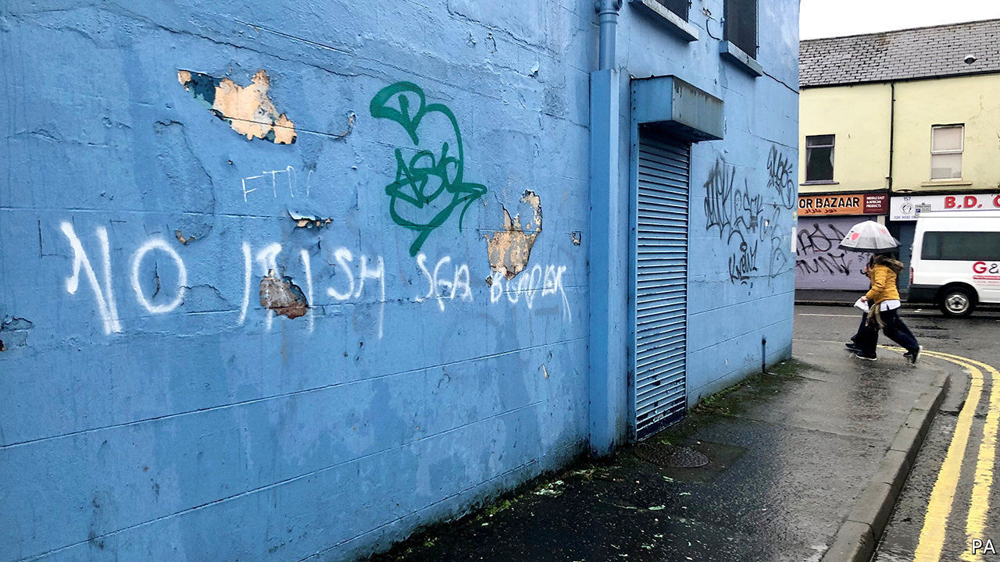

###### Northern Ireland

# A messy Brexit deal threatens to reignite violence in Northern Ireland 

##### Disquiet is growing among unionists 

 

> Feb 6th 2021 


AT A FANCY Brussels dinner of EU leaders in 2018, Ireland’s then taoiseach used a prop to convey the deadly seriousness attached to the Irish border. Holding up a copy of the Irish Times from 1972, Leo Varadkar pointed to its front page, which recorded how an IRA bomb at a border customs post in Newry killed nine people.


During the negotiations to deliver a Brexit compatible with what was wanted in London and Brussels, police and many politicians on both sides of the now largely invisible frontier warned that border infrastructure would be a target for dissident IRA factions, because it would symbolise Irish partition. The UK and EU averted that danger by creating a trade border between Great Britain and Northern Ireland instead. But now violent threats to that border are emerging from Ulster loyalists.


On February 1st the Democratic Unionist Party (DUP) minister with the politically uncomfortable task of implementing the new internal UK trade frontier withdrew many officials carrying out border checks after graffiti labelled them “targets”. Police said they had no evidence that the intimidation came from loyalist paramilitary groups who retain weapons, but warned that there was growing disquiet among unionists. According to the police, street protests would probably have started already were it not for the pandemic. Graffiti threatening Mr Varadkar have appeared in a loyalist estate in Belfast.


When the Irish Sea border started operating on January 1st, Arlene Foster, the DUP’s leader and Northern Ireland’s first minister, was pragmatically talking up the opportunities of the deal she had opposed. But under pressure from party members, she has backtracked and is now vowing to lead a campaign against the border. Although she is talking tough, she is acting with more restraint than many in her party.


The European Commission has not helped to make this fragile system work. On January 29th, as part of its attempt to rectify the EU’s vaccine shortage, it moved to trigger the emergency mechanism which allows aspects of the deal to be set aside. That decision, which had nothing to do with the local situation—there is far more vaccine in Northern Ireland than across the border—bolstered the unionist contention that the province has been cynically used as a battleground for unrelated disputes between the EU and the UK.


Although the EU rapidly backtracked, the development has heaped pressure on Boris Johnson to act to prevent disruption. On February 3rd his government asked the EU to extend until 2023 a series of “grace periods” in which parts of the border controls would not be enforced, in effect delaying the deal’s implementation in the hope of cooling tempers and finding solutions.


With Brexit having upset the delicate equilibrium of Northern Ireland’s peace, a dangerous message is now being heard and discussed openly by some of those close to paramilitaries. The threat of republican attacks led to the decision that border posts could not be put at the land border; the threat of loyalist attacks led to the withdrawal of staff from the Irish Sea border. Violence, or at least the threat of it, has worked where politics has failed.


In a region with centuries of bloody disputation, that is an exceedingly dangerous message. The pressure on politicians to resolve this problem peacefully is intense.■


For more coverage of matters relating to Brexit, visit our 

