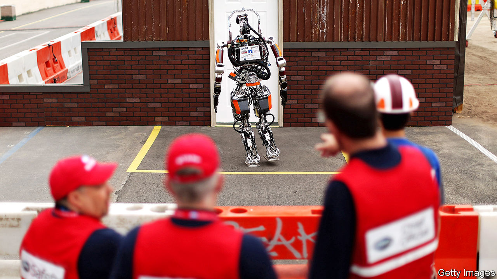
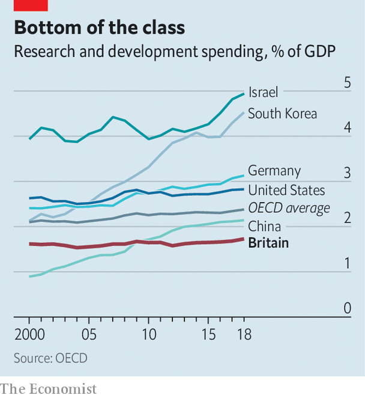

###### R&D

# A new science agency is part of plans to transform research in Britain 

##### The aim of the scheme is to boost high-risk projects 

 

> Feb 4th 2021 


“I want the UK to continue to be a global science superpower,” said Boris Johnson last year. On the basis of current R&amp;D spending around the world (see chart) that seems unlikely to happen. Whereas the share of GDP devoted to R&amp;D in many fast-growing countries is rising, Britain’s is flat. At $50bn, its annual R&amp;D spending is 40% smaller than South Korea’s, even though its economy is three-quarters larger.


The government’s first step towards improving Britain’s dismal performance is the announcement that Kwasi Kwarteng, the new business secretary, is creating an agency to foster fundamental research. Its working title, the “Advanced Research Projects Agency’’, is a clue to the model. Copying the American agency of the same name set up in 1958, which continues to sponsor programmes such as a competition to design robots that can help in natural disasters (contestant pictured above), was one of the priorities of Dominic Cummings, Mr Johnson’s former chief adviser.

 


The aim of the scheme is to boost “blue skies” research—high-risk projects that have the potential to hand Britain a stake in a technology that will define the future. The prime example is ARPAnet, the precursor to the internet which ARPA developed in the late 1960s. America still exerts disproportionate heft over the internet as a result. Silicon Valley’s predilection for big, risky investments was also an inspiration to Mr Cummings, though venture capitalists’ time-horizons are shorter.


The DARPA (D for defence was added in 1972) model which gave birth to ARPAnet was to hire specialist “programme managers” to run each of its research projects, rather than—as most national research bodies do—just giving money to scientists and letting them get on with it. British ARPA is likely to follow that model, and will have plenty of autonomy. Britain’s other publicly funded research agency, UK Research and Innovation (UKRI), operates in a more constrained manner, with more oversight over its spending than British ARPA will probably have. UKRI’s boss, Ottoline Leyser, has said she sees a place for institutions in which the funding model as well as the research are more experimental.


The idea is promising, but two elements that helped America’s research effort may be in short supply. One is money. The £800m ($1.1bn) that was earmarked for the science agency in the 2020 budget—its launch was delayed—is a drop in the ocean. America spends 2.8% of its GDP—a whopping $550bn a year—on R&amp;D. Yet public money may help researchers to attract funding from elsewhere, so it may have a multiplicative effect.


Another important element in ARPA’s success was the mood in America when it was created. A national research effort works best when there is a goal to rally around. In the 1950s America, cold-war competition with the Soviet Union combined with the United States’ global leadership in the wake of the second world war to provide that cohesion. Not just ARPA, but a host of other American national laboratories also made a string of wondrous discoveries. Bell Labs, the research division of the American Telephone and Telegraph Company, then a regulated monopoly, developed the transistor, the laser and the Unix operating system. “The Idea Factory”, a book on Bell Labs’ history, argues that the sense of unified national purpose at the time motivated those discoveries. No doubt the government hopes that the combination of Brexit and covid-19 will unleash that spirit in Britain.■

