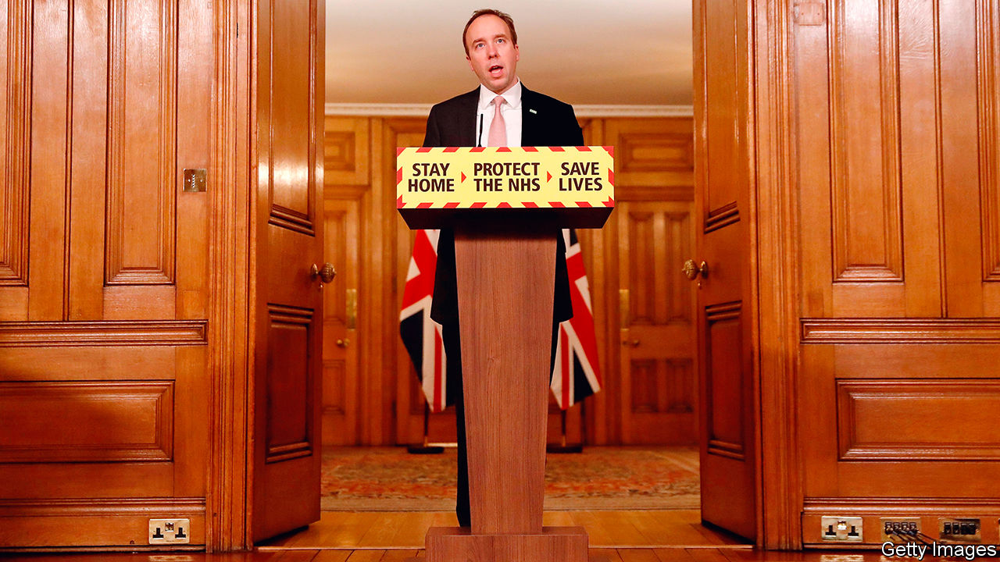

###### The gambler

# After a shaky start, Matt Hancock has got the big calls right 

##### But the Tory party does not much like the government’s most successful minister 

 

> Feb 6th 2021 


IN THE AUTUMN Matt Hancock, Britain’s secretary of state for health and social care, insisted that vaccines were on their way. According to reports at the time, this was greeted with disbelief by other government departments. “Hancockian” became synonymous among ministers with implausible optimism.


Now 10m Britons have received their first jab, a higher proportion than in any other big country. The decision to spread doses to maximise coverage looks solid; a paper published on February 2nd suggests it lifts efficacy. Britain has improved its manufacturing base, ready for another round of vaccines if required by new variants. By now, “Hancockian” ought to carry a different definition.


Few British politicians have seen their stature enhanced in the last year. Rishi Sunak, the chancellor, won plaudits for his early response, before launching a questionable scheme to encourage dining out. He nevertheless remains enormously popular among Tory members. Mr Hancock, meanwhile, limps near the bottom of tables compiled by ConservativeHome, a party bible. He lacks Mr Sunak’s charm or the prime minister’s humour. His refusal to admit mistakes—claiming that the government formed a “protective ring” around care homes in the first wave—grates.


And yet the health secretary deserves plaudits. He was quick to grasp the need to buy vaccines from lots of firms in the hope at least one came up trumps; a decision which, a senior Tory reckons, “could actually save the government in the end”. Anticipating vaccine nationalism, he insisted that Oxford University sign a deal with AstraZeneca, an Anglo-Swedish pharmaceutical firm, rather than Merck, an American one, and pushed to buy more doses than some thought necessary. The NHS, which operates at arm’s length from the Department for Health and Social Care (DHSC), is responsible for the roll-out. But the DHSC started planning early. The first meeting on the topic was held in early April.


The triumphs are not Mr Hancock’s alone. The vaccine task-force was, for instance, the idea of Sir Patrick Vallance, the chief scientific adviser. But, says another scientist, “what’s really good is that he does listen. If he’s got a particular point of view and you think something different, you can talk to him about it and he thinks about it.” Following advice, the DHSC and Downing Street provided early funding to the RECOVERY trial (which discovered the most effective treatment for covid-19) and COG-UK (which has done the bulk of the world’s genetic sequencing). Mr Hancock eased rules on data confidentiality, enabling quick analysis of the susceptibility of different demographic groups. When Kate Bingham, the head of the vaccine task-force, came under attack for her spending on public relations, Mr Hancock defended her. The health secretary has attributed his foresight to a viewing of the film “Contagion”; a more probable explanation is that, unlike some of his colleagues, he is smart enough to recognise good advice.


Not all of his gambles have succeeded. Going it alone when developing a contact-tracing app was a failure. The wider test-and-trace system has taken a long time to reach an acceptable level of performance. Mr Hancock shares the blame with the rest of the cabinet (and key scientific advisers) for the failure to put in place restrictions in March last year. Since then, however, he has been quicker to anticipate danger, spurred by his liability for the NHS and the logic that, since vaccines are on the way, the country shouldn’t give up. He opposed opening schools in January, and has sought stricter border controls. “He’s been the voice in cabinet, saying: ‘Hey guys, you’ve got to lock the fucking thing down,’” says the scientist. “Without him...we would have ended up in some very bad places.”


This has not been an easy role in a party which places a high value on personal liberty and economic growth. While most Britons support lockdowns, opposition is far more common among Tory members. Yet the success of the vaccines has changed the logic. It has also changed his colleagues’ outlook. “It has left everyone thinking, ‘Hang on a minute, can we be a bit more plucky upstart?’” says one cabinet minister. “Can we be a bit more Israel, South Korea, Singapore?” ■


Dig deeper


All our stories relating to the pandemic and the vaccines can be found on our . You will also find trackers showing ,  and the virus’s spread across  and .

