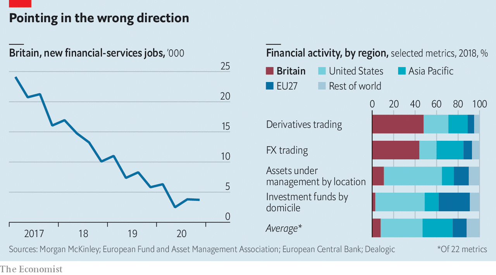

###### Finance and Brexit

# Britain’s financial-services business is divided over “equivalence” 

##### Should the country make a deal with Europe or not? 

 

> Feb 6th 2021 


IN THE FINAL weeks before Britain struck its Christmas Eve trade agreement with the European Union, Boris Johnson employed a euphemism for a no-deal outcome: he called it an “Australian-style” relationship. The agreement was sealed, to the relief of Britain’s manufacturing sector, but for financial services—the country’s core competence and dominant industry, which makes up 7% of its GDP—the outcome was sub-Australian. The EU recognises Australian rules as broadly equivalent to its own in 17 different areas, compared with only two for Britain. It is now easier to sell many financial products to clients in the EU from 10,000 miles away in Sydney than from across the Channel. “You just can’t imagine the Germans throwing the car industry under the bus like that,” laments a British asset manager.


The causes of the government’s neglect of the financial-services sector—which probably include a general hostility to bankers, fury at the generous application of taxpayers’ money to the industry after the financial crisis and a belief among politicians that the City can look after itself—are obscure, but the consequences are clear. Between the Brexit referendum in June 2016 and the end of the transition period at the 2020, around 7,500 jobs—5% of financial-services employment—and over £1.2trn ($1.6trn) of assets moved from Britain to European financial centres according to EY, a professional-services firm. That may be an underestimate, as EY tracked only larger firms; and more may go. Under “target operating models” agreed with European regulators, many firms have promised to shift more jobs to the continent by the end of 2021.


Recruitment data suggest that Brexit may not just be sending work abroad but also discouraging growth in Britain. Even before the pandemic, the number of vacancies posted for jobs in British-based financial-services firms was falling swiftly, according to Morgan McKinley, a headhunting firm (see chart). The figures are gross—net figures are unavailable—but the trend is unmistakable.

 


There are some small upsides to Brexit. New immigration rules that make it harder for firms to recruit low-paid Europeans also make it easier for them to hire highly- paid people from anywhere in the world. Brexit has prompted fresh thoughts about regulation. A review of the British listing regime, for instance, which Lord Hill, a former European Commissioner, is doing, may make London a more attractive destination for Asian firms seeking to raise capital. “We could have done 80% of the suggested changes while in the EU, but it didn’t feel so pressing,” says a banker.


The main question now is whether the EU will grant Britain further “equivalences”. The designation is a poor substitute for the “passporting” rights which entitled British firms to trade freely all over the EU. Equivalence covers fewer market functions and can be withdrawn with 30 days’ notice. As the EU has demonstrated in its dealings with Switzerland—the right for Swiss-listed shares to be traded on European exchanges was suddenly withdrawn in 2014—equivalence can be used for political leverage. But it is the only form of market access on offer to Britain.


In November, Britain granted the EU a wide range of equivalences. Hoping to get the same in return, the Treasury filled out some 2,500 pages of questions on the British regulatory regime, an exercise which an official derides as “especially pointless given they know what our regime is. It’s their regime.” But so far the EU has granted Britain only time-limited equivalence for clearing Irish securities and the operation of central clearing counterparties. Negotiations are continuing, and the Treasury is keen for a deal, but the EU does not seem to be in a hurry. A March deadline already looks likely to slip.


Some suspect that the EU is going slowly on purpose, because uncertainty may encourage business to flow from London to European capitals. William Wright of New Financial, a think-tank, reckons that the outflow from London over the last four years will “embolden Europe to push harder to repatriate more business”.


The EU says it cannot make a decision on equivalences until Britain makes its approach to divergence clear. The British government has talked in vague terms about deregulation—Rishi Sunak, the chancellor of the exchequer, referred to “Big Bang 2.0 or whatever” in a newspaper interview—but has not committed itself to divergence. A crucial question is what the EU would require of Britain in exchange for equivalence. “If it means targeting the same broad outcomes of well-functioning markets that is fine,” says an insurer. “But we can’t agree to line-by-line regulation by email.”


Big firms in the City are keener on equivalence than divergence. Europe, the source of a third of the financial-services industry’s export business, is important to them, and European rules, which Britain helped to shape, have served them well. For global firms, a common regulatory system between Britain and the EU makes the world a simpler place.


Compared with global City firms, those headquartered in Britain are less set on equivalence. They are more concerned about what will happen when, unconstrained by British policymakers, Europe’s more interventionist instincts are brought to bear on regulation.


Over to the west of the City in Mayfair, where most of London’s hedge funds are located, opinion is heavily in favour of divergence. Hedge fund managers’ views, shaped by a fast-moving world in which regulation is often a drag on innovation, tend to be more eurosceptic than those of the bosses of global firms located in the City and Canary Wharf. While most City figures wanted Britain to remain in the EU, high-profile hedge-fund bosses such as Crispin Odey and Sir Paul Marshall helped finance the Leave campaign.


Unlike banks, which do a lot of business in Europe, hedge funds raise most of their capital in Asia and the Middle East. They are lightly regulated, and plan to stay that way. “The only times the EU has affected my business is when they have tried to destroy it,” says a hedge-fund manager. The alternative investment sector is fairly small—it pays less than £5bn a year in tax and employs around 40,000 people—but its big cheeses are generous Conservative Party donors, so it has an outsized political voice.


The hedge funds’ particular bugbear is the EU’s Alternative Investment Fund Managers Directive, which provides a framework for regulating them. Many want it dropped, and the sector deregulated by, for instance, lowering authorisation requirements and dropping disclosure rules. But while such a step would go down well in pricey Mayfair eateries, those who dine in marginally less expensive City restaurants fear it would invite retaliation from Europe and thus make their lives more difficult.


The hedge funds are not alone in wanting divergence. Many in the insurance industry believe that a review of the Solvency II regulatory regime focusing on the needs of British firms could lead to some marginal improvements. Smaller challenger banks hope that Britain can tweak the prudential framework to suit them better.


For sectors such as manufacturing and agriculture, Britain must choose whether to align with European or American regulations. In financial services it has more clout. The EU without Britain is not a huge force in finance (see chart). Its share of the overall business has fallen from a fifth to 13% as a result of Brexit, compared with Britain’s 8% share. In many areas, Britain’s share is bigger than that of the EU 27. Now that it no longer needs to agree rules with its old European partners, Britain can make deals with countries like America, Singapore, Switzerland and Japan that offer a path to capturing fast-growing new markets such as fintech and carbon trading and for setting the rules that determine how those businesses are done.


The question of whether Britain should go for equivalence will probably be settled not in the City, Mayfair or Westminster but in Brussels. The EU’s sluggish approach to negotiations suggests that it sees no great advantage in offering Britain equivalence deals on terms that are likely to be accepted. If that is so, the City will have to adapt to a new world—as it has done before, and will no doubt do again.■


For more coverage of matters relating to Brexit, visit our 

