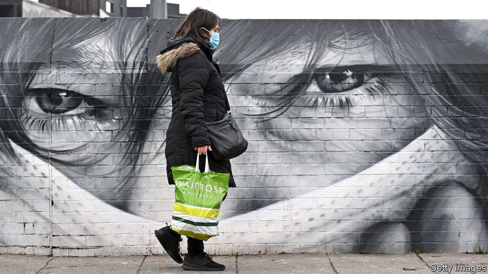
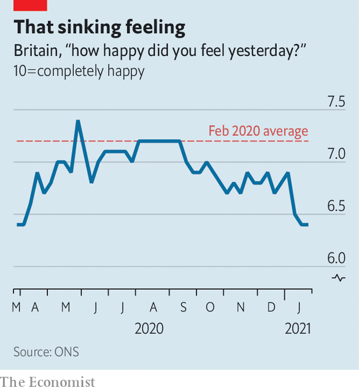

###### The national mood

# Even the successful vaccine roll-out is not improving Britons’ moods 

##### Why the long face? 

 

> Feb 6th 2021 


“WE SHOULD ALL allow ourselves a smile,” said Nicola Sturgeon, Scotland’s first minister, on December 8th. On that day Britain’s programme of mass vaccination against covid-19 began, with a needle into the arm of 90-year-old Margaret Keenan in Coventry. In January the pace of vaccination increased, putting Britain far ahead of continental European countries. Far from smiling, though, Britons are glummer than they have been for months (see chart).


Covid-19 flattened the national mood when it began to spread last spring. Between February and late March, the average self-reported happiness score in Britain (on a scale of nought to ten) fell from 7.2 to 6.4, according to the Office for National Statistics. People gradually cheered up during the spring and summer of 2020 before their spirits came crashing down again. Young people have become especially gloomy. In normal times happiness follows a U-shape, with the young and old happiest and the middle-aged glummest. The pattern is now an upward slope: the old are happier than the middle-aged, who are happier than the young.

 


The weather is probably not to blame. Britons usually become a little happier in the summer and gloomier in the winter, but the normal seasonal shift is far smaller than the gyration in mood that has occurred in the past year. Nor can the slump be put down to growing economic worries. A large survey carried out by Daisy Fancourt and others at University College London (which also shows a steep drop in happiness since September) suggests that people are less financially stressed now than they were last autumn.


Perhaps people are simply worried about catching and dying from covid-19. The national mood began to turn down roughly when cases began to rise. But the present gloom seems unwarranted. In January the number of deaths in England was about 30% higher than normal—awful, but not nearly as bad as last April, when deaths were as much as 120% above the normal level. And if people fear for their own health, it is strange that the young, who seldom die of covid-19, are so much less happy than the old.


That leaves lockdown as the most likely explanation. In opinion polls, Britons of all ages express great enthusiasm for government restrictions on their freedom; many even want them tightened. Unsurprisingly, though, they seem not to enjoy the experience. It is hard to separate the psychological effect of lockdowns from the effect of rampant disease and high death rates, since they occur at roughly the same time. But a study of Singapore by Terence Cheng, Seonghoon Kim and Kanghyock Koh suggests that restrictions themselves immiserate. The national mood slumped there during a strict lockdown last spring. Singapore has recorded a mere 29 deaths from the coronavirus so far.


Ms Fancourt’s survey suggests that young people in particular are behaving differently during the present lockdown. Almost half of 18- to 29-year-olds say they are spending less time communicating online with family and friends, compared with the lockdown last spring; only one-tenth say they are doing it more. That probably helps to explain their gloom. Having strong friendships boosts happiness a good deal even after controlling for income and other characteristics. Britons are also exercising less than last spring and (according to Ipsos MORI, a pollster) having less sex.


Oddly, Britain’s vaccination triumph might be making things worse, because it has persuaded more people that the crisis will end soon. The ONS survey shows that the proportion of people who think life will be back to normal within six months rose between September and January, from 10% to 20-25% (though it is still not as high as it was last spring). The effect on people’s feelings may be similar to the last stretch of a long-haul flight. When the end seems to be in sight, the waiting is interminable. ■


Dig deeper


All our stories relating to the pandemic and the vaccines can be found on our . You will also find trackers showing ,  and the virus’s spread across  and .

