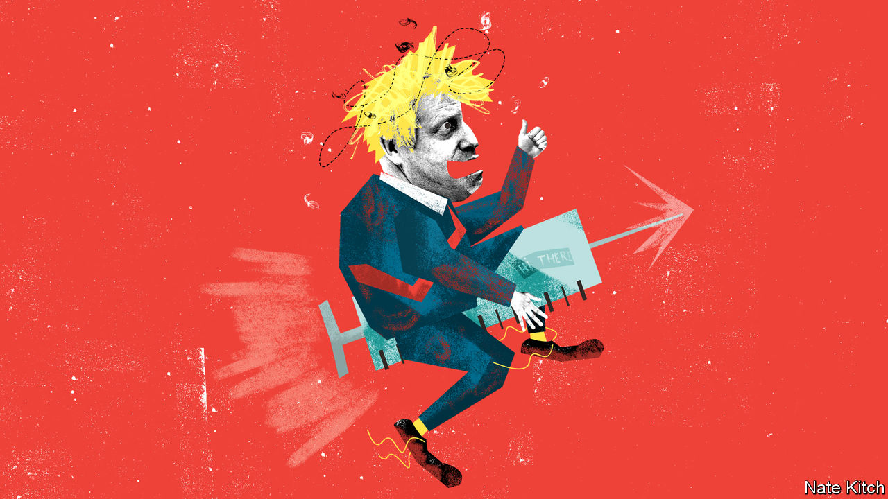

###### Bagehot

# How Boris Johnson should spend his political capital 

##### The best model may be a former Labour prime minister, Clement Attlee 

 

> Feb 6th 2021 


POLITICAL CAPITAL is a prime minister’s most precious resource: the magic substance that mobilises supporters, marginalises opponents and turns vague dreams into legislative triumphs. It is also the most ephemeral, here today and gone tomorrow. Having accumulated a lot in the last general election, Boris Johnson saw it disappear a year ago as he floundered in the face of covid-19. There was talk of him being “gone by Christmas”.


Now the Bank of Boris is in surplus again. The vaccine programme’s success has blunted the accusation that he’s an incompetent blunderer. With 14% of the population vaccinated, well ahead of Germany (2.4%) and France (2.3%), Britain has done better than any other big country. The EU, with its bungled vaccine nationalism, is doing its utmost to prove that the Eurosceptics were right all along. An opinion poll published on January 31st put the Tories three points ahead of Labour; one on February 1st showed that only 36% of Britons have a favourable view of the EU compared with 50% who have an unfavourable one. And Mr Johnson seems to be maturing as a politician: his tone is more statesmanlike and Downing Street more professional.


If Mr Johnson is wise, he will spend his political capital swiftly rather than trying to hoard it, for it may well evaporate. With the official covid-19 death toll having passed 100,000, Britain has one of the highest mortality rates in the world from the disease. Brexit is gumming up trade; the Manchester Chamber of Commerce reports that it is hitting the business of over a quarter of companies in the region. Northern Ireland is in crisis over the constitutional arrangements for the province.


But where exactly should Mr Johnson spend it? The two most obvious answers are making good on his promise to “level up” the country and preventing the break-up of the United Kingdom. But “levelling up” is at best the work of a generation and potentially a labour of Sisyphus: whatever can be done to push the boulder uphill will be undone by the incline of the British economy to the south-east. The best way to prevent Scotland from seeking independence is to prove that Britain is working so well that leaving it would be idiotic.


In spending his political capital—and the nation’s cash—Mr Johnson should prioritise three more concrete policies. The first is fixing social care, which has long been the third rail of British politics. A poorly thought-out plan to fix it, quickly dubbed the “dementia tax”, lost Theresa May her majority in the 2017 election. But now the cost of doing nothing exceeds the cost of doing something: even before more than 25,000 care-home residents died with covid-19 last year, the system was visibly rotting, with overcrowded facilities and mounting staff shortages.


Mr Johnson has frequently promised to provide a lasting settlement for the sector. He should now fulfil his pledge in the name of building a national memorial for the victims of the pandemic. The simplest way to reform the system is to preserve the principle at the heart of the NHS that care should be largely free at the point of delivery: cap personal contributions at, say, £50,000 ($68,000) and then pay for the rest out of general taxation, even if this means raising taxes. According to Policy Exchange, a think-tank, fully funding long-term social care would cost 0.5% of GDP—not a massive sum for so pressing a need.


The other end of the age spectrum, the young whose education has been sacrificed to protect their elders, also needs attention. The Institute for Fiscal Studies, a think-tank, estimates that school closures will cost the average pupil £40,000 in lost wages over their lifetime. The notion of average is misleading. Poor children who lack the ready internet access and quiet space needed for home study feel the consequences more than richer ones. The government needs to make sure that they have the chance to make up for lost time by, for example, establishing summer schools, lengthening the school day, extending the school year, offering enriched classes and allowing some children to repeat whole years.


Along with this domestic agenda, Mr Johnson needs a foreign-policy triumph. What better than for the man who brought Britain Brexit to preside over a new rapprochement with the EU? The EU is not about to autocombust, whatever the more excitable Eurosceptics may think, and can make Britain’s life difficult. Its current embarrassment should calm fears that any warming of the relationship is a prelude to rejoining, and thus give Mr Johnson room for manoeuvre.


It is time he rejected the dogmatic Brexiteer belief that Britain should deal primarily with nation-states, particularly France and Germany, rather than international abstractions. He should explore ways of working with the EU, particularly on foreign and security policy. Britain broadly agrees with the EU on big challenges such as Iran and climate change. It also has more to gain than to lose by co-operating with it on cross-border crime even if that involves the notional recognition of the European Court of Justice. Granting full diplomatic status to the European ambassador, João Vale de Almeida, would be a good way to start a rapprochement.

A good man after a crisis


Mr Johnson famously regards Winston Churchill as his model. But when it comes to spending political capital the best model may be Churchill’s friend and rival, Clement Attlee, the subject of a fine biography, “Citizen Clem”, by John Bew, a member of Number 10’s policy unit. Attlee reignited the nation’s spirit after the dark days of the war by passing the 1946 National Health Service Act, which provided free health care for all, and nurturing the 1944 Education Act, which created a more meritocratic society. He also laid the foundations of post-war foreign policy by forging a deep alliance with the United States despite the virulent anti-Americanism of many of his own MPs. The spirit of the late 1940s may be just what Britain needs in the early 2020s. ■

