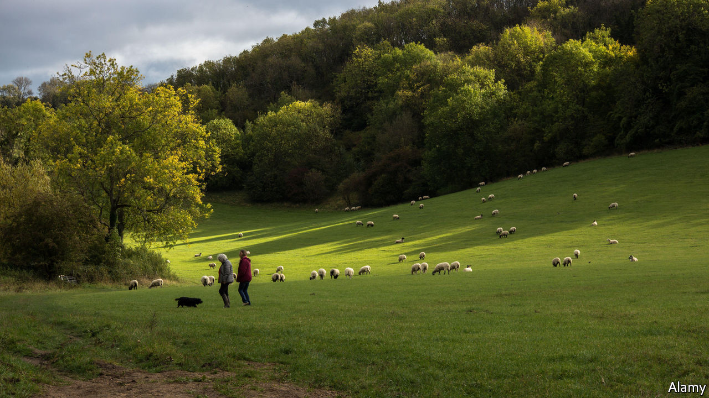

###### Country life

# More killings of sheep by dogs shows a delicate rural balance out of kilter 

##### Get off my lambs 

 

> Feb 4th 2021 


ON A DARK evening in November, Dan Lethbridge, a Cornish sheep farmer, came across a blood-soaked lamb. Disconcerted, he fetched his quad bike to survey his flock. Soon he had counted 18 carcasses. Some had missing ears and mutilated faces. Others were hanging limp from electric fences. They had clearly been attacked by a dog. There was another vicious canine slaughter in January, when Mr Lethbridge lost three ewes. Both culprits are still at large.


Attacks on sheep were rising before covid-19 struck because, according to NFU Mutual, a rural insurer, more dogs were left alone to rampage around the countryside. Lockdown, which has trapped people at home with their pets, should have mitigated that problem. Yet the cost of dog attacks on farm animals increased by a tenth in 2020 to £1.3m ($1.8m). Single episodes can have a big impact. In January, a farmer in Monmouthshire lost 50 pregnant ewes, each carrying at least two lambs, to a dog.


Britain’s sheep are the victims of two seemingly innocent covid-19-related trends. The first is a boom in rambling. A shortage of other entertainments has led many Britons to take to the nation’s footpaths. Stuart Roberts, deputy president of the National Farmers Union, says visitors on his land have trebled. On one day he counted 3,000 walkers.


Their arrival has disturbed an ancient but delicate relationship between farmers and wanderers. British walkers have unusually free access to farmland, through a network of footpaths that often cut through fields in which animals graze. Farmers sometimes resent this, but tradition and the law require them to put up with it. Now the impact has become more troublesome. Footpaths are getting wider, crops are being trampled and gates left open. “They don’t know how to respect the land,” says Mr Lethbridge.


Lockdown has also led to a boom in dog-buying, with the result that many virgin ramblers are accompanied by new pooches. First-time owners may be ignorant of the ways of both dogs and the countryside. NFU Mutual’s survey found 64% of owners let dogs roam free, but only 40% knew they could kill livestock. “Most people don’t realise that their lovely little fluffy pet, which is adorable at home, can suddenly get in among sheep and just go ‘Death’,” says Tobin Bird, a sheep farmer who runs “Sheep Proof Your Dog”, a training course for dog owners. He teaches them “to be top dog” and to go easy on positive reinforcement, because: “a treat means nothing when a dog is in full flight.” Whenever a local farmer shoots a bloodthirsty mutt, demand for his services rises.

