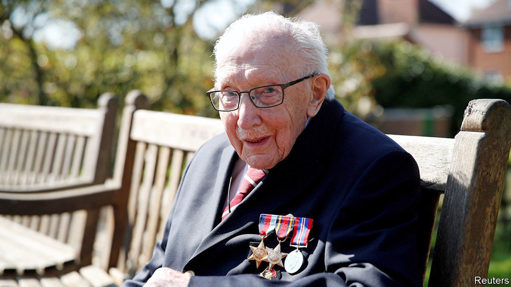

###### National hero

# Remembering Captain Sir Tom Moore 

##### The former soldier captured the spirit of the age 

 

> Feb 6th 2021 


FOR 99 OF HIS 100 years, Captain Sir Tom Moore was unknown to most of his compatriots. But when he died on February 2nd the prime minister and the queen paid tribute to him. He came to fame last year when his effort to raise £1,000 to support health workers by walking 100 laps of his garden before his 100th birthday caught the public imagination. He raised £33m. Sir Tom touched a couple of soft British spots. One is a love of the underdog: his feat was humble yet brave. The second is a fascination with the second world war, a common reference point for Britons struggling to make sense of a crisis that left them simultaneously terrified and bored. Sir Tom, who served in Burma, was one of a dwindling generation that linked present troubles to past conflict.■

