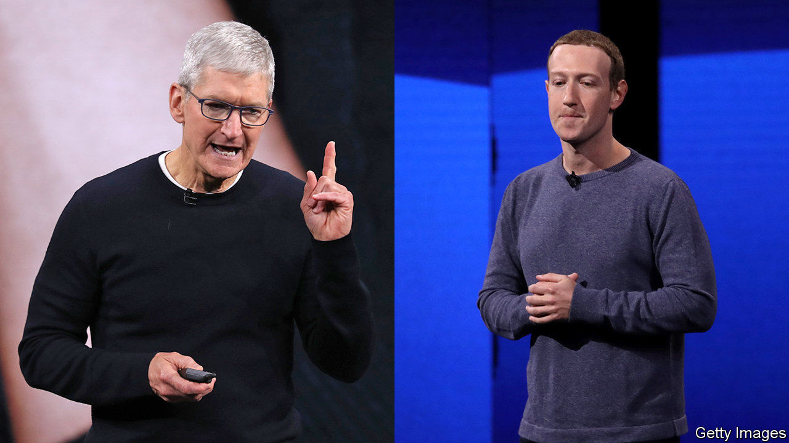

###### Cook v Zuck

# Apple’s privacy policy kicks Facebook where it hurts 

##### The iPhone-maker antagonises its ad-dependent Silicon Valley neighbours 

 

> Feb 4th 2021 


SELDOM HAS a tech giant excoriated another as Apple did Facebook. “What are the consequences of prioritising conspiracy theories and violent incitement simply because of their high rates of engagement?” asked Apple’s boss, Tim Cook, in a speech on January 28th. “A social dilemma”, he thundered, “cannot be allowed to become a social catastrophe.” Facebook was singled out without being named. Last year it complained about its portrayal in “The Social Dilemma”, a hit Netflix documentary.


Mr Cook’s warning came in response to Facebook’s own broadsides against Apple’s forthcoming “app-tracking transparency” measure. Soon a pop-up from Apple will start asking users of the latest version of iOS, its mobile operating system, if they want named apps such as Facebook to track their digital activity across other companies’ apps and websites. Huge numbers are expected to demur. That is likely to damage Facebook, possibly Google and a wide range of other ad-tech businesses.


Mr Cook’s righteous wrath makes it easy to forget how in the early days, Apple enabled ad tracking. In the 2000s app developers and advertisers learned to use its “unique device identifiers” to follow users around the internet. These UDIDs, as they were known for short, were permanently attached to every iPhone or iPad and made it easy to keep tabs on individuals’ online activity. Then in 2010 a privacy furore erupted around Apple and Google. Two years later Apple responded by banning app developers from using UDIDs. For a brief few months advertisers could barely track its customers at all.


The sixth incarnation of iOS introduced a new, less intrusive tool called “identifiers for advertisers”. Unlike UDIDs, these can be blocked, and do not identify users personally; any data collected are aggregated before being used. But they still allow tracking, which is switched on by default on iPhones, and fiddly to turn off. Apple’s aim back then was to help app developers earn revenue in iOS.


Now privacy is more central than ever to Apple’s brand. Four years ago it stopped tracking users on Safari, its web browser. Google, too, has announced plans to eliminate third-party tracking “cookies” from its Chrome browser by 2022. Ad-industry insiders find it odd that identifiers for advertisers are still around; last year some in the mobile-ad industry reckoned Apple was going to kill them off. With app-tracking transparency at least some users will presumably allow cookies to stay.


Facebook has nevertheless fought back hard. In December the social network took out newspaper ads claiming that Apple’s changes would hurt small businesses. Announcing Facebook’s earnings on January 27th Mark Zuckerberg, its boss, explained how his firm gives tiny firms ad-targeting tools that in the past only large companies had the resources to employ. This echoed other ad-tech types’ warnings of a return to a “spray and pay” world where, once again, half of all ads are wasted but no one knows which half. Moreover, Facebook argues, Apple is trying to shift the internet’s business model from one that is chiefly ad-supported to one that is increasingly paid for. In this view, Apple’s stance on privacy is not selfless but self-serving.


Facebook’s campaign against Apple could go beyond public admonishments. Last month rumours swirled that Mr Zuckerberg’s firm might sue the iPhone-maker over alleged preferential treatment given to its own apps in its App Store, while it imposes restrictions on third-party developers like Facebook. Apple’s App Store is already under scrutiny by America’s Department of Justice and the European Union’s competition watchdog.


Of course, Facebook’s own protestations are not exactly disinterested. It may want to divert attention from the antitrust lawsuits it itself faces. And the company will probably take a hit to its top line as a result of Apple’s move. In late January it named the latest iOS changes as a headwind for its ad business this year.


Most people will welcome Apple’s privacy proposal. But its ability to impose it on a big industry has underlined its power in a way that may not be entirely helpful for it. As for Facebook, its task now is to come up with its own pop-up to reassure people that its ad-tracking is harmless—even for the most talented ad creative, a tough brief. ■

