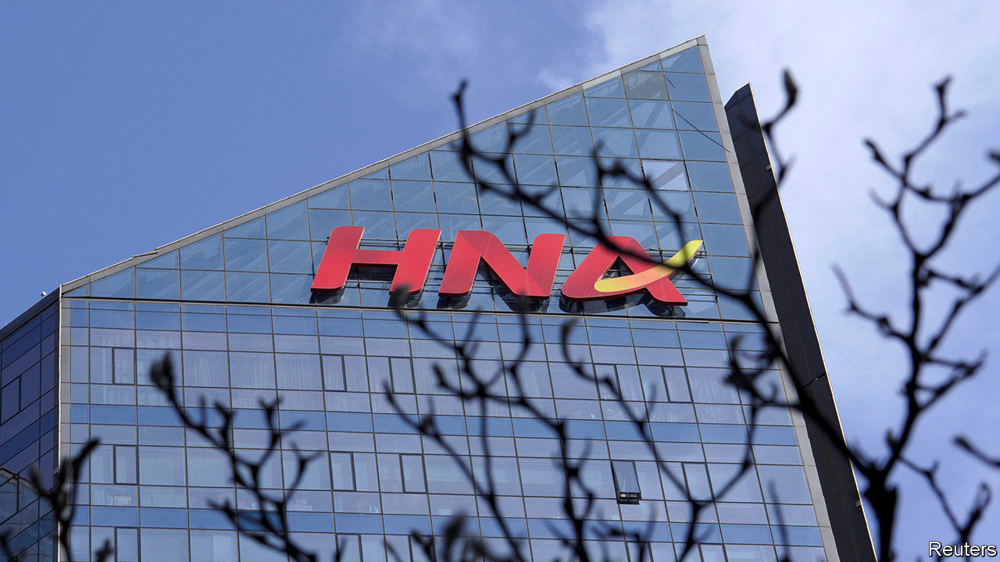
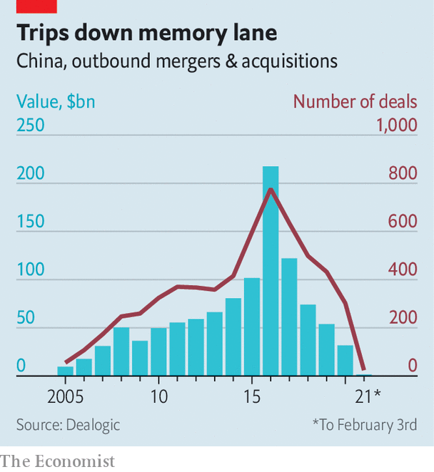

###### Too close to the sun

# What the fate of HNA Group says about China Inc’s foreign ambitions 

##### Globetrotting Chinese conglomerates retreat home 

 

> Feb 4th 2021 


FEW LIFE stories are as soap-operatic as Lai Xiaomin’s. The fallen state financier dallied with more than 100 mistresses, according to Chinese media. He was subsequently caught with three tonnes of cash in one of his dozens of homes. The sheer scale of his thievery—1.8bn yuan ($279m) in kickbacks, the largest bribery case since the founding of the People’s Republic of China in 1949—justified the death penalty, a judge opined. In a tragic denouement, Mr Lai was executed on January 29th. 


The moneyman’s most serious offense—and the one that ultimately cost him everything—may have been something else. Under Mr Lai’s control, Huarong Asset Management, a state-run financial group, became the lender of last resort to China’s riskiest corporate borrowers. When state banks said “no” to loans, Huarong said “no problem”. Its lending helped private conglomerates get around capital controls and scoop up assets overseas. This enabled some of them to enlarge their balance-sheets—occasionally to breaking point. These strains put the broader financial system at risk. And that perturbed the communist regime’s paramount leader, Xi Jinping, who prizes stability—including the financial sort—above all else.


The latest example came within hours of Mr Lai’s execution. HNA Group, a sprawling conglomerate with interests in airlines, finance, logistics, property, tourism and much else besides, said that its creditors had applied to a local court to initiate bankruptcy and restructuring proceedings. Huarong was among the groups seeking to claw back lost loans from the bankrupt concern.


HNA became known for amassing more than $80bn in debts and large stakes in Hilton, a large American hotel operator, and Deutsche Bank. But in recent years it often found itself short of cash. In 2019 it was in effect taken over by a state-backed management team, installed to stop the rot infecting the rest of the financial system. To make matters worse, disclosures made public on January 30th by HNA’s listed units, such as Hainan Airlines Holding, revealed that an internal investigation had found that some existing shareholders and associates had misused around $10bn of company money.


HNA’s demise, like Mr Lai’s, marks the end of an era for China Inc’s overseas ambitions. The conglomerate’s rise to prominence began in 2015, when it paid $7.6bn for Avalon, an Irish aircraft-leasing business. Such transactions fuelled a boom in outbound Chinese mergers and acquisitions. In 2016 Chinese firms splurged $218bn on foreign deals, more than twice as much as the year before, according to Dealogic, a data-provider.


Some purchases looked strategically sound—for instance ChemChina’s $43bn acquisition of Syngenta, a Swiss chemicals firm. Less disciplined buyers picked up trophy assets, such as the Waldorf Astoria hotel in New York (bought by Anbang, which started out in insurance) and Club Med (purchased by Fosun, another unwieldy holding company).

 


The globetrotting bonanza was short-lived (see chart). By 2018 Chinese authorities had grown wary of the domestic financial repercussions of reckless overseas adventures. At the same time, officials in America and Europe began to fret about the national-security implications of some Chinese investments.


In April 2018 Mr Lai was detained by the Chinese authorities. Three months later HNA’s co-chairman, Wang Jian, fell to his death in the French countryside. The incident was deemed an accident by local police. After that his group began to sell assets. Earlier that year the chairman of CEFC Energy, a conglomerate with interests in oil and finance and another of Huarong’s clients, was also detained, after attempting to buy a $9bn stake in Rosneft, Russia’s state-controlled oil giant. Chinese regulators were forced to take over Anbang. After more than two years they are still trying to offload its blingy assets, many of which have lost their sheen.


Not all of the era’s acquisitions were duds. Volvo, an iconic Swedish marque, seems to have thrived under Geely, a Chinese carmaking giant which bought it in 2010. In 2016 Midea, a white-goods manufacturer, bought Kuka, a German robot-maker, for $5bn and absorbed its valuable know-how. ChemChina appears to be a decent custodian of Syngenta. On February 2nd Alibaba reported 37% year-on-year growth in revenues for its international retail business; this, China’s e-commerce titan said, was mainly thanks to the strong performance of Lazada, a Singapore-based online-shopping platform it snapped up five years ago, and of Trendyol, a Turkish retail group in which it purchased a large stake in 2018.


These quiet success stories are, however, overshadowed by spectacular failures like that of HNA. They may be the last winners for a while, at least in the West, where governments and the public view Mr Xi’s unconcealed authoritarianism with growing anxiety. In 2020 Chinese firms spent just $32bn on foreign acquisitions, the lowest figure since 2007. ■

