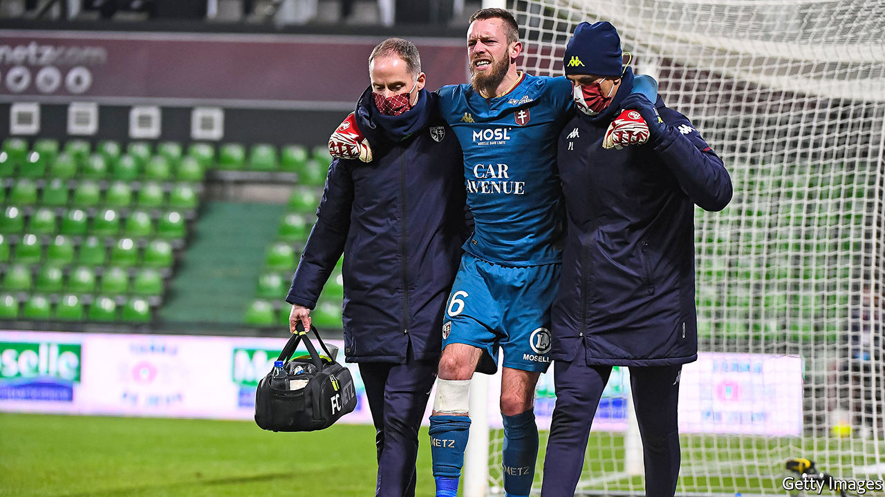

###### Goalless defeat

# Why no one wants to broadcast France’s Ligue 1 

##### The beautiful game is in an ugly financial situation 

 

> Feb 6th 2021 


IF A FOOTBALL match is played but no fans watch it, either in the stands or on television, did it really happen? The quandary might once have amused Albert Camus, a fine goalkeeper who dabbled in philosophising. It is also existential, in another way, for French football clubs. First, covid-19 has deprived them of live supporters. Then the top league’s broadcasting partner skipped town without paying. Teams that once feared relegation now worry about bankruptcy.


This year France’s Ligue 1 had hoped to kick off its journey to the European elite. Though the national team won the most recent World Cup, the domestic championship in which many of its stars compete is, financially speaking, outplayed by richer leagues in England, Germany, Italy and Spain. A whopper broadcasting deal starting this season, worth over €1bn ($1.2bn) a year, up by 60% on the previous arrangement, would help it level the playing field.


The deal proved too big a whopper even for Mediapro, the Spanish broadcasting group with Chinese backers that snapped up most of the matches. The channel it had set up to show Ligue 1 clashes attracted few punters. Stretched for cash, it made just one quarterly instalment in August, then stopped paying entirely. By December the contract was voided.


On February 1st an auction was held to replace Mediapro. No credible buyer emerged. Canal+, a pay-TV group controlled by Vincent Bolloré, a ports-to-media tycoon, unexpectedly stayed away. Having lost the main football rights in 2018 after several decades, Canal+ says it can live without Ligue 1 (it still shows a handful of matches). Many think it may rejoin the fray, but offer much less than Mediapro did. Amazon has also shown interest in streaming rights, but has offered stingier terms than traditional broadcasters. TV channels may bid for one match at a time.


For now, French football has no broadcasting deal for most matches—a catastrophe for clubs that rely on such rights for a third of their income (often more for smaller teams). They are already facing an entire season with no gate receipts. Pandemic-hit sponsors have less money to throw around. Player transfers, a traditional source of cash, are tricky in a depressed market. The league has already indebted itself to tide teams over; struggling clubs have been able to tap banks for state-backed loans. But a public bail-out of an industry that rewards its stars with multimillion-euro contracts would look unseemly.


Other European leagues are also ailing. Some, like the English Premier League, offered rebates to broadcasters during the covid-19 crisis. An auction for Italy’s Serie A rights in January fell short of expectations. A group of European clubs estimates 360 teams will need financial help to survive. The main concern in France is which channel will be airing the showdown on February 7th between Olympique de Marseille and Paris Saint-Germain—if any. French football wanted to be viewed as the most competitive in Europe. Now it would be happy just to be viewed.■

