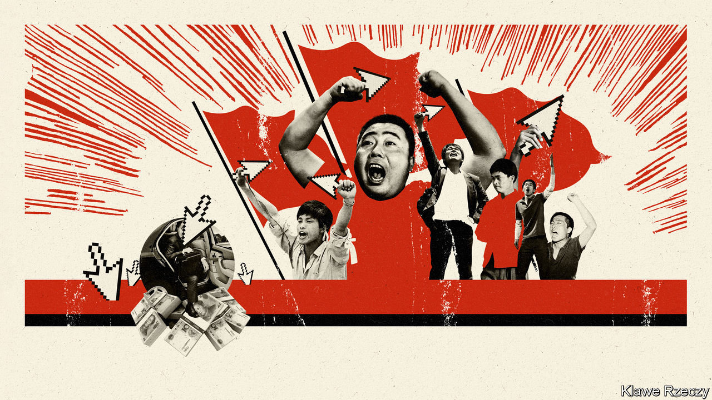

###### Keyboard Maoists

# Anti-capitalist tirades go viral in China 

##### Marxist rhetoric is gaining currency among young, overworked netizens 

 

> Feb 6th 2021 


IN THE BOOMING realm of short-video apps in China, the most popular clips often feature silly gags or cute animals, or both. Recently, however, a different genre has climbed the charts: criticism of capitalism. In December a user going by the name Zeng Shike posted a video on Douyin, the inside-China version of TikTok. In it he lambasted Jack Ma, an e-commerce tycoon, for being a selfish capitalist. “These big shots are trampling on small merchants,” he said in the amateurish production: just a city scene with a voice-over. “It used to be about serving people and making life more convenient. Now they’re causing financial trouble and harming society.”


Mr Ma’s business has been in the government’s sights, too. On November 3rd Ant Group, a fintech company that he founded, was forced to halt what would have been the world’s biggest initial public offering because of new regulations that will up-end its business model. It was after this that he became a lightning rod for online rants against capitalism. (Mr Ma disappeared from public view for nearly three months, but re-emerged on January 20th to give an online speech to rural teachers.)


In recent weeks netizens’ anger has also surged against other private firms and their bosses. Jude Blanchette, whose book “China’s New Red Guards” describes a revival of Maoism among Chinese people since the 1990s, argues that opposition to big non-state businesses has long been evident in the margins of public sentiment. The government normally supports firms such as Mr Ma’s and tries to dampen neo-Maoist suggestions that China is capitulating to capitalism. But sometimes it gives Maoists more freedom to air their grievances. That appears to be happening now. Officials are targeting China’s big tech firms with new antitrust rules aimed at curbing their power. “It looks like they are using public frustration to help give tailwind to this campaign,” says Mr Blanchette. (Ant Group has agreed with regulators on a restructuring plan, Bloomberg reported on February 3rd).


Lately netizens have also been attacking Pinduoduo, a discount-shopping app that rivals Mr Ma’s Alibaba, of which Ant Group is an affiliate. On January 4th it was revealed that one of Pinduoduo’s employees, a 23-year-old woman, had collapsed while walking home after an overtime shift. She died later in hospital. A national debate ensued, focused mainly on the culture of overwork in China. Some pointed to what they saw as a more basic problem. “In China’s speed-obsessed tech world, the labour law is treated like a tablecloth or toilet paper. It is never respected,” said the narrator of one video about “Capitalist Pinduoduo”. It has been watched more than half a million times. In another video a young man in a black hoodie calls on consumers to stop spending money on the company’s app: “The capitalists are just squeezing us. They don’t see us as people.”


Even Huawei, a telecom giant much loved by the government, has not been immune. Specifically, critics have focused on Annabel Yao, the youngest daughter of Ren Zhengfei, the firm’s founder. On January 14th Ms Yao released a 17-minute documentary to announce the start of a hoped-for career as an entertainer. She was greeted with scorn. “Controlling our material life is not enough. Capitalists also want to control our cultural life,” read the most-liked comment on her account on Weibo, a microblog platform. A flood of short videos derided her claim to be self-made.


But the videos go beyond mockeries of this or that wealthy person. One piece about how capitalism works explains that dairy farmers, in order to keep prices high, would rather dump excess milk than give it to poor people. In another, a young presenter, hat on backwards, praises Mao for arguing in 1972 that turning China capitalist would allow global firms to take control and make the country a semi-colony. “This great man’s vision has carried through the ages,” he says, with a thumbs-up.


Many of the videos lack revolutionary punch. Renditions of the “Internationale”, a socialist anthem, garner many clicks but seem more like kitschy nostalgia or funny memes than calls to action. The young people drawn to them are nothing like the Red Guards of Mao’s day, who used horrific violence against those branded as “capitalist roaders”. Yet their resentment of the business elite appears genuine. A rough indicator is the torrent of comments overlaid on videos carried by Bilibili, another popular app. Videos showing Mr Ma once inspired both respect and humour, with some viewers praising his business acumen and others sarcastically asking for money. Recently the tone has darkened, with comments such as “down with Jack Ma” and “workers of the world, unite!”

Nothing to lose but your memes


The anger is easy to explain. Inequality has soared in China over the decades. The proliferation of social media has made people more aware of the obscene wealth of some of their compatriots. After Ms Yao, the daughter of Huawei’s founder, released her documentary, one short video analysed her backdrop to draw viewers’ attention to the value of her luxurious home.


Coupled with a sense of unfairness is bitterness about unreasonable work demands. Employees of tech firms complain about what they call the “996” culture: an expectation that they should be in the office from 9am to 9pm, six days a week. Migrant workers from rural areas have it worse, whether grinding it out in factory jobs or rushing around as food-delivery workers (see ). But overworked young professionals have started referring to themselves as dagongren, a term that used to describe those who do menial jobs. Yan Fei, a sociologist at Tsinghua University, describes an emerging class identity among people who are struggling to get ahead. It embraces both white-collar and blue-collar workers.


The attacks on capitalism are, in a narrow sense, consistent with official rhetoric that still describes China’s economy as “socialist” even though private business generates 80% of urban employment and 60% of GDP. But why let tech titans be described as money-grubbing capitalists when they are often also hailed as leaders of China’s drive to become more innovative?


In part this reflects the Communist Party’s ideological ambiguity. It sees big private firms as national champions, but it also regards the preservation of Mao’s sanctity as essential to its grip on power (de-Stalinisation was the start of a slide towards the Soviet Union’s ruin, say party historians). That gives a bit of leeway to people who wave the banner of Maoism, even if what they say is not entirely in line with the party’s current thinking. Having let the anti-capitalist fires burn brightly for a time, censors will douse the flames. ■

