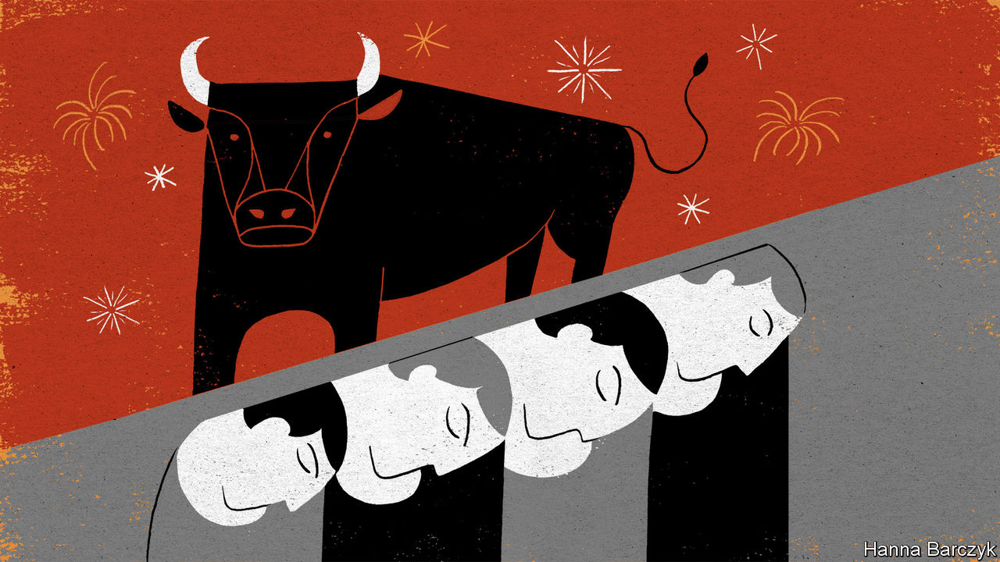

###### Chaguan

# Because of covid, many in China will miss their biggest holiday 

##### For migrant workers, the Spring Festival is often the only chance to see relatives in the countryside 

 

> Feb 6th 2021 


NO CROWD IN China is truly anonymous. Subtle badges of class, income and even region mark out individuals in the densest throngs, such as those seen at lunar new year, when hundreds of millions of migrant labourers, white-collar workers and students cram into trains, buses, aeroplanes or cars to visit faraway relatives. China is a country in constant, restless motion. But even in a normal year, it is also a place of hard-to-shed social distinctions.


This is not a normal year. In line with China’s ambition of keeping covid-19 infections as close to zero as possible, national health authorities have asked the public to avoid non-essential travel to see in the year of the ox. That is a reasonable request. But the burden falls heavily on those 300m migrant workers, for whom the holiday is often a rare chance to see children and aged parents.


China’s transport ministry predicts that a total of 1.7bn journeys will be made during the travel surge either side of new year, which this year falls on February 12th. That is down from about 3bn journeys in 2019, before the pandemic. Millions employed by the government or state-owned enterprises have simply been ordered to stay put. Workers in the private sector being harder to boss about, several wealthy regions are offering bonuses to migrants who abandon plans to return home. These range from cash payments of up to 1,000 yuan ($155), to extra points to help migrants apply for school places or residence papers in the city where they work. Travellers to rural areas with weak health services must take tests for covid-19 and self-isolate on arrival for a week or two.


These various nudges and prods are having a visible impact. On a recent weekday, there was only a thin crowd outside the main railway station in Guangzhou, a southern boomtown of 13m people. Travellers were almost outnumbered by steel-helmeted police officers and guards, as well as health inspectors in protective suits.


Talking to that crowd, it becomes clear that this is no monolithic mass of people. Instead, each individual’s decision to return home is shaped by employment status and regional background. Several migrants explain that they are taking off as much as a week earlier than usual. Many private employers have granted flexible holiday dates this year, enabling staff to stagger their departures. That allows all to enjoy emptier trains and roads, and some to get home before the strictest travel rules bite. A fortunate few locals need not worry about interprovincial controls. Chaguan meets one selling noodles part-time outside the station. A university student, she hails from Shantou, a city in the same province as Guangzhou, and plans to pop home by bus. She concedes that classmates from provinces which have seen recent outbreaks, in China’s icy north-east, are forbidden to leave college over the holidays. Still, she backs restrictions: “It’s best if you stay home and don’t cause trouble for the country.”


A married couple from Dengzhou county in Henan province are found waiting for their train on a low wall. Fearing infection, they paid for a ride-sharing car to the station to avoid crowded public transport. Both work for the same plastic-tubing manufacturer and are spurning an offer by bosses to pay 1,000 yuan to workers who skip holiday travel—employees’ movements can be verified with the help of smartphone health apps that are now ubiquitous in China. Extra money would help: the couple was stuck in their home village for a month on minimum pay when the virus hit around the lunar new year in 2020. But they long to see their daughter, 15, and son, 12, who live in Henan with grandparents. “My parents are getting old, my kids are still young. If we didn’t go back, my heart wouldn’t be at ease,” says the husband.


A group of older workers from Lingbao county, a poor region of Henan, are bracing themselves for 25 hours on hard seats on a slow train home. Earning just 107 yuan a day at a hardware factory, they have brought buckets of steamed buns and fruit to avoid “expensive” train food. They each paid 75 yuan for a covid test and will need another after self-isolating for a week in their mountain homes. “Making money is hard,” sighs one. Yet their precarious status gives them some autonomy, too. Their short-term contracts expired before the holiday, so no boss can make them stay.


At one point, Chaguan hears conflicting views. You in the West call China’s travel curbs mandatory but they are just advisory, insists a hotel tout. He asserts that China’s Confucian culture means that people like to agree with the government. Another man weighs in, declaring that migrant workers are treated worse than city folk. Moreover, he says, once “advice” from national leaders is enforced by grassroots officials it turns into an order. Abruptly, his indignation subsides. He is going home, unable to bear missing new year with his wife and children. “I have to go back, they are waiting for me to set off the firecrackers,” he says simply. The Communist Party seems wary of public anger. On February 3rd it warned local officials not to over-egg virus controls.

The ones staying behind


Away from the station, in a suburb of factories and shabby apartment blocks, many migrants are resigned to a holiday alone. A restaurant owner from the north-eastern province of Heilongjiang reports that most fellow northerners are staying in Guangzhou, for fear of getting stuck by a covid outbreak back home.


In a nearby alley a seller of fake Gucci shoes last saw his children half a year ago. He is not going home to rural Henan, in case he is quarantined for too long and his children miss the start of term in their primary school. His children understand, he says. He has sent them toys and their teachers have told them that “everyone has to tough it out a little this year.” Actually, Chinese families are not all experiencing the same tough new year. The migrants at the bottom of the social ladder have it worst. The pandemic is teaching the shoeseller’s children this harsh lesson at a young age. As village kids in a crowded country that is better at economic than social mobility, they have more such lessons to come. ■


Dig deeper


All our stories relating to the pandemic and the vaccines can be found on our . You will also find trackers showing ,  and the virus’s spread across  and .

