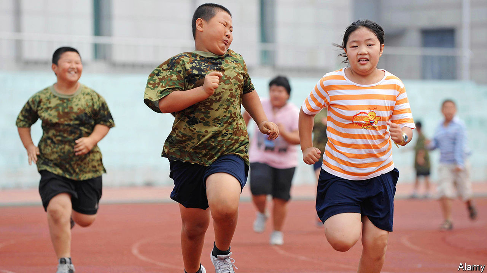

###### Young at art

# Officials in China make pupils take sport seriously—with exams 

##### They believe insufficient physical education is turning boys into wimps 

 

> Feb 6th 2021 


IN EXAM-OBSESSED China, educators have long struggled with the problem of overworked schoolchildren. Attempts to do away with some test-oriented teaching often face resistance from parents, who worry that their offspring could lose out in the race to get into a good university. Some enlightened officials are taking a new tack. In the south-western province of Yunnan they have not only revamped the physical-education test in the zhongkao, an examination for entrance to senior secondary school. They have also given it the same weighting in the exam as all-important subjects like maths and Chinese. Eight provinces have joined Yunnan in including art and music tests in the zhongkao.


These reforms are in response to demands by the central government for a more well-rounded approach to education. In 2017 primary and secondary schools were ordered to hire only specialists to teach PE and art. In October they were directed to organise daily gym classes; to include PE and art in the zhongkao; and to make pupils’ graduation conditional on their fitness (it did not say how to assess this). The government says it wants to foster a “lifelong habit of exercise” and, through art, “noble sentiments”.


The government worries about how many youngsters are in poor shape. In 2017 officials in the southern city of Guangzhou found that only 2.6% of local children were in “excellent” health. Half of pupils surveyed there had myopia. Today one in five Chinese children is overweight, up from just one in 20 in 1995. Such statistics fan another fear: that today’s youngsters, and boys in particular, are over-indulged wimps. The state news agency, Xinhua, grimly summed it up with a headline: “Why good times produce weak children”.


In 2018 many parents were upset that a children’s show—co-produced by the education ministry, ironically—had featured male pop stars who, with their perfect coifs and eyeliner, were not deemed role models manly enough for their sons. In January the ministry pledged to “pay more attention to cultivating pupils’ masculinity” and endorsed a politician’s proposal to hire more male PE teachers to prevent the “feminisation” of teen boys. Zhu Weiqiang of East China Normal University, who advises the government on PE reforms, says that teaching a non-aggressive form of kung fu was once commonly proposed. Now officials want children to learn wrestling.


But parents do not want their children to be distracted from their books. They are used to pupils getting full marks in PE with next-to-no effort, partly because examiners have tended to grade generously to avoid “unfairly” penalising hard-working students, says Mr Zhu. Schools often cancel PE and art classes in favour of extra revision-sessions for other subjects.


This will change with the new reforms. But parents are already griping that PE will be just one more source of stress. They fret about how art will be appraised. Some point out that schools in big cities will be able to fork out for boxing gear and trips to calligraphy museums, giving their pupils yet another edge in the zhongkao. Mr Zhu laments the use of exam pressure to get people’s attention. Still, he hopes it is but a hop, skip and a jump to greater fitness. ■

