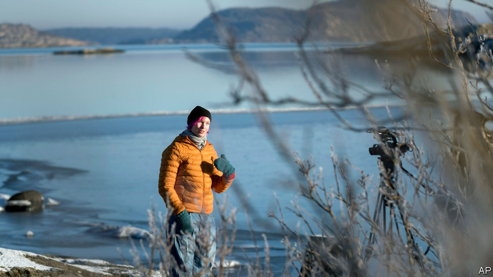

###### Solitary cinema

# A Swedish film festival has just one attendee 

##### Not exactly paradise 

 

> Feb 6th 2021 


WHEN THE Goteborg Film Festival offered the chance for a film fan to spend seven days alone on an island, with only 60 films for company, the organisers weren’t sure if anyone would want to apply. The pandemic has been isolating enough, even for Swedes, who have yet to lock down like other Europeans. The lucky winner would not be able to bring a phone or contact friends and family during a week of stormy seas and dark Swedish winter. No one was expecting that the festival would get over 12,000 applications from 45 countries.


The chosen castaway, a pink-haired Swedish nurse called Lisa Enroth, has been on Hamneskar island, 37km north-west of Gothenburg (as it is spelt in English), since January 31st. Sending her by boat to an “isolated cinema” was the best way to carry on the festival this year, says its chief organiser, Mirja Wester. A single person watching films cannot spread the virus (unlike the 160,000 at last year’s event). The solitary experience is also in keeping with how millions have watched movies of late. And like the lighthouse that towers over the island, streamed and downloaded films shine a ray of hope.


Still, some films are not meant to be watched alone. By day three, Ms Enroth was already rueing her lack of friends and wine. “I should have had someone there to cling onto,” she said in a video diary after watching “The Macaluso Sisters”, a tragic Italian drama. She confessed to having “started talking to the stove”. It is easy to understand how she feels, alone on a rocky outpost. Yet such sentiments have long been common all over Sweden. Half of Swedish households are single-person ones.


When lighthouse-keepers first came to Hamneskar, no one thought they could survive long in such desolation. Ms Enroth’s prospects are rosier. A psychiatrist is on standby in case she starts to struggle. And for an emergency nurse whose energy has been drained by the pandemic, solitude may even be a relief.

