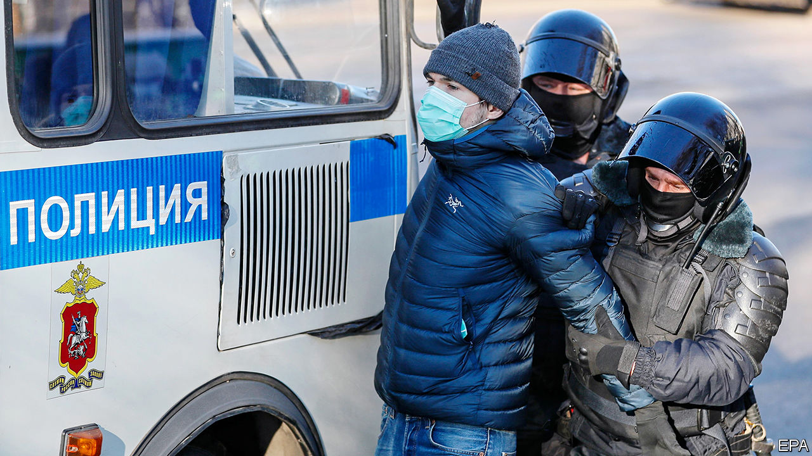

###### A Muscovite mockery of justice

# Russia’s regime is weakened by putting Alexei Navalny in jail 

##### President Vladimir Putin’s reputation is tarnished anew 

 

> Feb 6th 2021 


JUDGING BY THE security measures, you would have thought Moscow was experiencing a terrorist attack. Police in riot gear surrounded the capital’s main court and blocked the approaches. Muscovites suspected of being protesters were whisked away and bundled into police vans. By lunchtime 350 people, including journalists, had been detained, adding to nearly 2,000 arrested during protests two days earlier. Jails and detention centres filled up so fast that many demonstrators were held in police vans in freezing temperatures without food or water for up to 40 hours.


The reason for the mass arrests was Alexei Navalny, Russia’s opposition leader, who had returned last month from Germany, where he had been treated for poisoning, ordered, he says, by President Vladimir Putin himself. On February 2nd Mr Navalny was put in a glass cage inside the Moscow court and sentenced to nearly three years in prison. This converted the original, suspended, sentence handed down in 2014 into a trumped-up case designed to stop him from standing for election. The European Court of Human Rights in Strasbourg had previously exonerated him of that charge and made Russia pay him compensation.


The latest proceeding was a mockery of the law. Mr Navalny denounced it as “one man’s hatred and fear…I mortally offended [Mr Putin] by surviving. And then I committed an even more serious offence: I didn’t run and hide.” Worse still, Mr Navalny had revealed that Russia’s Federal Security Service (FSB) had smeared his underpants with Novichok, a toxin. Mr Putin would go down in history not as a global statesman but as “Vladimir the Underpants Poisoner”, said Mr Navalny. His speech, blanked out by state television, was broadcast by TV Rain, an independent internet channel, and watched by nearly 9m people on YouTube. Within minutes of the sentencing, Mr Navalny’s team had called people out onto the streets.


Taking no chances, riot police closed metro stations and took over the main squares and crossroads. Videos that spread instantly on social media showed small groups of mostly young and peaceful Muscovites walking through the centre chanting “Navalny” and being shoved into side streets where they were beaten.


The poisoning of Mr Navalny made it clear that the FSB, rather than the civilian technocrats who were once responsible for domestic politics, are now dominant, says Alexei Venediktov of Echo Moskvy, an independent radio station. “They describe Navalny as ‘the engine’ and ‘the banner’ of the protest movement.” Locking him up will disable the engine, they reckon.


They also plan to sully the banner by portraying Mr Navalny as a foreign agent planted by the West to overthrow Mr Putin’s regime. They cite the protests by democratic countries, including America, Britain and Germany, and the attendance of their ambassadors at Mr Navalny’s sentencing, as proof of its determination to hobble Russia. Mr Navalny’s call for sanctions against Mr Putin’s friends could bring a new charge of treason that carries a sentence of up to 20 years. Prosecutors are also working on a new fraud case, alleging that Mr Navalny has stolen donations to his own anti-corruption foundation.


Yet by unleashing violence against peaceful protesters, the Kremlin is helping Mr Navalny in his main task: undermining Mr Putin’s legitimacy. The president is clearly rattled by Mr Navalny’s bold return and his explosive two-hour video, which was watched by 100m people, showing a vast secret palace allegedly belonging to Mr Putin. The president is now trusted by only 29% of the population, says a recent poll by the Levada Centre, a fall of 20 percentage points since he was re-elected in 2018. For this, blame corruption, a stagnant economy and a shift in media consumption. Mr Putin dominates state TV. But most Russians under the age of 40 get their news and views from the internet, where Mr Navalny is strong. The Kremlin would like his sentencing to display its limitless power. In fact it, enhances Mr Navalny’s moral stature at Mr Putin’s expense. ■

