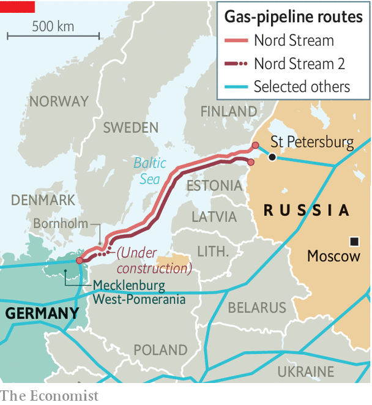

###### Running out of gas?

# Why Germany won’t kill Nord Stream 2 

##### But Americans sanctions might 

 

> Feb 1st 2021 


IN THE CHILL waters off Bornholm, a Danish island in the Baltic sea, a complex game of cat-and-mouse is playing out. A flotilla of Russian boats is rushing to complete the construction of Nord Stream 2, a 1,230km (765-mile) gas pipeline that would double capacity from Russia to Germany. Less than 150km of it remains to be built. Meanwhile, the American government, armed with sanctions legislation, is picking off companies it suspects of involvement. As the saga enters its endgame, the pipeline’s fate may depend on the outcome of this race.


Nord Stream 2 has inspired criticism ever since 2015, when Gazprom, Russia’s state-backed gas giant, and five European energy firms formed a consortium to lay a new pipeline costing €9.5bn ($11bn) next to an existing one along the Baltic seabed. American opposition, grounded in concerns that the new pipe will expand the Kremlin’s influence, is bipartisan. Eastern Europeans, as well as France, fear growing dependence on Russian energy—and depriving Ukraine, from which Russia has gobbled territory, of transit fees from an existing land pipeline. Attitudes in Brussels range from concern to bitter opposition.


Germans who value these opinions wonder why their politicians insist on ploughing ahead in splendid isolation. Yet Angela Merkel’s government has long sought to insulate the pipeline from diplomatic rows. Challenged after the recent detention in Moscow of Alexei Navalny, a Russian dissident, Mrs Merkel said she had not changed her mind on the pipeline. To circumvent American sanctions, the government of Mecklenburg-West Pomerania, a rural German state where the pipeline makes landfall, has set up a foundation, funded mainly by Gazprom, to mediate between Nord Stream 2 and private contractors—in the name, risibly, of “climate protection”. (Genuine greens are appalled.)

 


Yet not only does that ploy look doomed, America’s dogged efforts to kill the pipe are bearing fruit. Congress has passed two sets of sanctions aimed at it. In December 2019 the mere threat forced Allseas, a Swiss undersea construction firm, to pull its vessels from the project, halting construction for a year and costing Gazprom a fortune. Many other international companies have been scared off.


Russian ships eventually restarted work in December. But the heat continues to rise. On January 19th the American government made good on its threats for the first time, slapping sanctions on Fortuna, a Russian vessel repurposed for pipe-laying. A few weeks earlier Congress passed an amendment to a different sanctions law, passed in 2019. By radically expanding the set of companies now exposed to American action to include insurers, certifiers and any entity supporting “pipe-laying activities”, the new law is a “game-changer”, says Mateusz Kubiak of Esperis, a Polish consultancy. Russian assets may eventually be able to finish the pipe-laying, he says. But certification, a technical exercise to show the pipeline meets international safety and design standards, “cannot be simply transferred to some murky Russian company.”


What now? The aggressive sanctions policy of the Trump administration unsettled even stalwart foes of Nord Stream 2 in Europe. Joe Biden is keen to rebuild America’s tattered alliances, but his team also opposes the pipeline. Optimists think the most recent sanctions legislation could offer a way out. The sanctions are mandatory, limiting the White House’s room for manoeuvre. But as Dan Fried, a sanctions co-ordinator at the State Department in the Obama administration, notes, the text also lowers the bar for the president to waive the sanctions. “It’s a hint that Congress wants a deal,” he says. Mr Biden’s team has indicated that it is open to suggestions.


What might a deal look like? One idea is an automatic mechanism to impose sanctions on Gazprom should the Kremlin renege on a deal brokered by Mrs Merkel in 2019 to keep gas flowing across Ukraine. This could form part of a grand bargain in which America drops its sanctions in exchange for German commitments to bolster energy- and other forms of security in eastern Europe. But Germany would need not only to signal interest in such ideas, but to pause support for the pipe. And officials in Berlin fear hardliners in Congress may tie Mr Biden’s hands. The diplomatic stalemate, then, may drag on. Meanwhile, the delicate dance in the Baltic continues. ■


For more coverage of climate change, register for The Climate Issue, our fortnightly , or visit our 

