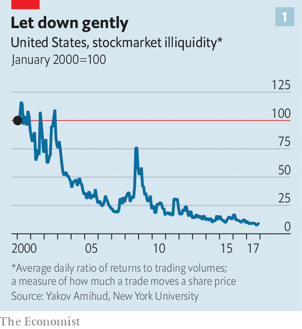
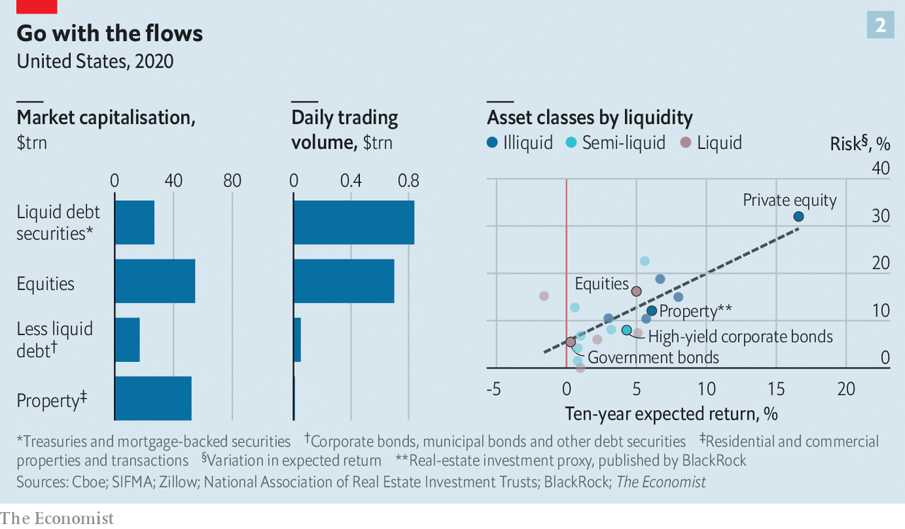

###### Transfer of power

# A new epoch for retail investors is just beginning 

##### Technology may soon make markets for all kinds of assets as liquid as the stockmarket 

 

> Feb 6th 2021 


FOR NEARLY a fortnight, the world was mesmerised by the fortunes of GameStop. Shares in the beleaguered brick-and-mortar purveyor of video games soared from a few dollars in 2020 to above $480 on January 28th, before sinking as low as $81 on February 2nd. A firm that was worth $200m in April last year was briefly valued at $30bn before falling back to Earth. The gyrations, fuelled by an army of day traders that dwells on forums on Reddit, a social-media site, have been chronicled on every front page and ruffled the feathers of regulators and politicians in Washington, DC.


Look beyond the memes and the mania, though, and the story tells you something about the deep structural changes in financial markets. The fact that the fast-paced frenzy was possible is a testament to just how frictionless trading stocks has become, aided by technological advances. Shares can be bought on an app while you queue for a coffee, at a price that is whisker-close to the wholesale price.


Progress towards unfettered stockmarket access began in 1975, with the abolition of huge fixed commissions and the entry of discount brokers like Charles Schwab, says Yakov Amihud of New York University. Then came automated trading and the decimalisation of share prices. By the 2010s, high-frequency traders had risen to dominate share trading (see ). “At each stop along the road, the market offloaded some trading costs and liquidity improved,” says Mr Amihud.

 


Trading costs tumbled, and the quantity of shares traded ballooned. The more participants piled in, the quicker and cheaper it became to trade, in turn (see chart 1). In 2015 Robinhood, the online broker through which many GameStop trades would flow, was launched, becoming the first platform to charge users no fees at all. That, and the pandemic, which freed up time and provided stimulus cheques as starter funds, have spurred retail participation to new heights. Retail investors made up a tenth of trading volumes in America in 2019. By January this year their share had risen to a quarter.


As frictions were sanded down, powerful institutional investors that had padded their bottom lines by charging meaty fees for exposure to stocks saw the assets they control slip away. Now they compete with a range of vastly cheaper offerings: index funds that track the market; exchange-traded funds (ETFs), which offer access to baskets of assets; and robo-advisers, which allocate cash among cheap funds according to portfolio-management theories. Such innovations, possible thanks to advances in computing power and machine learning, have probably saved investors $1trn or more in fees since 1975.


Outside stocks, fat fees and thin volumes still gum up markets, resulting in slow-motion transactions and deterring traders. But the same forces that pushed down trading costs and drove up liquidity in the stockmarket are poised to disrupt all manner of assets, from corporate bonds to property, and even Picassos and classic cars. As happened with stocks, this will eventually empower individuals at the expense of established intermediaries.


Wherever you look, technology has helped create new, liquid markets. “The market for knick-knacks in the attic was once illiquid,” says Alvin Roth, a Nobel-prize-winning economist. “The internet made it possible to have your lawn sale on eBay.” GPS and smartphones made ride-sharing apps—which create thick markets for journeys—possible.


Examples in financial markets abound. In 19th-century America buyers travelled from farm to farm testing wheat before striking a deal with a single farmer. Then railways made it possible to move grains cheaply in silo cars. But these silos also made it wasteful to store farmers’ grains separately. So in 1848 the Chicago Board of Trade started classifying wheat by quality (1 the best, 5 the worst) and by type (red or white, soft or hard, winter or spring). Standardisation brought down the cost of moving and shopping for grains, making the market more efficient. The process was so effective that the word commodity is now synonymous with standardisation.


But building a liquid market for an asset is not easy. To see why, compare the markets for bonds and property with equities. They are broadly comparable in size (see chart 2). Yet bonds and buildings change hands in different ways. This is largely the result of fragmentation. There are 4,400 listed firms in America. An investor buying a share in AT&amp;T does not care which one they hold—it is as if they were picking from a set of identical marbles. Now imagine they want to buy an AT&amp;T bond. It is as if a single marble had been smashed into hundreds of pieces, each of them different. There are 224 AT&amp;T bonds alone: each pay different coupons, mature at different times and are worth different amounts. And there are 300,000 distinct corporate bonds in America. Now imagine the investor wants to buy property. All those marble fragments have been ground into sand. Available figures suggest there are 5m-6m commercial buildings and more than 140m dwellings in America, each unique.

 


Fragmentation chills trading activity. The market for stocks is bustling. AT&amp;T shares change hands 40m times a day (though some investors will hold for years, and high-frequency traders might hold for less than a second). Small-cap stocks—recent action in GameStop aside—tend to trade less frequently.


Bonds are stickier and dearer to trade. Even the most liquid of AT&amp;T’s bonds only trades a few hundred times a day. “Some bonds are like museum pieces: they get put away in insurance companies’ portfolios, never to trade again,” says Richard Schiffman of MarketAxess, a trading platform.


At the stickiest end is property. A slice of real-estate investment is offered to the masses, via listed trusts. But the big investments, managed by private-equity firms, are open only to institutions like pension funds or wealthy individuals. Houses, too, turn over slowly. Buyers and sellers must be painstakingly matched. Sellers in America pay a meaty 5-6% commission. Just 5% of homes change hands a year.


Low transaction volumes make it difficult to price assets. The price of a share in AT&amp;T can be arrived at instantly. Some bonds, like recently issued Treasuries, are easy to price too. Older issuances are trickier. Traders either attempt to match a seller with a buyer, or look at recent transactions in similar bonds as a guide. Pricing property is a similar, but more glacial, process.


Fragmentation long seemed a hurdle to making the bond market as rapid-fire as the stockmarket. An institutional investor wanting to buy a bond would talk to two or three big banks or brokers that dominate the market. But this is starting to change thanks, in large part, to open-ended fixed-income ETFs, funds that hold diversified baskets of bonds. These enhance price discovery and trading volumes in two ways.

All the world’s a market


The first is through their design. Some of the fixed-income ETFs offered by BlackRock, an asset manager, have 8,000 or more different bonds in them. As demand for an ETF rises, it begins to trade above the fair value of its component bonds (ie, at a premium). “When one of our ETFs trades at a premium we expect to see creation activity,” says Samara Cohen of BlackRock. The firm works with a handful of marketmakers, which have an incentive to expand the size of the ETF when it trades at a premium. Jane Street Capital, one such marketmaker, might offer BlackRock a portfolio of 400 bonds to add to its ETF, pushing the price back towards fair value. Jane Street gets to keep the difference—it bought those 400 bonds at market price, and sells them at the implied premium at which the ETF was trading. When the ETF gets cheaper, the reverse occurs. Jane Street redeems units of the ETF for its component bonds at a discount and sells them for market prices (again, pocketing the spread). All this activity, which is increasingly automatic, enhances price discovery.


The second effect is through the wider trading of an ETF. Each time it trades, a reference for its component parts is created, which helps price other bonds. And ETFs trade far more frequently than their components. In March 2020, as volatility shook markets, BlackRock’s biggest investment-grade corporate-bond ETF traded 90,000 times a day. The top five holdings of the fund traded just 37 times. Price accuracy means lower trading costs—a step towards frictionless markets.


Trading technology is also improving. MarketAxess was set up to make it easier for investors to contact all the big banks’ bond desks and brokerage firms—around 20 firms in total—at once. But the platform has since introduced open trading, which functions almost like an exchange, letting all participants interact with each other. The result is that trading need not be solely dependent on banks for liquidity, says Mr Schiffman. Around a third of the transactions MarketAxess facilitates on its platform are such “all-to-all” transactions.


The next phase might be automating bond trading. Overbond, a fixed-income analytics firm, consolidates trading data that it plugs into a machine-learning algorithm. The algorithm finds recent transactions in similar bonds and spits out implied prices. It was the arrival of fast serverless cloud computing that helped the algorithm mimic a human trader in real time, says Vuk Magdelinic of Overbond.


In less liquid assets, like private equity and property, the seeds of change have just been planted. To smaller investors, illiquidity can be a curse: nervous regulators try to restrict access to illiquid assets. But for institutions, it is a boon. Private-equity pitch books chatter about the “illiquidity premium” their investments earn. The result is that private markets hold appeal for certain types of investors that are willing and able to lock their money up, but not others. A quarter of university endowments and a sixth of sovereign-wealth funds’ capital are invested in them. By contrast, insurers and retail investors plough just 1% of their capital into private markets.

And all the men and women traders


This too could eventually change. For one, firms in private markets are beginning to create funds that can expand or shrink as they gain or lose clients, an innovation that echoes that of bond ETFs. Investors typically buy into private markets when a fund manager raises capital. The capital is locked up for a decade or more, and used to buy 20 or so companies or real-estate investments over several years. But in January Hamilton Lane, an asset manager, launched a private-equity and private-credit fund that circumvents this dynamic by ditching the fundraising cycle.


“When a [private-equity] fund manager buys a company for their fund they may ask us to partner with them for the equity for the project,” says Drew Schardt of Hamilton Lane. This is a cheaper way of getting access, he notes: direct or co-investment deals do not have any underlying fees attached to them. These deals come along fairly regularly, allowing the fund to grow with demand. It can also shrink: the fund is structured so that its investments mature regularly. They should do so at a rate of 20% a year, fulfilling the limited redemptions the firm plans to offer. It also plans to match those keen to exit the fund with others buying in, using third-party valuations.


Other startups want to go even further. Regulation is helping them. Only accredited investors can invest in property, venture-capital funds or hedge funds. “Accredited” once meant the rich, those earning more than $200,000, or worth more than $1m. But a rule change in 2017 means that those with professional experience or knowledge are now eligible too.


This change has fuelled the growth of startups offering property investments to the masses. One such firm is Cadre, set up in 2014. Ryan Williams, its co-founder, who previously worked at Blackstone, an alternative asset-manager, wants to build an exchange for commercial property that allows people to trade stakes in buildings, almost like a “digital stockmarket”.

 


Cadre finds an investment opportunity with a life of around five or seven years and lists it on its platform. Investors can buy pieces of it through the site. Every quarter, rental income is paid out and investors can choose to cash out through a trading system. “We provide a quarterly valuation for their investment, and they can choose to sell all or some of their stake at a range of prices,” says Mr Williams. This secondary market typically clears quickly.


Low fees are likely to be part of the draw. Cadre charges a 1% fee on any cash deposited on the platform and an annual management fee of 1.5%. This is just a quarter of what an investor might pay a traditional alternative-asset manager. The firm’s clients include the establishment: Goldman Sachs, a bank, is spending $250m on behalf of its wealth-management clients. But individuals are stepping in, too.


Yieldstreet, which was founded in 2015, offers property investments as well as those in snazzier alternatives like art, marine finance (such as the funding of container ships) and private credit. In 2015 the Securities and Exchange Commission changed its rules on “mini” initial public offerings (IPOs), increasing the amount that can be raised to $50m. A clutch of firms have since listed artworks and classic cars.


Even in residential property, the most sluggish and expensive market of all, firms are using technology to improve efficiency. “When we thought about what makes a properly functioning marketplace, it all came down to price discovery and data,” says Rich Barton, the founder of Zillow, an “i-buying” firm, which acts like a marketmaker for houses. After a decade gathering data on every home in America, it can now plug a property’s characteristics into machine-learning algorithms to price them, just as Mr Magdelinic plugs in characteristics of bonds. Zillow buys homes based on the algorithm’s assessment, taking them onto its balance-sheet. It then sells these on its platform.


There is evidence this is pushing down agents’ fees. Commissions are dropping quickly in areas in which i-buyers operate. A study by Mike DelPrete of the University of Colorado suggests that the fees i-buyers pay to buyers’ agents are falling. In places such as Phoenix, Dallas, and Raleigh the fees paid to agents have dropped by around 0.5-1 percentage points in a little over a year. In Atlanta they have fallen by half in just two years.


Bring these developments across disparate markets together, and it seems clear that technology is making it possible for liquidity, price transparency and competition to crop up in a variety of financial markets. True, the markets for art, bonds and houses will never be quite as frictionless as the stockmarket. Mr Schiffman thinks Tesla’s bonds are unlikely to be as exciting as its shares. The clue is in the name. “It is fixed income!” he laughs. No one will make a snap decision to buy or sell a house—because they have to live in it.

They have their exits and entrances


Yet the oncoming rush of liquidity should worry institutional investors. Many help their customers gain exposure to a basket of small companies, or to commercial property. But that often comes as part of a pricey package deal: clients must also buy the slick advice that comes with it. Once it became possible to buy exposure alone in the stockmarket, many of them ditched their stock-pickers.


Now price transparency and liquidity seem bound to deliver fierce fee competition in other asset markets. Retail investors may one day be able to stuff their cash into a portfolio of low-fee funds in everything from stocks and bonds to art and property. It is this, rather than gyrations in GameStop stock, that will give retail investors more power over Wall Street. ■

