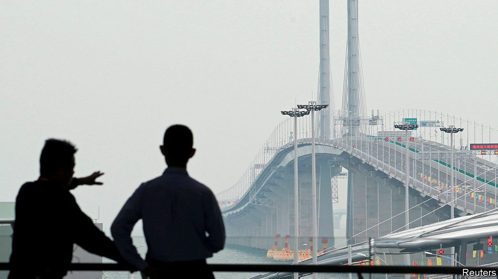

###### Border crossings

# Chinese investors’ access to foreign assets expands—a bit 

##### A new scheme will allow access to wealth-management products in Hong Kong 

 

> Feb 6th 2021 


THE 55-KILOMETRE Hong Kong-Zhuhai-Macau bridge is a quick drive but a technical challenge. The trip requires motorists to buy insurance in three jurisdictions. Those making the jaunt from Hong Kong to Macau must still buy a Chinese policy, because the waters below the bridge belong to the mainland. Traffic is low.


Such are the barriers to movement in and out of China. For most people, attempting to shift money between China and the territories can be even more frustrating. For many years insurance products sold in Hong Kong created a bustling business whereby rich customers from the mainland bought policies worth hundreds of thousands of dollars using Chinese credit cards, only to later cash them out in Hong Kong dollars. In Macau, plastic watches once sold for $10,000. Upon swiping their Chinese cards, buyers received the tawdry timepiece along with a stack of dollars.


China’s regulators have sought to crush these schemes, wary of outflows of capital from the country. Yet they have also acknowledged the very real demand for overseas investments. A series of reforms have been launched over the past two decades to construct a closely monitored regime for cross-border investments, mostly catering to institutional investors. Stock Connect, which since 2014 has allowed Chinese investors to buy shares in Hong Kong, helped make the territory the world’s best-performing major stockmarket in January. Money from the mainland poured into stocks such as SMIC and China Mobile, which have been, or face being, delisted from the New York Stock Exchange, and have been removed from some MSCI indices. Buy trades from Shanghai to Hong Kong hit HK$423bn ($55bn) in January, up by 155% from December. China’s retail investors played a significant role in the rally.


In coming weeks regulators in Hong Kong and China will take another step towards opening up, with an investment channel called Wealth Management Connect. This will allow rich individuals to buy unlisted investment products in Hong Kong, opening a new world of assets to those who qualify. But rather like crossing the bridge between the jurisdictions, the technical details of the plan are onerous.


For a start, the scheme will be open only to people living in the Greater Bay Area, a region of about 72m people in Hong Kong, Macau and much of China’s Guangdong province. To use the channel, investors must open an account at a bank in China and then travel to Hong Kong to open a separate account in person—a difficult task during the covid-19 pandemic. The investment size, at 1m yuan ($155,000) a year, will be rather limited for China’s wealthy punters. The overall programme is to be restricted to 150bn yuan ($23bn) a year, a drop in the ocean next to China’s $3.2trn in foreign-exchange reserves.


The design of Wealth Management Connect underlines Beijing’s desire for unwavering control over its capital account even as it ever so gradually opens up. Much like Stock Connect, the new scheme will operate in a closed loop that does not allow convertibility beyond the target investments. Cashing out can be done in yuan only. Proceeds must be sent back to the mainland. “Regulators are still very cautious on capital outflows,” says a partner at a large accounting firm. Whether such limited exposure to offshore assets replaces the demand for pricey plastic watches in Macau remains to be seen. ■

