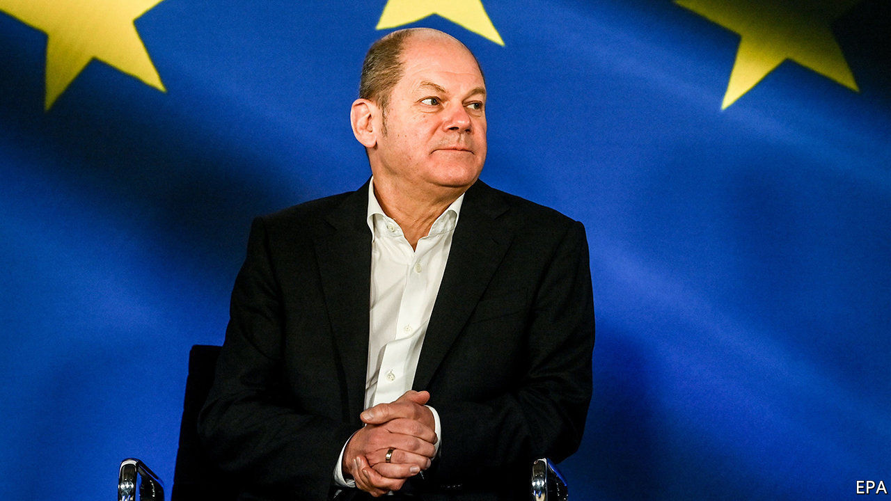

###### After months of dithering

# Germany’s finance minister promises to overhaul financial regulation 

##### In the wake of Wirecard’s collapse, BaFin will be beefed up 

 

> Feb 4th 2021 


WHEN MATTHEW EARL first called the whistleblower hotline of BaFin, Germany’s financial regulator, to report suspicious business practices at Wirecard, the person who picked up the phone said he could not understand English well enough. The London-based short-seller, who co-wrote a report in 2016 alleging fraud at the payment-processing company and bet on a fall in its share price, rang again. His respondent simply hung up. “That is when I gave up,” Mr Earl told a parliamentary inquiry into the regulatory failings that allowed the Wirecard disaster to happen.


BaFin has been the target of criticism ever since the spectacular collapse of Wirecard in June 2020, which followed the Bavarian company’s admission that €1.9bn ($2.1bn) of funds, nearly a quarter of its balance-sheet, “probably do not exist”. Olaf Scholz, the finance minister, dithered over holding the bosses of the regulator accountable, as well as over the announcement of changes to Germany’s piecemeal system of financial regulation. The emergence of allegations of insider trading in Wirecard shares by a BaFin employee was the last straw. On January 29th Mr Scholz fired Felix Hufeld, the boss of BaFin, and Elisabeth Roegele, Mr Hufeld’s deputy. Four days later he presented his plans for a regulator “with more bite” that, he says, can be as good as the best in the world.


Mr Scholz’s seven-point roadmap, which Roland Berger, a consultancy, helped to draft, contains snazzy Anglo-Saxon jargon, such as “data-intelligence unit”. The finance minister wants to hire more experts, in particular auditors: currently, only five of the roughly 2,700 employees of the watchdog are auditors. A “focused-oversight body” is to supervise complex companies in their entirety. (The supervision of Wirecard was split between BaFin and other agencies, some at the state, rather than federal, level.)


A task force will carry out forensic audits of companies suspected of fraud. BaFin’s IT system will be improved. Rather than hanging up on calls, the reformed regulator will encourage exchanges with market participants and systematically register complaints from whistleblowers.


Not everyone thinks Mr Scholz has gone far enough. Fabio De Masi, a member of parliament from the Left, a socialist party, who sits on the Wirecard inquiry, argues that Germany needs an elite forensic team that is paid top euro. He also wants the agency to be independent of the finance ministry. Danyal Bayaz, a parliamentarian with the Greens, finds the reform “a bit thin”. He had been looking for a mention of co-ordination with other European Union members. Last year the European Securities and Markets Authority criticised BaFin for its “deficient” handling of Wirecard.


Mr Scholz did not announce BaFin’s next boss; Mr Hufeld departs on April 1st. Jörg Kukies, a junior finance minister and a former banker at Goldman Sachs, has been talked of as a candidate, but says he does not want the job. Mr Scholz says he is looking around the world for a top finance expert who can mark a new start at the regulator. If they are to communicate with employees manning the hotline, though, any foreign appointees will need to brush up on their German.■

