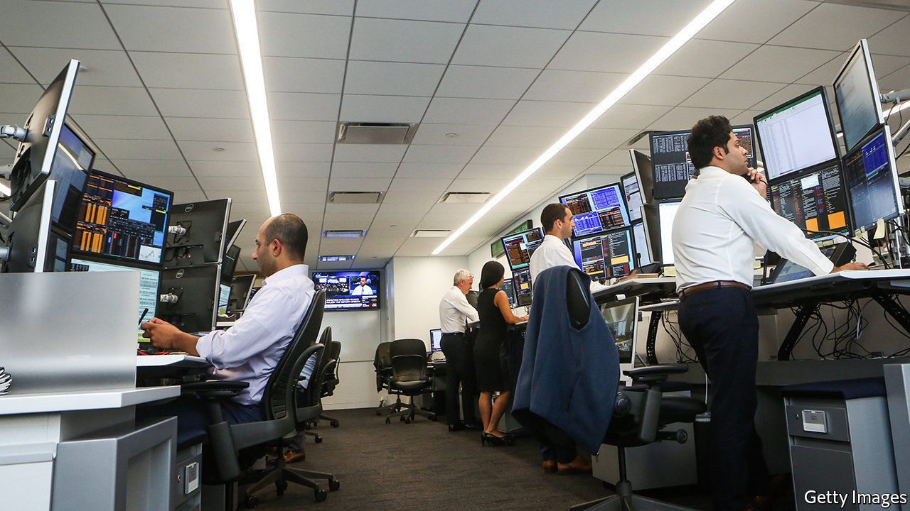
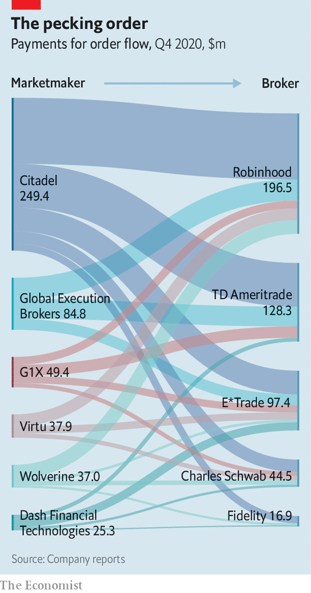

###### Pay-per trade

# High-frequency traders are in the spotlight 

##### They are the stockmarket’s new intermediaries 

 

> Feb 6th 2021 


FROM ONE perspective, retail stock traders have never had it so good. There is fierce competition among brokers, including the likes of Charles Schwab and Fidelity, for their business. This broke out into an all-out price war in 2019 when these firms cut stock-trading commissions to zero, four years after Robinhood, a startup promising commission-free trading, came on the scene. Retail participation in stock trading is at a new high.


This happy picture is somewhat muddied by the practice of payment for order flow (PFOF). Instead of charging users for each trade, brokers are paid by marketmakers to direct users’ trades—or “order flow”—through them. Marketmakers take small profits on the difference between the price that a broker’s user pays and that at which a share is offered for sale in the market. The mania around GameStop, a seller of video games, has put the practice, and its practitioners, in the spotlight.


On January 28th Robinhood decided to suspend buy orders for GameStop, after the retailer went viral in a forum on Reddit, a social-media site, and its shares spiked in value. The decision outraged users and was condemned by lawmakers on both sides of the aisle. Robinhood contends the decision reflected its obligations to the DTCC, a clearing-house that settles most equity trades. There is a two-day lag between an equity trade and its settlement, when the buyer gets their share and the seller receives their cash. In the interim, brokers must post collateral for users’ trades.


Vladimir Tenev, one of Robinhood’s founders, said he received a “nerve-wracking” call from the DTCC as GameStop prices surged, asking him to post $3bn in collateral. To meet these demands, the firm drew down its credit lines with banks and raised $1bn in capital. (It has since raised a further $2.4bn.) And to limit the amount of collateral it would have to post, it also temporarily halted buy orders for certain stocks.

 


Users decried the decision. Robinhood earned around $200m from PFOF in the fourth quarter of 2020 (see chart). Last year most of its orders flowed through Citadel Securities, a marketmaker run by Ken Griffin, a Chicago-based billionaire. The same parent company owns Citadel, a hedge fund. It had bailed out Melvin Capital, one of the funds short-selling GameStop, which had been targeted by the army of retail investors.


Users have questioned whether these links played some part in Robinhood’s decision to halt buy orders. (As has Elon Musk, the boss of Tesla, who nicknamed Mr Tenev “Vlad the stock impaler” when he interviewed him about the decision on social media on January 31st.) Mr Tenev has said “we absolutely did not do this at the direction of any marketmaker or hedge fund.” And Citadel has said it is not involved in, or responsible for, any retail broker’s decision to stop trading.


But questions about the ethics and prevalence of the practice, which is banned in Britain and Canada, are likely to linger. The GameStop episode has drawn attention to a group of tech-savvy high-frequency marketmakers, notably Citadel, that has largely replaced banks as the main intermediaries of stockmarkets. They stand in between market participants and stock exchanges, matching trades in microseconds. Though they take orders from all sorts of institutions, including hedge funds and pension funds, they typically only pay for orders from retail brokers.


That in itself is not necessarily suspicious: marketmakers regard retail order flow as “friendly”. Institutions might “run over” a marketmaker by placing orders in several places simultaneously, or place an “iceberg” order, one much larger than it first appears. Both strategies make it hard for the marketmaker to profit on trades. Retail orders carry no such risk.


Much of the scrutiny, though, is likely to rest on Robinhood. The online broker earns a lot more from marketmakers than its peers do. This is because it charges more: for every 100 shares Robinhood’s users traded in companies listed in the S&amp;P 500 in the fourth quarter of 2020, it collected an average of 41.8 cents from marketmakers. Charles Schwab, by contrast, collected just 11.7 cents.


Robinhood has been in trouble with regulators before. In December the Securities and Exchange Commission told it off for not telling users it made money from PFOF. The commission also found the broker failed in its duty to execute users’ trades at the best possible price. Robinhood paid $65m to settle the charges. (It has said the fine relates to historical practices.)


Mr Tenev is due to testify in front of the House Financial Services Committee on February 18th. The subject of PFOF will inevitably come up. As its share price tumbles, GameStop’s time in the spotlight may soon be over. For Robinhood and PFOF, though, this is perhaps just the start. ■

