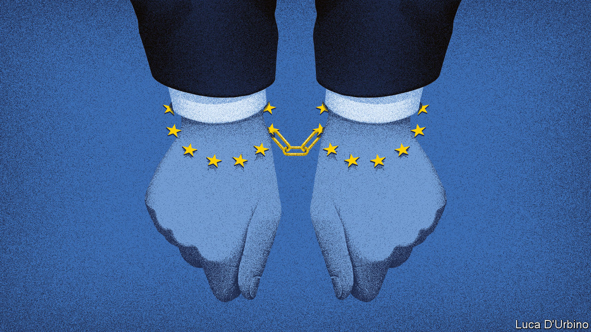

###### Brexit and the City

# Access to the EU financial-services market is not worth the price 

##### Being a rule-taker is too big a cost for “equivalence” 

 

> Feb 6th 2021 


WHEN TALKS between Britain and the European Union about trade went to the wire in December, they nearly collapsed over fishing, which contributes less than 0.1% to British GDP. Financial services, which contribute 7%, were left in the cold. As far as banks, insurance firms and the like are concerned, there might just as well have been no deal at all. American firms now trade with the EU on better terms than British ones do.


Britain’s financial-services industry is already counting the cost of the government’s negligence. Between the referendum in June 2016 and the end of 2020, around 7,500 jobs and over £1.2trn ($1.6trn) of assets moved from Britain to various European capitals. But as with much about Brexit, the terms of Britain’s departure from this market have still to be settled (see ). The two sides continue to negotiate over whether Britain should enjoy “equivalence”—a temporary right to trade on equal terms with EU companies.


Free trade in financial services would benefit both sides. If the EU is prepared to offer it on the basis that both sets of regulators are aiming at similar outcomes—such as orderly and stable markets—then Britain should accept it. However, as with the overall trade deal, Europe expects to extract a price for market access. If the price is that the EU writes the rules, Britain should walk away.


Politics is one of the reasons. When things go wrong in finance the government often has to step in. If the voters’ money is used to prop up a system, their representatives will rightly expect to be in charge. Andrew Bailey, who as governor of the Bank of England is responsible for the system’s stability, told Parliament earlier this year that being a “rule-taker” would be too high a price for Britain to pay.


The EU is a valuable market for Britain’s financial-services industry, making up around a third of its exports. Being bound by the EU’s existing rules would be no great burden, for Britain had a big role in designing them. But those rules will probably tighten. Europe’s politicians tend to be more interventionist and protectionist than Britain’s, and they suspect Britain’s light-touch regulation of having contributed to the financial crisis and the euro-zone meltdown. They could also write rules designed to boost their own financial centres by undermining London.


If Britain accepts EU financial regulation, it will be a large dog being wagged by a small European tail in many areas of business. Where Britain is dominant, such as in derivatives and foreign exchange, and in new areas such as carbon credits where it has a good chance of taking a slice of the business, it should be seeking to make the rules alongside big markets such as America and Japan, and forward-looking ones such as Australia and Switzerland.


Although the price of equivalence is likely to be high, the prize is not especially valuable. The EU’s share of the global market is shrinking; and equivalence can be withdrawn at 30 days’ notice, as Switzerland found in 2014 when it fell out with the EU and stocks listed there were suddenly banned from EU exchanges. The EU has little compunction in using rules as political cudgels, as its threat last month to stop vaccine trade between Ireland and Northern Ireland demonstrated.


Britain would have done better to stay in Europe’s financial-services market, and to retain its clout over the rules that govern it. That’s no longer an option. Being kicked out of trading European products will hurt. But rather than accept rules set by other governments, Britain should cut its losses and diverge.■


For more coverage of matters relating to Brexit, visit our 

