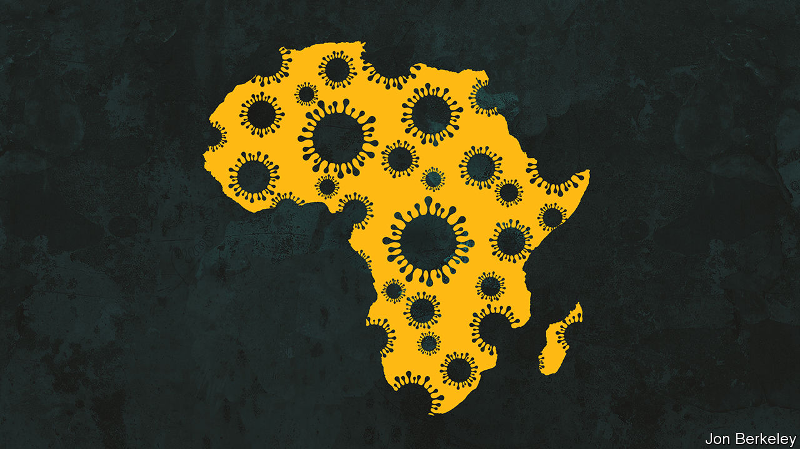

###### The toll on growth

# The pandemic could undercut Africa’s precarious progress 

##### Africans need jabs and loans, sharpish 

 

> Feb 6th 2021 


IN THE YEARS before covid-19 sub-Saharan Africans were not only the world’s youngest people, with a median age of less than 20, they were also some of the most optimistic. Just 12% of Japanese told pollsters they thought their lives would improve over the following 15 years, compared with 78% of Kenyans. Nigerians and Senegalese were even more upbeat.


The pandemic has made it harder to be sunny. When covid-19 first struck, a lot of pundits thought Africans might be spared the worst, because so many are young or work on the land (and would thus be little affected by lockdowns). Yet it now looks as if the virus will leave more lasting scars in Africa than elsewhere. Whereas rich countries can hope for a rapid economic rebound as they vaccinate their people, Africa is years away from jabbing enough to achieve general immunity. The IMF predicts it will be the slowest-growing large region this year. Repeated waves of infection will also disrupt the schooling of millions, putting at risk the educational and demographic trends that are among Africa’s best reasons to be hopeful.


Optimism about Africa began before the pandemic, with a long commodities boom in the years to 2014, which fuelled rapid economic growth. The share of Africans who were extremely poor declined from 56% in 2003 to 40% in 2018. And many more children started attending school. In Ethiopia, for instance, almost all children were enrolled in primary school by the time of the pandemic, up from 65% in 2003. Better-educated children earn more as adults. If female, they also go on to have smaller families and devote more effort to educating each child. Africa’s demographic transition promised future prosperity.


When the first wave of covid-19 hit, Africa seemed to weather it well. Sub-Saharan GDP fell by 2.6% in 2020, compared with 3.5% for the world. Of the 24 countries that posted any growth at all, 11 were in sub-Saharan Africa. Its official covid-19 statistics look good, too: with 14% of the global population, it has about 3% of recorded cases and deaths. Alas, those statistics are surely misleading. Few African countries have tested enough to have any real sense of how many cases they have suffered. And few record more than a fraction of deaths. If South Africa, which tests a lot, is any guide, cases and deaths in the rest of Africa are much higher than reported.


The greatest harm is likely to come not from the immediate impact of the pandemic, but rather from its lingering effects on economies, households and societies (see ). Start with Africa’s economies. Before the pandemic, growth was already slowing. Because the region’s population is growing by 2.7% a year, about twice the pace of Asia’s, Africa needs at least as much economic expansion merely to stand still. Yet GDP has lagged behind population growth since 2016.


What is more, governments entered the crisis with strained balance-sheets. By the end of 2019, public debt was 62% of GDP; in 2020 it rose to 70%. Rich countries can borrow cheaply and pay citizens to stay at home: on average they have spent more than 7% of GDP cushioning the shock of covid-19. African governments have spent only 3% of GDP, and even that was a burden. Fully 46 introduced social-welfare grants, but they did not stop 32m people falling into extreme poverty. To avoid debt crises, many African governments may curtail spending on infrastructure, too. This will stymie growth. Without better ports, roads and power supplies, Africa will reap fewer benefits from a continental free-trade deal that came into effect last month.


Africa is at the back of the queue for vaccines, alas. The Economist Intelligence Unit, our sister organisation, predicts the region will struggle to obtain enough doses to reach herd immunity before 2024. As much of the rest of the world gets back to work, travel and play, Africa could find that covid-19 is, in effect, endemic. The travellers and tourists who help generate almost 9% of GDP will stay away. Lockdowns and curfews will choke markets and bars. Most worrying, schools could close again.


Sub-Saharan classrooms have been fully or partly shut for 23 weeks, above the global average. Since half of Africans are without electricity, never mind laptops and Wi-Fi, remote learning is tricky. Modelling by the World Bank suggests that the classes already forgone will cost close to $500bn in future earnings, or almost $7,000 per child. This is a huge sum in a part of the world where the average GDP per person is less than $1,600 a year.


To make matters worse, many children—mostly girls—will never go back to their books. Many will become child labourers or brides. In one coastal area of Kenya, for example, only 388 of the 946 schoolgirls who got pregnant during the school shutdown last year have resumed their studies. It is too soon to know how many girls will stay away for good, but if large numbers do, Africa’s demographic transition may be at risk. In general those with no schooling go on to have six or more children each. This falls to about four for women who finish primary school and two for secondary school.


Two things need to happen urgently to mitigate Africa’s covid-induced calamity. First, people must be vaccinated more quickly than on current plans. Many African governments, wary of the cost, have been slow to order vaccines. Yet the returns to spending on vaccination are likely to be far higher than on just about anything else. The approval of new vaccines promises to help ease global shortages. Rich countries, which have ordered more than they need, should donate excess stocks and money to COVAX, the global programme for pooling the purchase and allocation of vaccines.

When the jabbing is done


Even if vaccines come soon, African treasuries will still need help to avoid drawn-out debt crises and growth-choking cuts to spending. Lenders such as the World Bank and IMF should offer more cheap loans, and support proposals by the African Development Bank and others to woo more private capital.


Africa’s cries for help—whether in the form of jabs or loans—risk being lost amid the tumult of a truly global crisis. But the fragility of African economies and societies is a reason to act swiftly. It is also in outsiders’ interest to help. So long as the virus is rampant somewhere, it can mutate and spread anywhere.■


Dig deeper


All our stories relating to the pandemic and the vaccines can be found on our . You will also find trackers showing ,  and the virus’s spread across  and .

