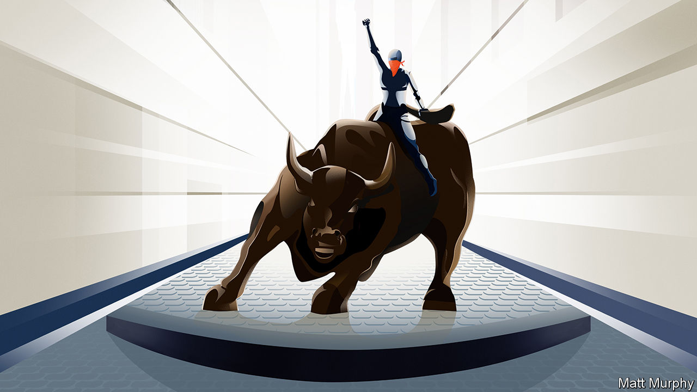

###### Global finance

# The real revolution on Wall Street 

##### High tech meets high finance 

 

> Feb 6th 2021 


EVENTS ON Wall Street have become so strange that Netflix is said to be planning a show to immortalise them. But what should be the plot? One story is of an anti-establishment movement causing chaos in high finance, just as it has in politics. Another is how volatile shares, strutting online traders and cash-crunches at brokerage firms signal that a toppy market is poised to crash. Both gloss over what is really going on. Information technology is being used to make trading free, shift information flows and catalyse new business models, transforming how markets work (see ). And, despite the clamour of recent weeks, this promises to bring big long-term benefits.


Don’t expect screenwriters to dwell on that, obviously. Their focus will be the 8m followers of WallStreetBets, an investment forum on Reddit, who have invented a new financial adventurism: call it swarm trading. Together, they bid up the prices of some obscure firms in late January. This triggered vast losses at hedge funds that had bet on share prices falling (see ). And it led to a cash squeeze at online brokers which must post collateral if volatility rises. Since January 28th the most prominent, Robinhood, has raised $3.4bn to shore itself up.


The swarm seems to have moved on. This week the price of some favoured shares sank and silver leapt. Meanwhile, in many markets the normal rules of play have been suspended. Almost 300 “SPACS” listed last year, raising over $80bn and allowing firms to float without the hassle of an initial public offering (IPO). Tesla has become America’s fifth most valuable firm. Bitcoin, having gone from the fringe to the mainstream, has a total value of $680bn. Trading volumes for shares are at their highest in at least a decade and those for some derivatives are off the charts.


Part of the reason for this is that government bail-outs have put a floor under risky debt. Banks have so much spare cash—JPMorgan Chase’s pile has risen by $580bn in the pandemic—that they are turning depositors away. Instead of using the lockdown to learn Mandarin and discover Tolstoy, some people have used their stimulus cheques to daytrade. Although the whiff of mania is alarming, you can find reasons to support today’s prices. When interest rates are so low, other assets look relatively attractive. Compared with the real yield on five-year Treasuries, shares are cheaper than before the crash of 2000.


Yet the excitement also reflects a fundamental shift in finance. In recent decades trading costs for shares have collapsed to roughly zero. The first to benefit were quantitative funds and big asset managers such as BlackRock. Now retail investors are included, which is why they accounted for a quarter of all trading in January. Meanwhile, information flows, the lifeblood of markets, are being disaggregated. News about firms and the economy used to come from reports and meetings governed by insider-trading and market-manipulation laws. Now a vast pool of instant data from scraping websites, tracking industrial sensors and monitoring social-media chatter is available to those with a screen and the time to spare. Last, new business models are passing Wall Street by. SPACS are a Silicon Valley rebellion against the cost and rigidity of IPOs. Robinhood, a tech platform from California, executes trades through Citadel, a broker in Chicago. In return for free trading, users’ trades are directed to brokers who, as on Facebook, pay to harvest the data from them.


Far from being a passing fad, the disruption of markets will intensify. Computers can aggregate baskets of illiquid assets and deploy algorithms to price similar but not identical assets, expanding the universe of assets that can be traded easily. A sharply rising proportion of bonds is being traded through liquid exchange-traded funds, intermediated by a new breed of marketmakers, such as Jane Street. Contenders such as Zillow are trying to make housing sales quick and cheap, and in time commercial-property and private-equity stakes may follow.


On paper this digitisation holds huge promise. More people will be able to gain access to markets cheaply, participate directly in the ownership of a broader range of assets and vote over how they are run. The cost of capital for today’s illiquid assets will fall. It will be easier to match your exposure to your appetite for risk.


But financial progress is often chaotic. First time around, innovations can cause crises, as the structured-credit boom did in 2007-09. The capacity of social media to spread misinformation and contagion is a worry. It is hard to see how some underlying assets justify the price rises of the past few weeks. Some fear that powerful firms hoarding the data of individual investors will exploit them. Already the Robinhood saga has led politicians on the right and the left to fret about losses for retail investors, mispriced assets and the threat to financial stability if market infrastructure should be overwhelmed as investors stampede from one asset to the next. Tellingly, the only big stockmarket dominated by technologically sophisticated retail investors is China’s. Its government employs censorship and an array of price and behavioural controls to try to keep a lid on it.


Although that is thankfully not an option in America, the regulators’ toolkit does need to be updated. It must be made clear that speculators, amateur and professional, will still bear losses, even if they attract sympathy from politicians. Irrationality thrives in online politics because it imposes no direct cost. By contrast, in markets losses act as a disciplining force. If today’s frothiest assets collapse, the bill could be perhaps $2trn: painful but not catastrophic in a stockmarket worth $44trn.

Don’t forget season two


Insider-dealing and manipulation rules also need to be modernised to deal with new information flows. Stupidity, greed and a killer instinct are all perfectly acceptable: deception, including the spread of misinformation, is not. Price-sensitive data need to be kept widely available. And the plumbing must be renovated. America’s trade-settlement system works with a two-day delay, creating a timing mismatch that can lead to cash shortfalls. It needs to be able to cope with faster trading in an expanding range of assets so that the system can withstand a crash. Netflix’s TV drama will doubtless pitch daytrading heroes like Roaring Kitty against the wicked professionals on Wall Street. Off-screen, in the real revolution in finance, a far bigger cast can win.■

