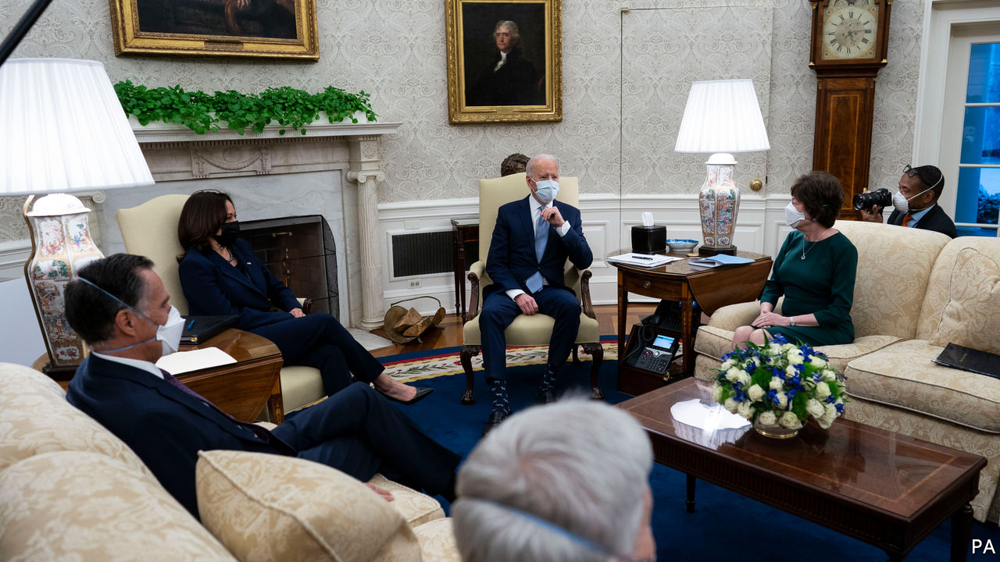
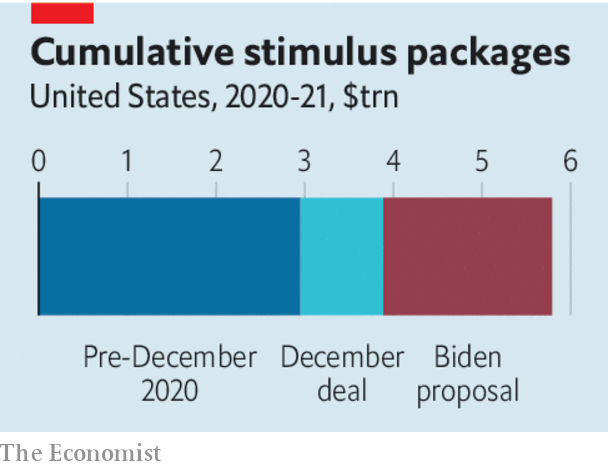

###### Fiscal stimulus

# Why Joe Biden’s proposed stimulus is too big 

##### America’s economy needs targeted relief more than indiscriminate spending 

 

> Feb 6th 2021 


AMERICA’S ECONOMY will recover faster from the pandemic than its rich-world peers, the IMF predicts. Not because it has controlled the spread of disease—it hasn’t—but mostly because of its enormous economic stimulus, which boosted household incomes by more than 6% in 2020 even as the unemployment rate peaked near 15%. Before Joe Biden became president, Congress had already spent $4trn fighting the crisis. Now he proposes $1.9trn more emergency spending, which would take the total to over 25% of GDP in 2019. Republicans think that is too much. A group of the party’s senators has made a counter-offer of a plan worth about $600bn (see ).


The right size for the bill is not best judged from the top down. America is not in a normal recession that is best solved by a calibrated slug of government spending. No amount of pump-priming will fully reopen restaurants, nightclubs and offices while the virus remains prevalent—nor would that be desirable. The government must instead fight the crisis from the bottom up.


Congress should spend whatever is needed on vaccinations and on replenishing the incomes of workers bearing the brunt of the crisis. They have lost their jobs through no fault of their own, and if their incomes collapsed, they would slash their spending, spreading the pain to the rest of the economy. Extending a generous top-up to unemployment-insurance benefits beyond its expiry in March should be a priority.

 


Nobody should fret about the cost of providing what is in effect disaster relief. Prolonging vast deficits, however, does carry a risk. According to official projections released on February 1st, without more stimulus America’s GDP would lag behind its potential by only 1.3% at the end of 2021. Mr Biden’s proposed spending is six times bigger than the shortfall. The “multiplier” effect of government spending on output is hard to estimate, but is small today because many households are saving stimulus money. Yet should vaccinations let the economy reopen fully in the second half of 2021, the pent-up effects of stimulus may cause the economy to overheat, leading to a burst of inflation.


Higher inflation would be tolerable—welcome, even, up to a point. But it would mean any further deficit spending, for example on Mr Biden’s infrastructure plan, would further stoke the fire. Better to preserve fiscal fuel by avoiding unnecessary largesse. Democrats want to send cheques worth $1,400 to most individuals, adding to the $600 they recently received. Universal handouts stop people falling through the cracks of bureaucratic means-tested programmes, but $2,000 is an arbitrary total popularised by Donald Trump. Mr Biden’s plan also includes $350bn for state and local governments. Early in the crisis it looked as if they would suffer a collapse in tax revenues. In fact, their budgets have held up as the federal government’s generous unemployment benefits and a burst of spending on goods have boosted their tax receipts. Neither of these items in Mr Biden’s bill is a priority.


The right fiscal policy would be flexible, providing emergency spending for as long as the pandemic persists and saving a broader fiscal boost for later if necessary. Republicans—and some moderate Democrats—are right to argue that $1.9trn is excessive today. Mr Biden may be willing to trim his proposal. A figure of around $950bn would allow for unemployment insurance, a smaller amount of catch-all universal cheques, Mr Biden’s assault on child poverty and extra spending on vaccines.


Equally, Democrats are right to fear that hawks in Congress could derail the recovery if the crisis worsens. Republicans should pledge to support further spending were that to happen. The Democrats should husband their limited opportunities to circumvent Republican opposition in the Senate. A bipartisan agreement now will raise the odds that the economy will get the right amount of support at the right time. ■

