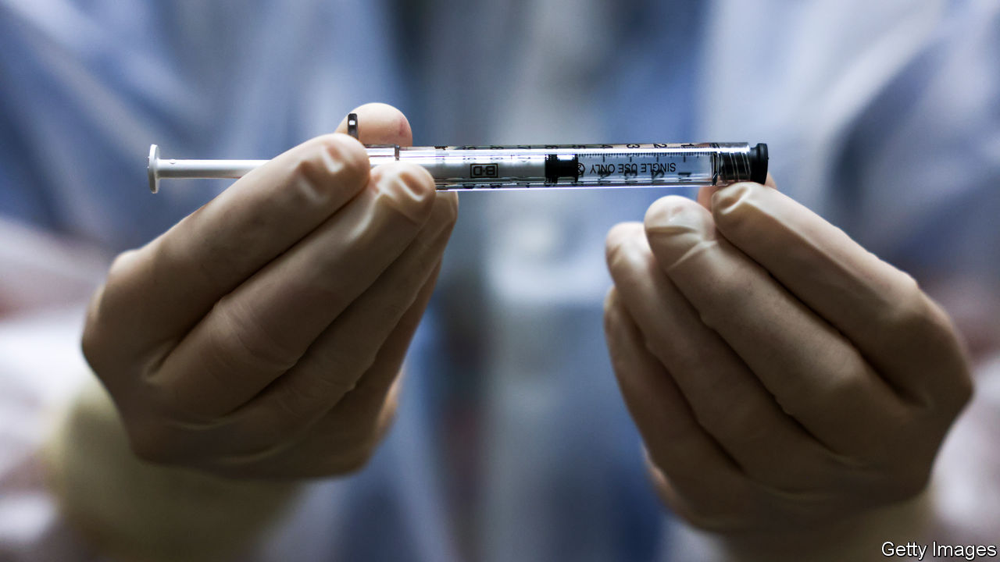

###### On Ethiopia, vaccine passports, space debris, Wikipedia

# Letters to the editor 

##### A selection of correspondence 

 

> Feb 6th 2021 


Ethiopia responds


The government of Ethiopia condemns in the strongest terms the accusation that it is “” (January 23rd). Your claim is based on unknown accounts and frettings. In fact, the government has mobilised and delivered more than 31,000 tonnes of food, non-food items and medical supplies to Tigray in the past month.


There is a delicate balance between guaranteeing basic necessities and maintaining security in the Tigray region. The defence forces and other security institutions have demonstrated exceptional courage and skill in this regard. Utility companies and other service providers are working at full speed to restore amenities in Tigray. They are doing so in the wake of acts of vandalism against infrastructure carried out by the Tigray People’s Liberation Front. Reconstruction will take time.


The people of Ethiopia want peace and the rule of law. The TPLF has been the sponsor of destabilisation, terror and massacres over the past three decades. It has not eased its thirst for power, even after it was unseated through protests and the electoral rules it had itself helped engineer.


The gravest error the article made was its shortsightedness. The past two years have been profoundly painful for all Ethiopians, but the government believes we are heading the right way. Magnifying troubles and echoing accusations of past regimes is a distraction. Ethiopia is reforming and entering a new era. The law-enforcement operation in Tigray is a costly but necessary step in that direction.


In this complicated and high-stakes operation, humanitarian, diplomatic and media agencies will have to endure the inconvenience of heeding to the direction of the government. The success of this operation necessitates that, as Tigray transitions to rebuilding and recovery.


It is regrettable that The Economist assumes that leaders in Africa are either evil or incompetent.


AMBASSADOR REDWAN HUSSEIN

on behalf of the State of Emergency Media Task Force

Addis Ababa

 


Two concepts of liberty


Vaccine passports “raise ethical questions”, you say (, January 23rd). The general adoption of vaccine passports is meant to encourage people who might otherwise resist getting a jab. To abuse Sir Isaiah Berlin’s famous distinction, the “negative” liberty of any individual not to be forcibly vaccinated will remain inviolate. But at the same time, the sheer weight of the incentives that the passport system entails will make getting vaccinated seem like the only realistic route to living a good life, or being “positively” free, in Berlin’s sense. Instinctive vaccine-dodgers will therefore choose to get it for fear of missing out.


In most circumstances, corralling people towards particular choices (especially choices to do with their bodies) is a dangerous and illiberal use of state or societal power. But in this very peculiar situation, in which the mass exercise by individuals of their negative freedom not to get injected would result in endless further lockdowns, there are good liberal reasons for nudging everyone towards opting for a vaccine.


SAM WILLIAMS

Dubai

 


Space trash


Trying to clean up space debris is a problem that has been festering for decades (“”, January 16th). The legal framework in the context of liability in the event of collision is vague and largely untested in law. Meanwhile, insurers who have quietly supported efforts to tackle the issue have been distracted by a series of unrelated and sustained satellite losses coinciding with declining premiums. There is, however, some glimmer of hope. Moves towards the serious financial backing of debris-removal technology are under way and efforts to develop a new treaty to address the legal consequences of debris have started among legal academics.


Ultimately, it will take regulation and economic measures, such as performance bonds, taxes and fees. The big question is how to implement the requirements on a global basis. As you pointed out: everybody’s business is nobody’s business. Getting agreement on an international treaty is not easy, hence all we have are non-binding resolutions and other international guidelines promoting debris-mitigation measures. To be effective a treaty would need to include at the very least all the countries with launch capability in the hopes that they would put pressure on their payload customers.


PHILIP CHRYSTAL

Of counsel

GBF Attorneys-at-Law

Zurich

 


Checking the facts


Wikipedia’s Utopian ideal is also a weakness (“, January 9th). Being able to make infinite corrections is not the same as being correct. How does one know, when reading a particular article, at what stage of its evolution one finds it? Wikipedia defends its disclaimer of accuracy as comparable to that of authoritative publications, such as “Encyclopedia Britannica”. But entries in traditional encyclopedias are signed by their authors and vetted by editors. This is by no means a guarantee of accuracy or lack of bias, but it is a serious and transparent attempt at both. Moreover, readers may judge from its byline whether a “Britannica” entry is slanted towards a particular point of view; the anonymity of Wikipedia’s contributors makes such discernment impossible.


Anyone who has ever tried to correct errors in a Wikipedia entry, only to find them repeatedly reinserted by other contributors with a competing agenda, will attest to the site's unreliability. Even counting on Wikipedia as a repository of basic information, such as names, dates and places, is a crap shoot. Perhaps the vast majority of its articles are indeed accurate, but which ones constitute that majority, and at what point in time? Literally no one knows; it has become so vast that moderating its millions of entries in any comprehensive way would be impossible. This is how the site is designed to work.


BARRY EDELSON

Huntington, New York


Wikipedia may be unique online because it “sells no advertising”. However, it does provide a free platform for companies to display their corporate messages, written by their marketing departments. Are these true statements vetted by Wikipedia? No. Wikipedia also has a devil’s bargain with Google. No matter what you search for on Google, from “cats” to “Catullus”, Wikipedia is positioned first. If you do enter “cats”, to learn about the animal, you get what reads like a Wikipedia advertorial for the movie “Cats”.


PEGGY TROUPIN

New York


Yeovil Town Football Club “toils in obscurity in the fifth tier of the English league”, you say. Any article on encyclopedias should strive for complete accuracy, so I must point out that Yeovil Town plays in the National League, which is the fifth tier of the English football pyramid, but is not part of the official English Football League. “Toils in obscurity” is perfectly correct.


RICHARD BAKER

Editor

Takeustothegame.com

London

