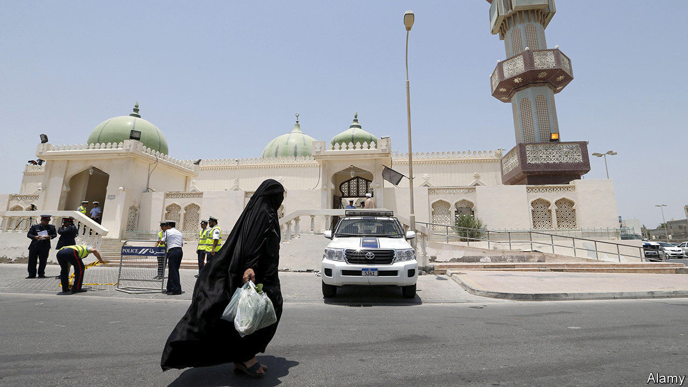
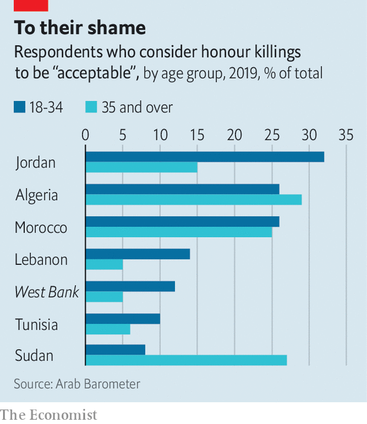

###### Murder, plain and simple

# Arab governments are doing too little to end honour killings 

##### In some countries, more people approve of honour killings than of homosexuality 

 

> Feb 4th 2021 


KUWAIT’S NATIONAL assembly is so rowdy that debates sometimes descend into fisticuffs. But on one issue, at least, the MPs have little to say. Sheikha al-Ajmi, a parliamentary employee, was killed by her brother in December. Some say he didn’t like her working as a security guard; others say he was angry that she wanted to marry outside their clan. The chamber offered no condolences. MPs may have feared the wrath of her tribe. Some probably approved. “They think what happens at home, even murder, is a private matter,” says Nour AlMukhled, a Kuwaiti activist.


No country in the Middle East and north Africa releases an official count of “honour killings”, which typically involve men murdering female relatives for actions they consider immoral. Activists say such killings are still common in the region, despite years of campaigning against them. Most states treat them more lightly than other forms of murder. Take Kuwait, where a man who catches his wife committing adultery or a female relative in the presence of a man and kills her (or him) faces at most three years in prison for what is considered a mere misdemeanour.


Activists have tried to shame leaders into changing such laws. Abolish 153, a group in Kuwait, aims to get rid of Article 153 of the penal code, which sets out the lax punishments for honour killings. Last summer the hashtag #Ahlam’s_Screams trended in Jordan after a man was filmed in public using a brick to smash the skull of his daughter, Ahlam. (He then sat down next to her body, drank tea and waited for the police to arrive.) Elsewhere, groups arrange hideouts for women in danger.


There has been some progress. Several governments have passed laws against domestic violence and abolished ones that allowed rapists to dodge prosecution by marrying their victims. Jordan, which used to put women seeking refuge in jail, opened its first shelter for women in 2018. But only Lebanon, Tunisia and the Palestinian Authority have abolished laws that treat honour crimes leniently. In November the United Arab Emirates said it had, too, though it has yet to publish the provisions.


Critics dismiss the measures as lip service. Enforcement by judges, officials and police—mostly men—is patchy, they say. Local authorities sometimes register honour killings as suicides or disappearances. The legal system is superseded by tribal codes in some areas. And rulers find it easier to stop peaceful female activists than murderous men. When women in Saudi Arabia tried to register a charity to set up shelters in large cities, Muhammad bin Salman, the crown prince, had them jailed.

 


Arab opinion is difficult to gauge because polling is forbidden in many places. But in 2018 and 2019 a survey of six countries in the region (and in the Palestinians’ West Bank) by Arab Barometer, a pollster, found that more people thought honour killings were acceptable than thought so of homosexuality. In most places, young Arabs were more likely than their parents to condone honour killing (see chart).


The results are reflected on the Arab street and on social media, where opponents of honour killings are accused of promoting adultery and Western norms. A year ago thousands of protesters rallied in Hebron, the West Bank’s largest city, after the Palestinian Authority signed the UN’s Convention on the Elimination of All Forms of Discrimination Against Women.


Worse, the scope of what is deemed a punishable breach of honour is widening. In the past year women have been murdered for such offences as wearing make-up and chatting online. Last month a Saudi woman was killed by her brothers for having a Snapchat account. (When her sister wrote on social media that her body had been dumped in the desert, the police detained her.) More generally, during lockdowns to contain covid-19, violence against women has increased. “No woman feels safe,” says Ms AlMukhled. “Men are getting away with murder.” ■

