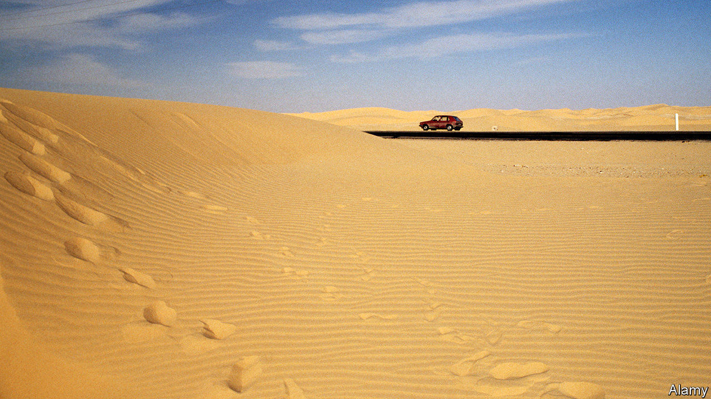
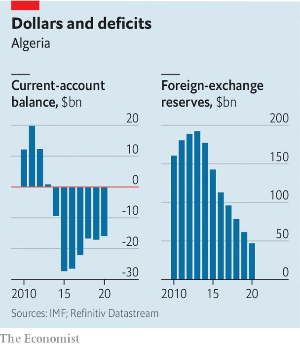

###### Broken-down country

# What a shortage of cars says about Algeria 

##### An effort to keep hard cash in the country has left Algerians looking for a ride 

 

> Feb 4th 2021 


IN MOST PLACES a new car is a bad store of value. Its resale price plummets the moment it is driven out of the dealership. But not in Algeria. Hassan Houicha has been getting offers to buy his Volkswagen for the same sum he paid for it in 2013. Still, he refuses to sell. “What if I can’t find another car?” he says.


Algeria has a problem. It does not produce cars. Yet, in an effort to keep hard currency in the country, it banned car imports in 2016. To no one’s surprise, this caused a shortage. Such shoddy policies are typical of how the government is handling a stubborn current-account deficit and resulting hard-cash crunch (see chart). Its capricious actions increase volatility in a country that toppled its autocrat in an uprising two years ago, and where the economy shrank by 5.5% in 2020.

 


Over 90% of Algeria’s foreign-currency receipts come from oil and gas exports. But receipts have been on a downward trajectory for years. (A slump in energy demand because of the pandemic has not helped.) Meanwhile, over the past decade Algeria has spent more than 28% of its GDP each year on imports. As a result, its foreign reserves have fallen from almost $200bn in 2014 to under $50bn today. Economists say they could run out in two years.


So the country has been trying to spend less hard cash. It significantly cut its import bill in 2020. Sonatrach, the state energy firm, which does much of its business in foreign currency, has been told to slash spending for this year by half. The government has levied tariffs of up to 200% on everything from chocolate to mobile phones. In January it suspended the import of red meat. Two weeks earlier, President Abdelmadjid Tebboune sacked the transport minister and the boss of Air Algeria, the national carrier, for using hard currency to buy catering supplies.


The ban on foreign cars, though, has proved more controversial. Last year Ferhat Ait Ali, the minister of industry, said they were “not a priority”. But growing public anger over the shortage has prompted Mr Ali to change tack. In January he said that $2bn would be allocated for car imports by vetted dealerships. The allocation is meant to cover everything from passenger cars to commercial trucks. “They are trying to avoid another uprising,” says Zine Ghebouli, an analyst. “But at a certain point people will recognise that $2bn is not enough.” The car-import bill in 2013, when there were no restrictions, topped $6bn.


Algeria has long tried to diversify away from energy, build up manufacturing and reduce its reliance on imports. After banning car imports in 2016 it set up partnerships between foreign producers and Algerian businessmen with the aim of assembling cars locally. The government hoped to create a motor industry as hefty as that of Morocco, Algeria’s neighbour, which ships cars to Europe and across Africa.


Algeria’s plan drew foreign partners such as Renault, Volkswagen, Hyundai and Kia. The partnerships were given free land and subsidised energy for their plants, and breaks on taxes and custom duties. In return, they were required gradually to increase their use of local materials. But building a local supply chain is difficult in a country with no history of carmaking. Critics say the new plants used more foreign parts than they were supposed to, and the cars they produced cost more than the imported cars they replaced, while still eating up hard currency.


Algerians saw it as yet another example of regime insiders lining their pockets at the public’s expense, a defining feature of President Abdelaziz Bouteflika’s rule. Since he was pushed out in 2019, there has been some accountability. On January 28th a court upheld prison sentences for two former prime ministers convicted of awarding contracts to cronies and costing the state hundreds of millions of dollars. Two former industry ministers and several businessmen have also received jail time.


Still, Algerians complain that the old elite remains in charge—and the people still need cars. The assembly plants had their import licences revoked and were closed. The government says it is seeking to establish new partnerships between foreign firms and local businessmen, and that this time it will ensure that more production happens locally. But no new deals have been announced. And Algeria is still running out of cash. ■

