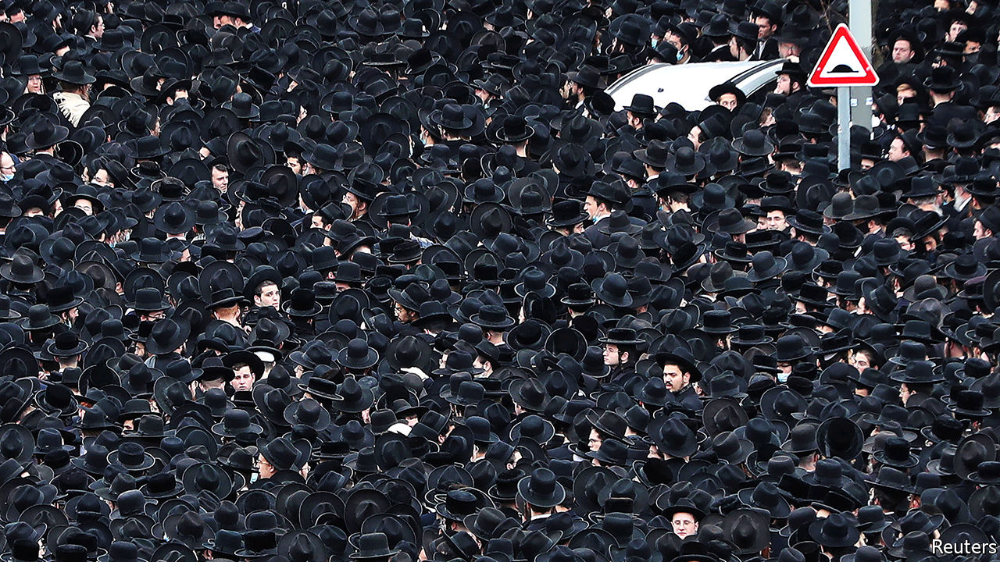

###### Rise of the secularists

# Will his alliance with the ultra-Orthodox doom Binyamin Netanyahu? 

##### The party of Yair Lapid, an avowed secularist, is moving up in the polls 

 

> Feb 4th 2021 


HE WAS HARDLY a household name, but the funeral of Rabbi Meshulam Dovid Soloveitchik on January 31st may prove a turning-point in Israel’s election campaign. The event drew some 20,000 ultra-Orthodox mourners, in defiance of a nationwide lockdown to combat covid-19 (see picture). “It’s wrong to break the lockdown, but when a man like this passes, there is an uncontrollable urge to demonstrate our respect for the life he led,” says Chaim Walder, an ultra-Orthodox writer.


For more secular Israelis, the funeral was yet another reminder of the government’s failure to enforce covid-related restrictions on the ultra-Orthodox, who are 12% of the population. The devout continue to pray in packed synagogues and hold big weddings. Some ultra-Orthodox schools and yeshivas remain open, despite all other schools being closed. Many of those angry about the disparity have blamed Binyamin Netanyahu, the prime minister, and thrown their support behind the party of Yair Lapid, a secularist.


Mr Netanyahu’s coalition relies on the backing of two ultra-Orthodox parties, so he goes easy on the group. “There are gatherings on all sides, in all communities,” he said after the funeral. The prime minister would rather talk about how Israel leads the world in vaccination per person. Over a third of the population have been jabbed. Still, covid-19 cases and deaths have been rising. The main reason appears to be the arrival of a more infectious variant. But the ultra-Orthodox account for nearly a quarter of the new cases.


In a recent poll, 61% of Israelis said they did not want ultra-Orthodox parties in the next government. Many voters believe Mr Lapid is the only contender who would definitely leave them out. His own party, Yesh Atid, has moved up to second, behind Mr Netanyahu’s Likud, in the polls. The vote is on March 23rd. “I don’t want my campaign to focus on [ultra-Orthodox] against secular,” says Mr Lapid. “It’s about a return to normalcy versus a sense of chaos, which is what most Israelis are now feeling.”


Mr Lapid, a former television talk-show host, created Yesh Atid in 2012. He served as Mr Netanyahu’s finance minister from 2013 to 2014. But for years he was seen as lacking the experience and gravitas to be prime minister. He seemed to acknowledge that in 2019, when he teamed up with Benny Gantz to create the Blue and White list of candidates—led by Mr Gantz. It battled to a virtual draw with Likud in an election last year, but split after Mr Gantz broke his promise not to serve under Mr Netanyahu, who faces charges of bribery and fraud.


Early in this campaign it seemed as if the main threat to Mr Netanyahu would come from his right. A former ally, Gideon Sa’ar, formed a party for disgruntled Likudniks. But Mr Sa’ar is also wary of antagonising the ultra-Orthodox, whom he would like to draw away from Mr Netanyahu. Mr Lapid is better placed to capitalise on the prevailing mood—and, perhaps, to put together a coalition that does not include Likud or the ultra-Orthodox parties. ■

